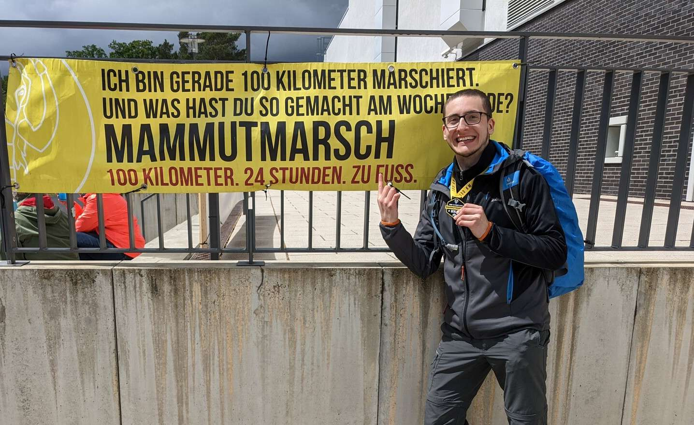
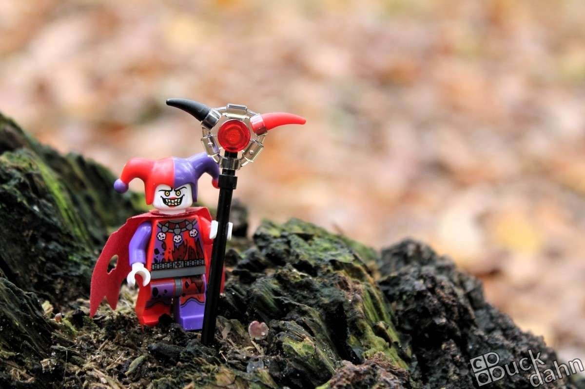
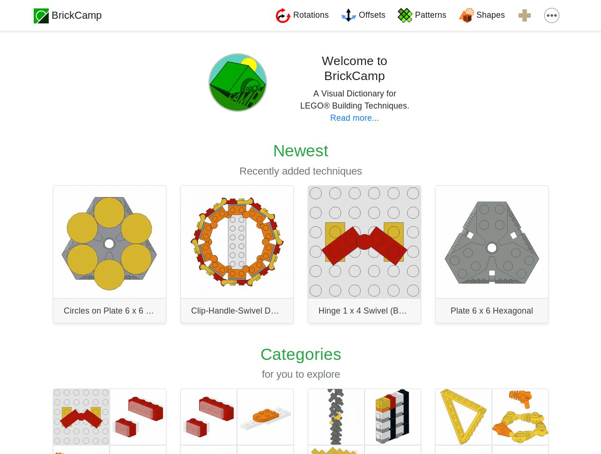
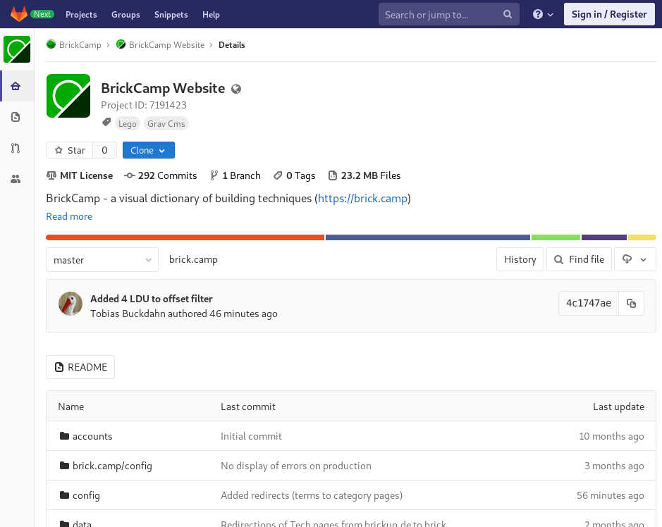
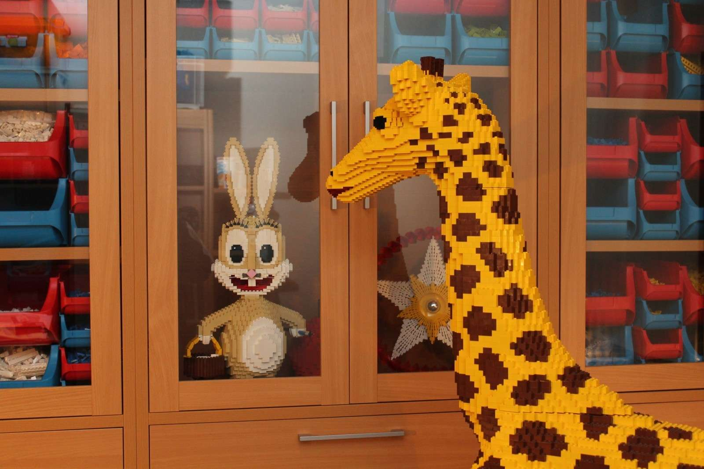

Hi, mein Name ist Tobias Buckdahn und ich heiße Dich herzlich auf meiner Webseite willkommen. Hier teile ich vieles rund um meine Hobbys, die da wären:

### LEGO Modellbau

Wie Du sicherlich schon bemerkt hast baue ich sehr gerne LEGO Modelle. Ich liebe die Herausforderung, Ideen greifbar zu machen und mit den kleinen Plastiksteinchen zu verwirklichen. Früher meist in Form von Skulpturen, zurzeit eher als Technic/Robotik-Modelle.

### Arduino

In letzter Zeit bin ich häufig mit Arduino und anderer Microelektronik zugange. Löten, crimpen, verkabeln, programmieren, etc. Noch habe ich auf meiner Webseite wenig davon geteilt, aber ich möchte meine Projekte demnächst auch hier vorstellen.

### **Wandern**

Ich bin sehr gerne zu Fuß unterwegs. Dabei haben es mir insbesondere "Extremwanderungen" à la Mammutmarsch angetan.

### Fotografie

Früher war ich häufiger mit der Spiegelreflex-Kamera unterwegs. Als Lieblingsmotive natürlich LEGO Modelle z.B. auf Ausstellungen oder kleine Szenen mit Minifiguren. Aber ich erfreue mich auch an Naturbildern wenn sich die Gelegenheit ergibt. Inzwischen nutze ich aber nur noch die Handy-Kamera.

### Webdesign

Neben dem Bauen selbst fasziniert mich auch das Präsentieren von Inhalten online. Das ist zum einen der Grund für diese Webseite, zum anderen aber auch für weitere Webseiten, die ich betreue. Dazu gehören [Brick.Camp](https://brick.camp), [Berliner-Steinkultur.de](https://berliner-steinkultur.de) und [SteineWAHN.de](https://steinewahn.de)

### Freie/Offene Software

In den letzten Jahren habe ich mich viel mit frei verfügbarer und quelloffener Software ( [FOSS](https://de.wikipedia.org/wiki/Free/Libre_Open_Source_Software)) auseinander gesetzt. Meine ersten Gehversuche in Richtung eigener Beiträge finden sich zu [meinem User auf GitLab](https://gitlab.com/brickup) und [Github](https://github.com/brickup-de). Insbesondere mein [Projekt BrickCamp](https://gitlab.com/brick.camp/brick.camp) ist komplett öffentlich einsehbar zum Stöbern.

### Ordnen und Sortieren

Sowohl an BrickCamp als auch am Fotografieren und Modellbau fasziniert mich das Sortieren und Organisieren. Ich investiere einiges an Zeit, um Bilder, Steine und Bautechniken zu kategorisieren und sortieren. Das Ergebnis sind schicke Sammlungen, die teilweise von chaotischen Phasen der kompletten Reorganisation durchzogen werden.

