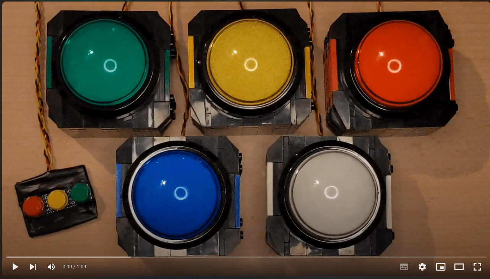
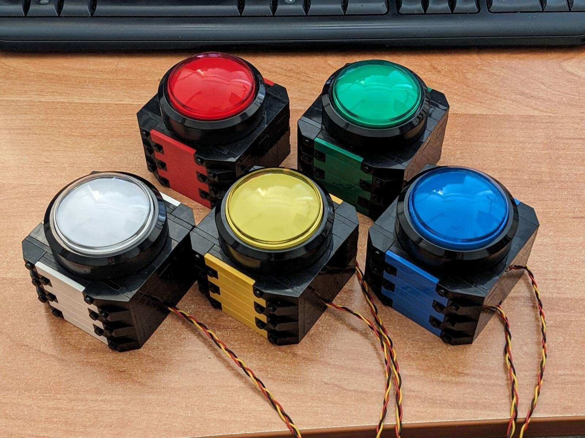
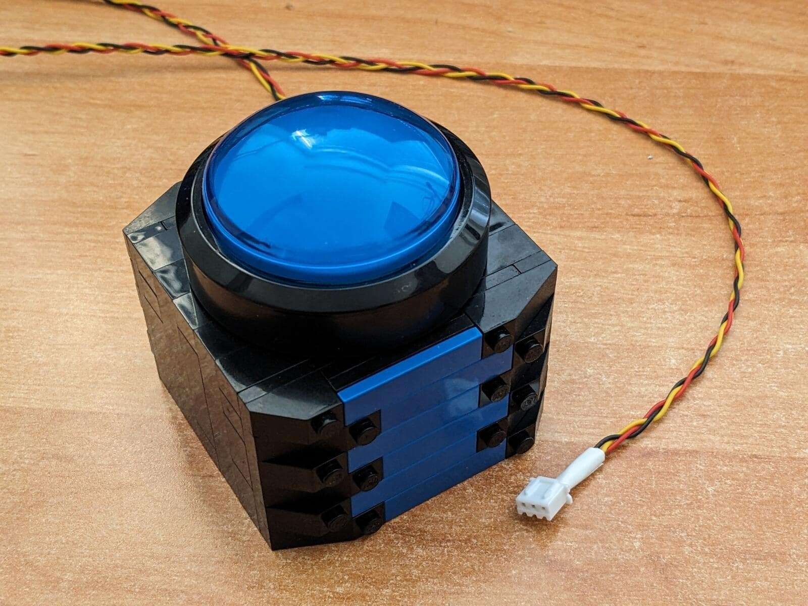
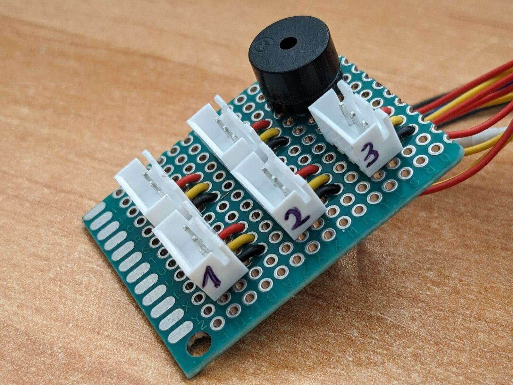
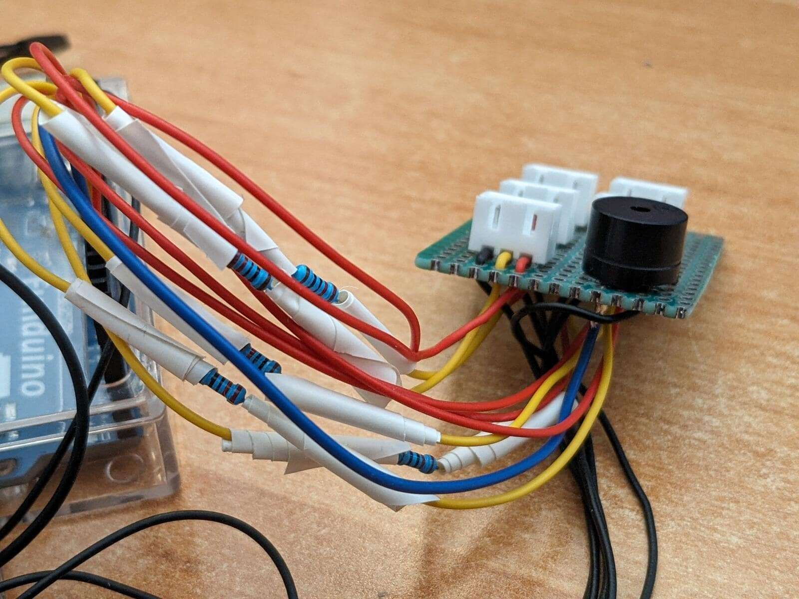
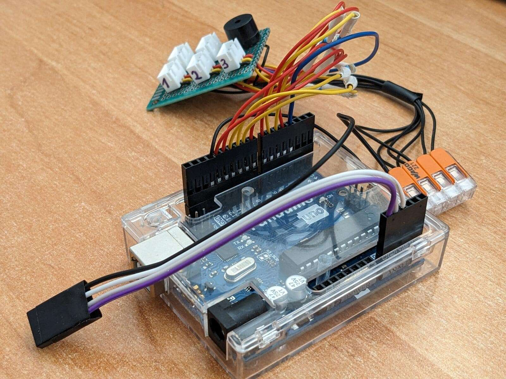
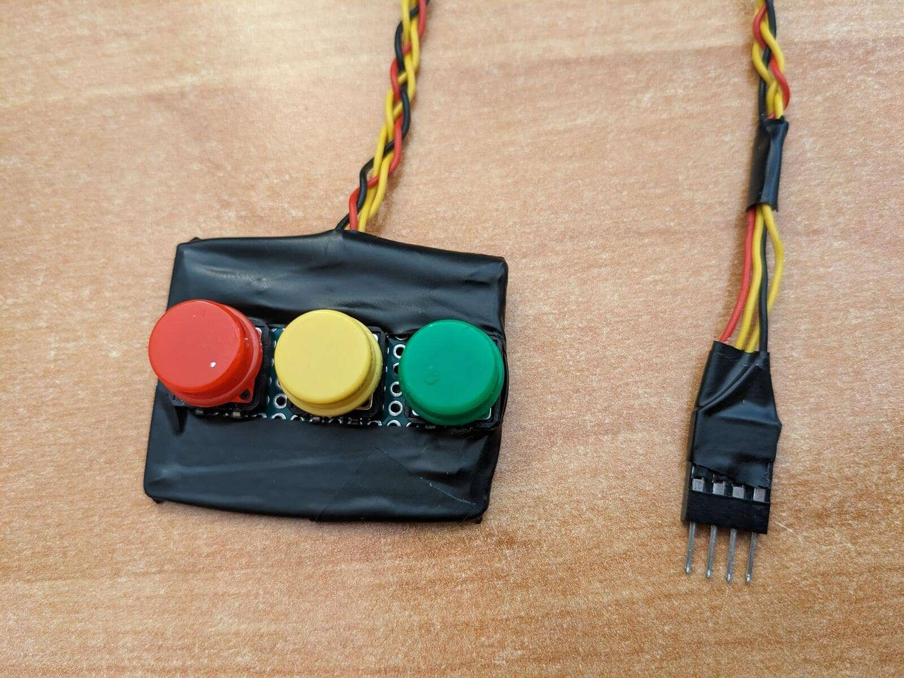
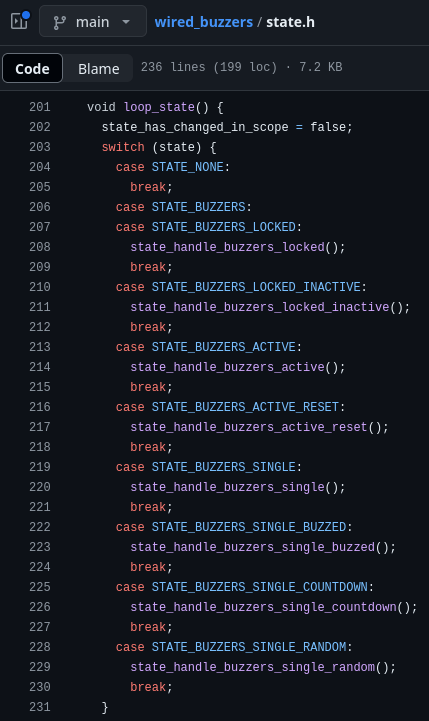
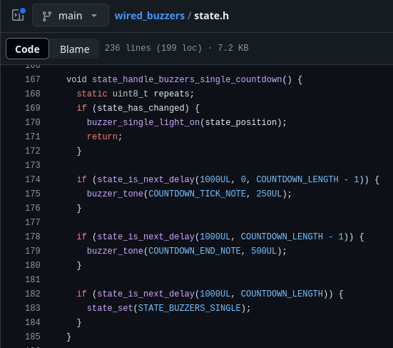

---
category:
  - arduino
  - lego
  - programmierung
cover:
  alt: LEGO Buzzer mit Arduino
  image: buzzer_photo_4.jpg
date: "2024-07-24T23:40:55+00:00"
tag:
  - blau
  - gelb
  - grün
  - rot
  - schwarz
  - weiß
title: Arduino-LEGO-Buzzer
url: /2024/arduino-lego-buzzer
---

In den vergangenen Monaten habe ich ein Buzzersystem mit Arduino und LEGO gebaut. [Coding und mehr](https://github.com/brickup-de/wired_buzzers) finden sich auf Github und eine kurze Demonstration [hier auf Youtube](https://www.youtube.com/watch?v=WlllEnodv78):

 Youtube-Video mit einer Demo

## Die Buzzer

Für die Buzzer habe ich klassische Arcade-Buttons verwendet, konkret [diese von Amazon](https://www.amazon.de/STARTS-Kuppelf%C3%B6rmige-Beleuchtete-Drucktasten-Maschinenspiele/dp/B01MSNXLN0/ref=sr_1_26?__mk_de_DE=%C3%85M%C3%85%C5%BD%C3%95%C3%91&crid=35E8DNTQ5VL3J&dib=eyJ2IjoiMSJ9.8SrDFbZvghGtXNzOrsfGLV89d2fVv3VgksEi4357T7I0R1Xyev6UdvDjli65trcJaKKAYRZuulvs97OL3R_gKaEVn7KCKPeRSTo7XaT4S8UT1pNIELxtHW6qUiQ0VS_ug8ephV7apHPTWJT3txuij7TDehXwBPYZonzkaZJmMlPfBhB9ZSerrSEsEZSFWn5I.OXcoc55o0nW98f1pIgQWIJqT5PX4K4alof3mOcUZEp8&dib_tag=se&keywords=arcade+spiele+buttons+10cm&qid=1721860483&sprefix=arcade+spiele+buttons+10cm%2Caps%2C77&sr=8-26). Sie finden sich aber auch in vielen anderen Shops, einfach "Arcade Button 60mm" suchen. Die LEDs in den Arcade-Buttons habe ich gegen 3V-LEDs ohne Widerstände ausgetauscht. So kann ich sie per Arduino betreiben.

In Kombination mit je einem selbst gebauten Gehäuse aus LEGO ( [hier geht's zur Bauanleitung](https://github.com/brickup-de/wired_buzzers/blob/main/wired-buzzer-lego-box-instructions.pdf)) sieht das wie folgt aus.

Zu jedem Buzzer führen drei Kabel - eins für die LED, eins für den Taster und einmal Ground für beides. Die Kabel habe ich direkt an die Kontakte der Arcadebuttons gelötet und zur einfacheren Handhabung geflochten. Ans andere Ende habe ich JST-XH-Stecker gecrimpt. So lassen sich die Buzzer später separat transportieren.

## Die Zentraleinheit

Zum Anschluss der fünf Buzzer entstand folgende kleine Platine. Sie enthält fünf JST-XH-Buchsen sowie einen passiven Lautsprecher.

Von dieser Platine gehen alle Kabel in Richtung Arduino und sind dort an Dupont-Stecker gecrimpt. In die Kabel für die Buzzer-LEDs wurde zusätzlich ein Vorwiderstand eingelötet und mit Isolierband verklebt.

Das Herzstück ist ein Arduino UNO. Am unteren Ende sind weitere Kabel für die Fernbedienung zu sehen, die ebenfalls passend gecrimpt wurden.

## Die Fernbedienung

Für die Steuerung der Buzzer habe ich eine kleine Platine mit drei Druckknöpfen zusammen gelötet. Die vier Kabel, je ein Datenkabel plus Ground, habe ich wieder geflochten zur einfachen Handhabung. Mit Isolierband habe ich meine mangelhaften Lötkünste versteckt.

## Die Programmierung

Wie bereits erwähnt findet sich alles [Coding auf Github](https://github.com/brickup-de/wired_buzzers). Nachfolgend nur ein paar Kniffe, auf die ich besonders stolz bin:

**Finite State Machine**: Das Herzstück der Ablauflogik ist eine [Zustandsmaschine](https://de.wikipedia.org/wiki/Endlicher_Automat), welche Inkonsistenzen verhindert.

**Kein Delay**: Um stets auf Eingaben reagieren zu können wird kein delay genutzt. Stattdessen wird über eine Hilfsfunktion in jedem Loop errechnet, ob bereits die gewünschte Zeit verstrichen ist.

## Die Bedienung

Es gibt drei Hauptzustände, in denen sich die Buzzer befinden können:

- **LOCKED:** Alle Buzzer sind gegen Eingaben gesperrt und leuchten nicht.
- **ACTIVE:** Alle aktiven Buzzer leuchten und warten auf Eingabe.
- **SINGLE:** Genau ein Buzzer leuchtet und alle Buzzer sind gegen Eingaben gesperrt.

Passend dazu gibt es drei Knöpfe zur Bedienung:

- **Rot:** Setzt Status LOCKED. Aus Status SINGLE kommend wird zusätzlich der aktuelle Buzzer als inaktiv markiert ("falsche Antwort"). Dieser wird dann im nächsten Status ACTIVE nicht wieder mit eingeschaltet.
- **Gelb:** Setzt Status SINGLE, indem ein zufälliger Buzzer aus den noch aktiven ausgewählt wird. Bei bereits ausgewähltem Buzzer werden stattdessen Buzzer-Sounds bzw. der laufende Countdown übersprungen.
- **Grün:** Setzt Status ACTIVE. Falls nicht im Status LOCKED gedrückt werden zusätzlich alle inaktiven Buzzer wieder als aktiv markiert.

Viel mehr gibt es zu diesen Buzzern gar nicht zu sagen. Ich bin sehr stolz auf dieses kleine Projekt und hoffe, sie auch bald einzusetzen.
