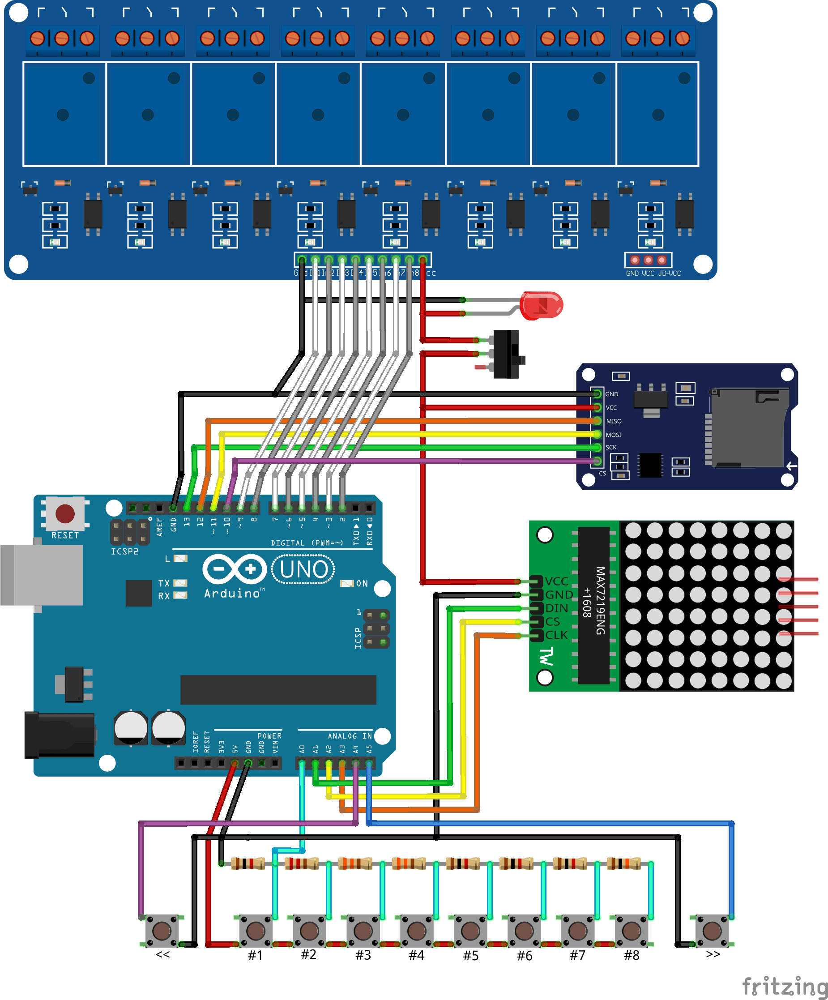
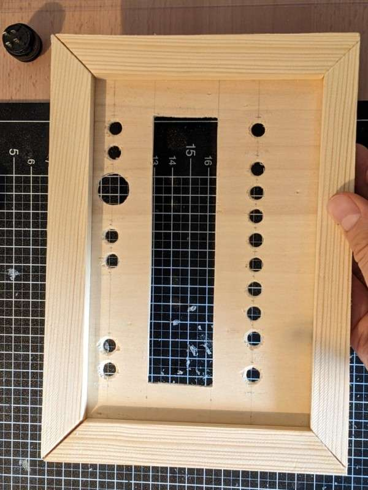
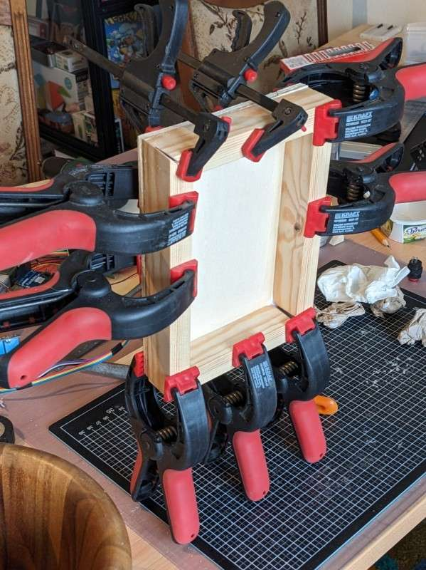
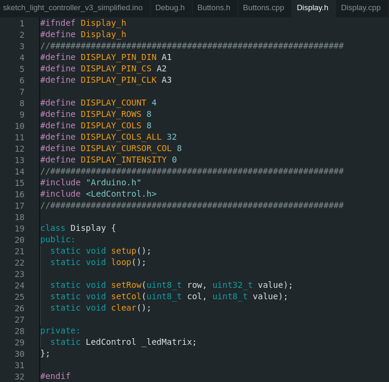
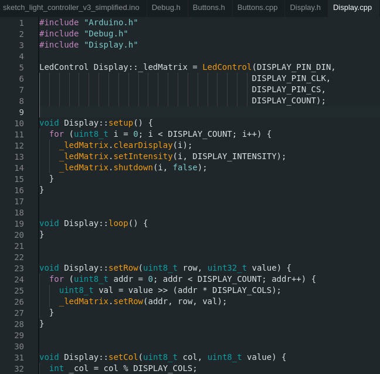

Alle Jahre wieder dekorieren meine Eltern ihren Garten mit seeehr vielen Lichterketten zur Weihnachtszeit. Wer zu viel Zeit auf Youtube verbringt weiß, dass manch andere sogar soweit gehen, ihre gesamte Weihnachtsbeleuchtung zu Musik zu synchronisieren. Das ist uns zu viel des Guten. Dennoch wollten wir mal ausprobieren, was mit sequenziellem Ein- und Ausschalten von Lichterketten in verschiedenen Mustern so an Effekten möglich ist.

**Die Idee: Eine Box auf Arduino-Basis,** in die man ohne Programmierkenntnisse eine Sequenz eingeben kann. Entsprechend dieser Sequenz werden anschließend Relais geschaltet, an denen je eine Steckdose verkabelt ist. An diese Steckdosen werden jeweils eine oder mehrere Lichterketten angeschlossen.

Nach vielem Grübeln, Löten, Sägen, Programmieren und Debuggen entstand schließlich folgendes:



**Die elektronischen Komponenten** für dieses Projekt sind nachfolgend aufgelistet. Ich habe sie allesamt bei [Funduinoshop.de](https://funduinoshop.com/) gefunden und beschafft, sie sind aber auch in anderen Shops weit verbreitet.

- Arduino UNO _(bzw. eine günstigere Drittanbieterversion)_
- 5V 8 Channel Relay Modul
- SD Speicherkartenmodul _(plus günstige SD-Karte)_
- LED-Matrix-Platine mit vier 8x8-Modulen und MAX7219-Treiber
- R16-503AD Schalter _(einrastend, mit roter LED, 16mm Gewinde)_
- 12x12x9mm Taster _(acht in rot, zwei in weiß)_
- diverse Widerstände

**Der Schaltplan** ist über mehrere Versuche hinweg gewachsen und sieht in der finalen Version wie folgt aus. LED und Schalter sind hier separat gezeichnet, da ich nichts passenderes in der [Fritzing-Software](https://fritzing.org/) gefunden habe.

Acht **digitale Pins** des Arduino _(D2-D9)_ sind mit je einem Relais verbunden. Das Speicherkartenmodul belegt weitere vier digitale Pins _(D10=CS, D11=MOSI, D12=MISO, D13=SCK)_. Die Relais können über einen Schalter in ihrer 5V-Stromzufuhr leicht ausgeschaltet werden. Da auch die Status-LED im Schalter diese Stromzufuhr nutzt, erlischt diese dann ebenfalls. Die Pins _D0_ und _D1_ bleiben ungenutzt, um die serielle Kommunikation beim Debugging / Programm-Upload nicht zu stören.

Drei **analoge Pins** sind mit der LED-Matrix verbunden _(A1=DIN, A2=CS, A3=CLK)_. Zwei weitere sind für die Vorwärts- und Rückwärts-Taste im Einsatz _(A4/A5)_. An dem verbleibenden analogen Pin _(A0)_ sind acht Taster per "Widerstandsleiter" angeschlossen. Dadurch kann der gedrückte Taster über die anliegende Spannung identifiziert werden - siehe nachfolgendes Video. Es kann aber stets nur ein Taster zeitgleich gedrückt werden.



**Das Gehäuse** besteht aus zwei Teilen mit DIN-A5-Sperrholzplatten als Grundfläche. Diese bekommen jeweils einen Rahmen aus passend zugesägten Leisten (20x10mm bzw. 20x30mm Querschnitt). Am schwierigsten war es, ein Rechteck für die LED-Matrix mit dem Dremel auszufräsen. Einige Löcher musste ich zudem wieder zuspachteln, da ich ursprünglich mit mehr Tasten geplant hatte.

**Die Programmierung** geschieht in der Sprache C++ und ist in mehrere Module/Klassen aufgeteilt.

- **sketch\[...\].ino**: Einstiegspunkt, welcher den einmaligen _setup_\- und die regelmäßigen _loop-_ Aufrufe an die nachfolgenden Module weiterreicht.
- **Debug:** Ausgaben via _Serial Monitor_ zur Fehlersuche, Diese sollen sich eigentlich per _#define DEBUG false_ deaktivieren lassen, aber das funktioniert nicht ... also lasse ich sie erstmal drin.
- **Buttons**: Eingaben über die Taster erkennen und interpretieren.
- **Display:** Sequenz über die LED-Matrix ausgeben.
- **Storage:** Lesen / Ändern der Sequenz auf der SD-Karte.
- **Controller:** Aktionen auf Basis von Benutzereingaben oder Zeitintervallen ausführen, Steuert zudem die Relais.

Die **Header-Dateien** mit Endung _.h_ bilden die Grundlage für jedes Modul. Hier lassen sich Vorgaben anpassen, wie z.B. die Belegung der Pins ( _#define ..._). Ferner wird die Grobstruktur des zugehörigen Codings definiert ( _class ... public ... private ..._) und bei Bedarf Coding von anderen Stellen eingebunden ( _#include ..._).

Die **Quellcode-Dateien** mit Endung _.cpp_(C++) enthalten das eigentliche Coding je Modul. Die Unterteilung erfolgt entsprechend der Struktur aus der zugehörigen Header-Datei.

Hier zwei Screenshots aus _Display.h_ und _Display.cpp_ als Beispiele. Das vollständige Coding kann [hier auf Github](https://github.com/brickup-de/arduino-light-controller) eingesehen und heruntergeladen werden.
