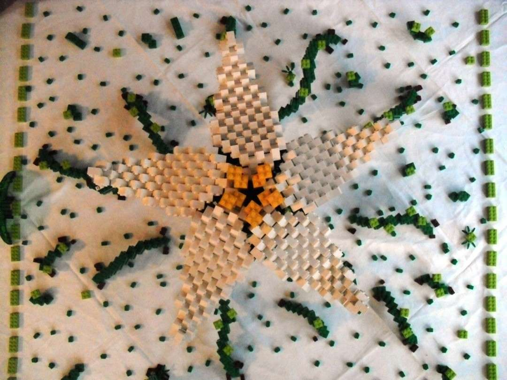
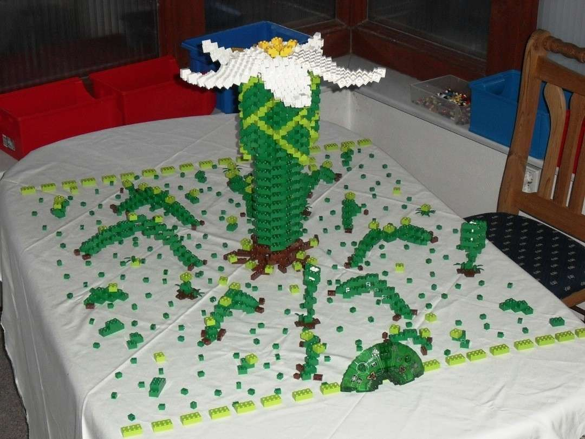
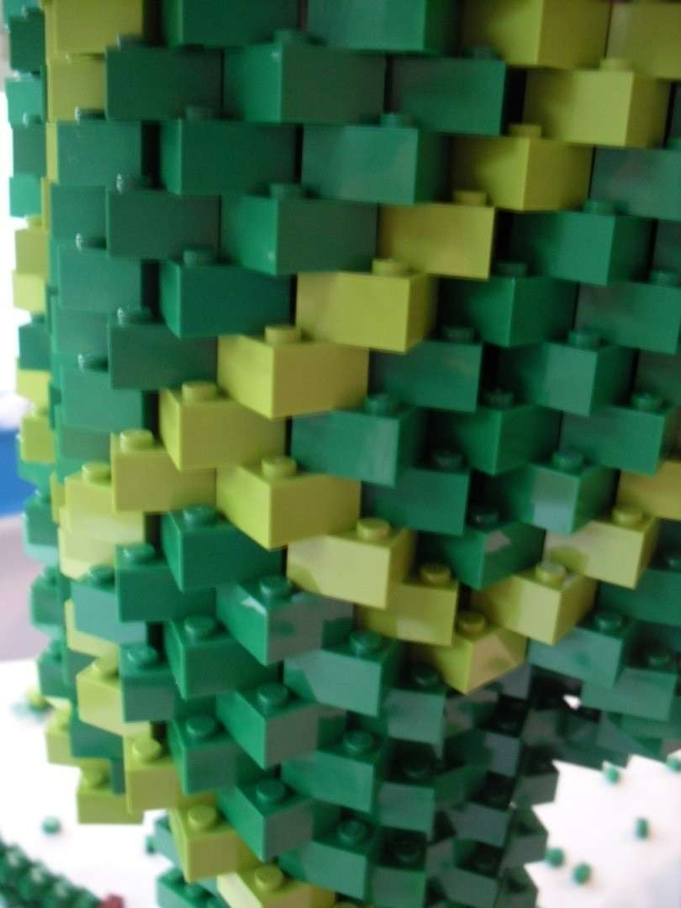

Willkommen auf der grünen Seite von Lego. Ist es nicht schön zu wissen, dass auch diese Plastiksteinchen im Frühling blühen und gedeihen können. Dennoch ist auch die grünste Legoskulptur leider nicht biologisch abbaubar - mein aufrichtigstes Bedauern an dieser Stelle.

