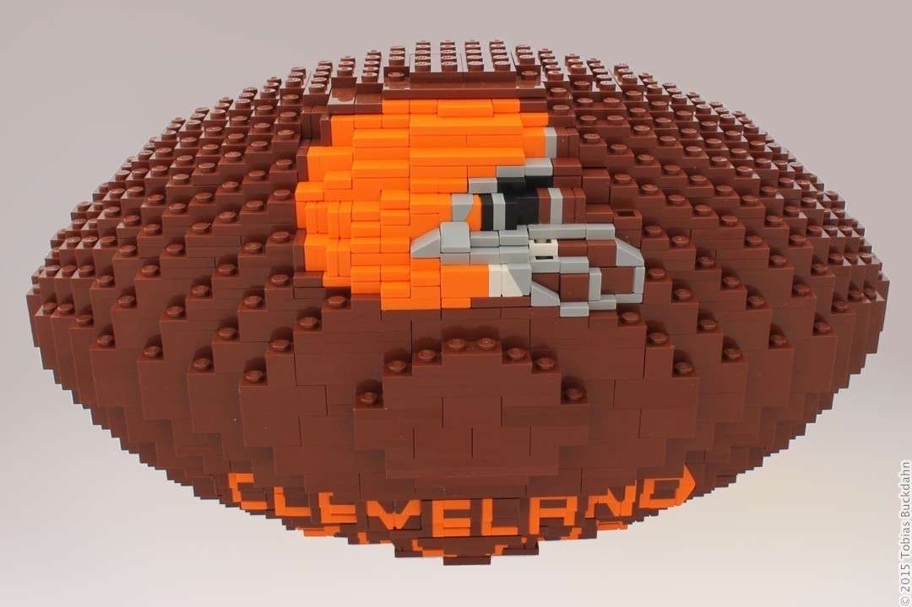
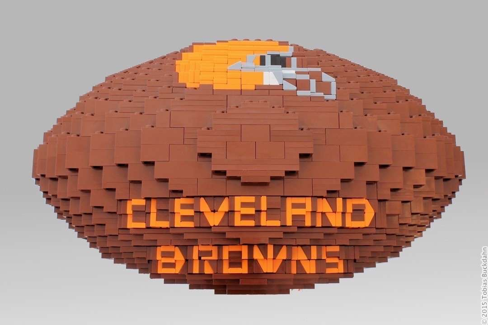
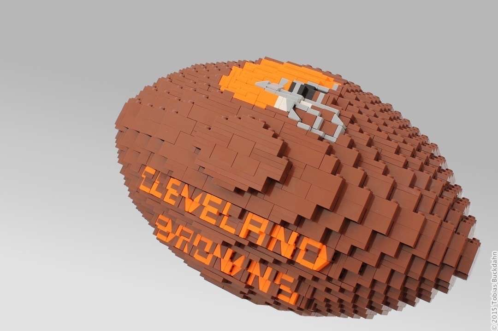

---
categories:
  - skulptur
cover:
  alt: IMG_5557
  image: IMG_5557.jpg
date: "2015-11-24T20:29:44+00:00"
tags:
  - braun
  - orange
title: Cleveland Browns Football
url: /2015/cleveland-browns-football
---

Seit meinem [ersten Football-Modell](/2013/football/) sind nun schon bald zwei Jahre ins Land gegangen. In dieser Zeit habe ich des Öfteren Fragen zu dem Modell zugeschickt bekommen. Eine besondere Anfrage erreichte mich im Mai diesen Jahres. Eine Schweizerin war auf der Suche nach einem Hochzeitsgeschenk und ist dabei auf eben dieses Modell von mir gestoßen.

Nach einem regen Mailwechsel hatte sie mir geschildert, wie sie sich einen passenden Football vorstellte. Er sollte das Logo der Cleveland Browns tragen, da der Beschenkte dem Team sehr verbunden ist. In den folgenden Monaten habe ich dann diverse Abende geplant und gebaut, um diesen Wunsch wahr werden zu lassen.

Das Logo erwies sich als besondere Herausforderung. Der Schriftzug ließ sich relativ intuitiv umsetzen. Der Helm jedoch mit seinen dünnen Visier-Linien machte es mir nicht leicht. Das Glücksgefühl, als das Modell dann schließlich fertig vor mir stand, war umso größer.

Im September machte sich der Football dann per Post auf den Weg in Richtung Schweiz. Dort kam er rechtzeitig für die Hochzeit an und erwies sich als die perfekte Überraschung. Ich bin überglücklich, dass alles so gut geklappt hat.

An dieser Stelle möchte ich noch dem Ehepaar viel Glück und Freude für die gemeinsame Zukunft wünschen. Auf das die Steine dieses Modells die einzigen bleiben, die man euch in den Weg legt, und ihr genau wie sie zusammenhaltet.
