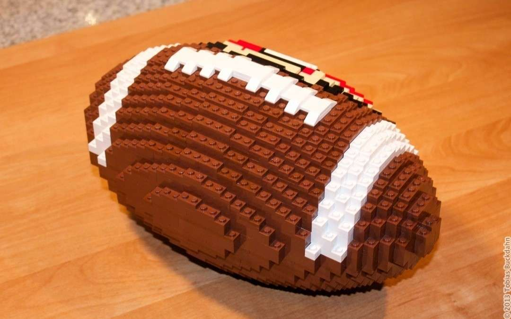
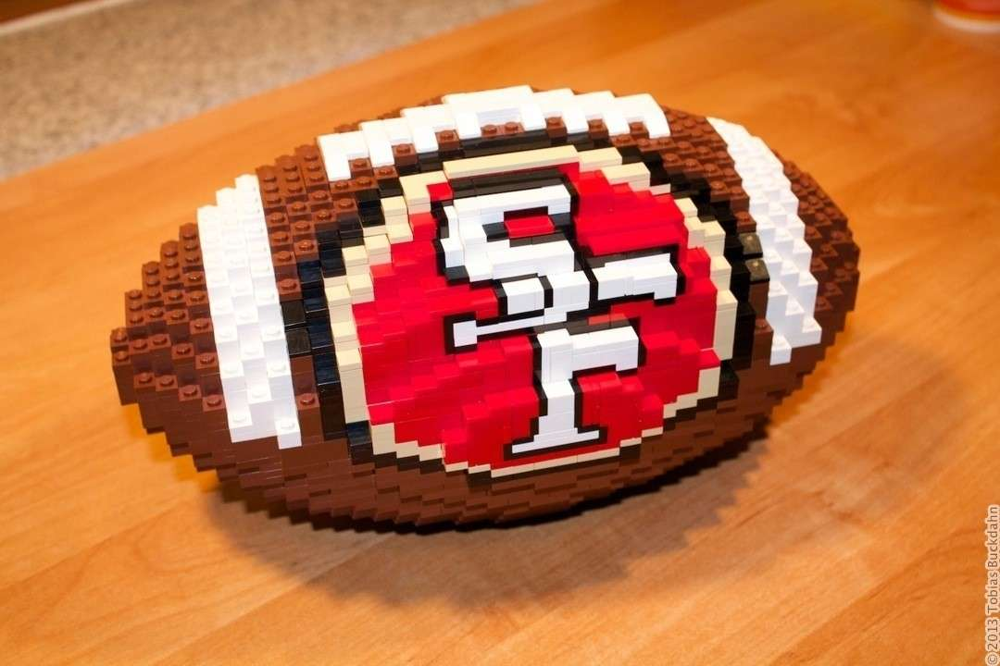

---
category:
  - skulptur
cover:
  alt: Football
  image: IMG_2447.jpg
date: "2013-12-24T10:00:12+00:00"
tag:
  - braun
  - rot
  - weiß
title: SF 49ers Football
url: /2013/football
---

**"Hmm, so ein Legomodell wäre doch eigentlich eine super Geschenkidee"**. Mit eben jenen Worten begann die Geburt dieses Legomodells Ende September 2013. Es war ein ganz normaler Tag im Leben eines Studenten, als Jenny Krüger ihre Vision für ein Weihnachtsgeschenk an mich herantrug. Sie wünschte sich einen Football in Originalgröße - gebaut aus Legosteinen und verziert mit dem Logo der San Francisco 49ers. Das Ganze wäre ein perfektes Weihnachtsgeschenk für ihren Freund, der selbst leidenschaftlicher Footballfan und -spieler ist.

Da ich von Football so gut wie nichts wusste (außer, dass der gleichnamige Ball nicht rund ist), bekam ich zunächst ein paar Referenzbilder und -maße zugeschickt. Anschließend begann ich mit den Vorbereitungen und dem Bau. Die braunen Steine besaß ich glücklicherweise bereits aufgrund meines [Giraffenprojektes](/2013/giraffe/ "Giraffe"), sodass insgesamt nur wenige Steine fehlten.

An dieser Stelle sei erwähnt, dass ich selten etwas so schwieriges wie das Logo auf diesem Modell gebaut habe. Das Herausfordernde war, dass es durch die Form des Footballs verzerrt wird. Zudem sind die beiden Buchstaben des Logos dünn schwarz umrandet - ein Detail, dass man für einen Fan nicht einfach weglassen kann.

Alles in allem war es eine abenteuerliche Herausforderung, und ich bin überglücklich, sie gemeistert zu haben. In dem folgenden Video seht ihr die **Entstehung der Skulptur im Zeitraffer**. In echt hat der Bau des Modells 12 Stunden gedauert - verteilt über ungefähr eine Woche.

_Das Video ist leider nicht mehr online_

**Memo an mich selbst:** Ich notiere diese Errungenschaft auf der Liste meiner großen sportlichen Leistungen und streiche das Wort "Sportmuffel" mit sofortiger Wirkung aus meinem Charakterzeugnis.
