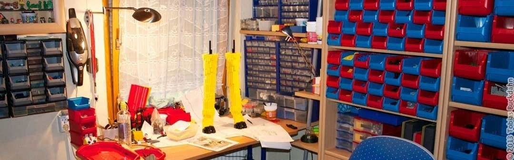
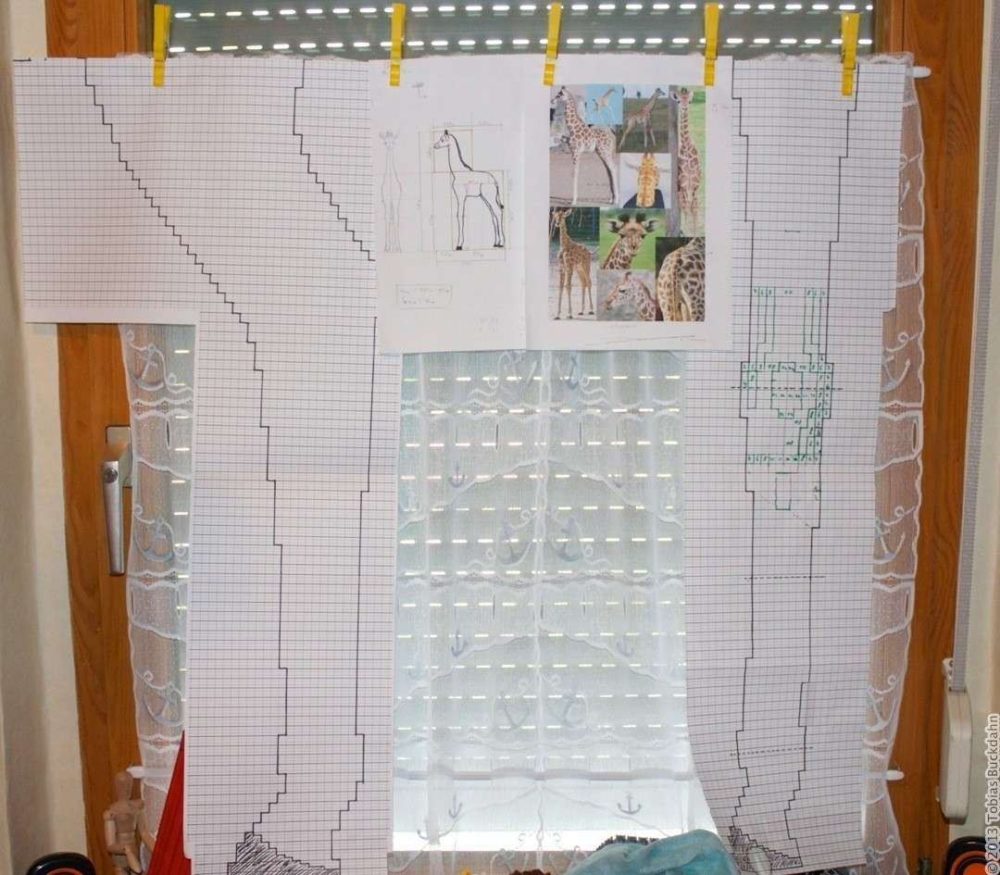
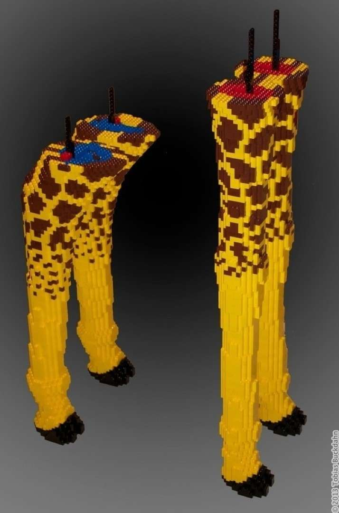
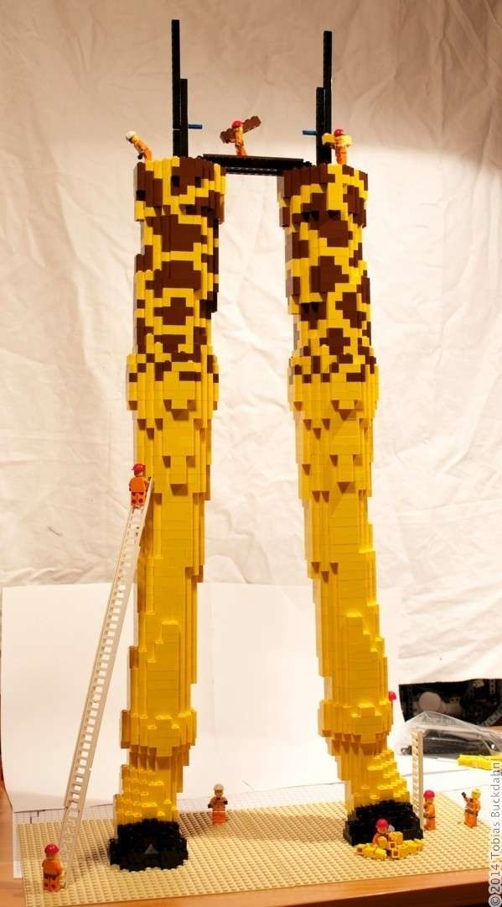
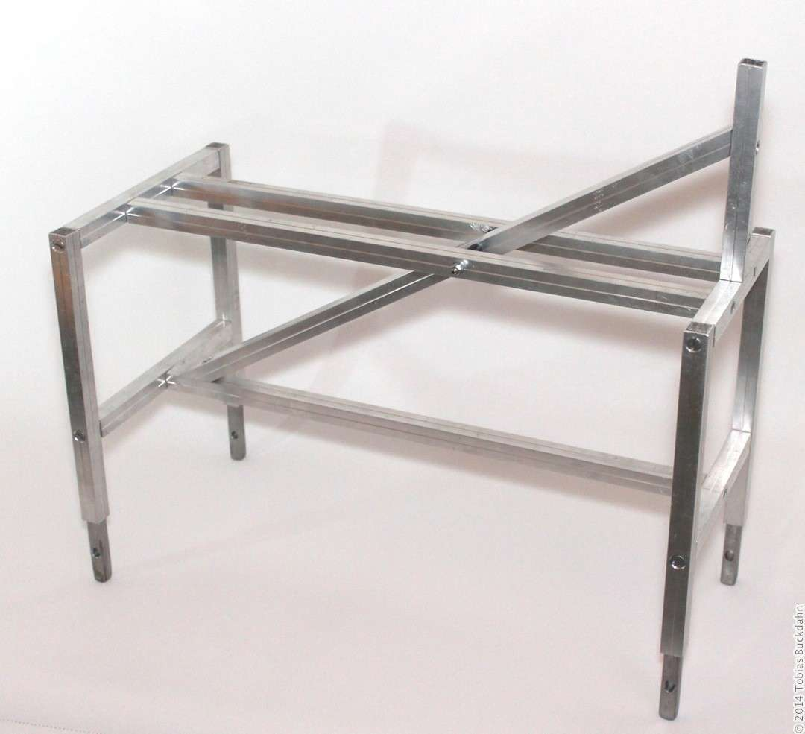
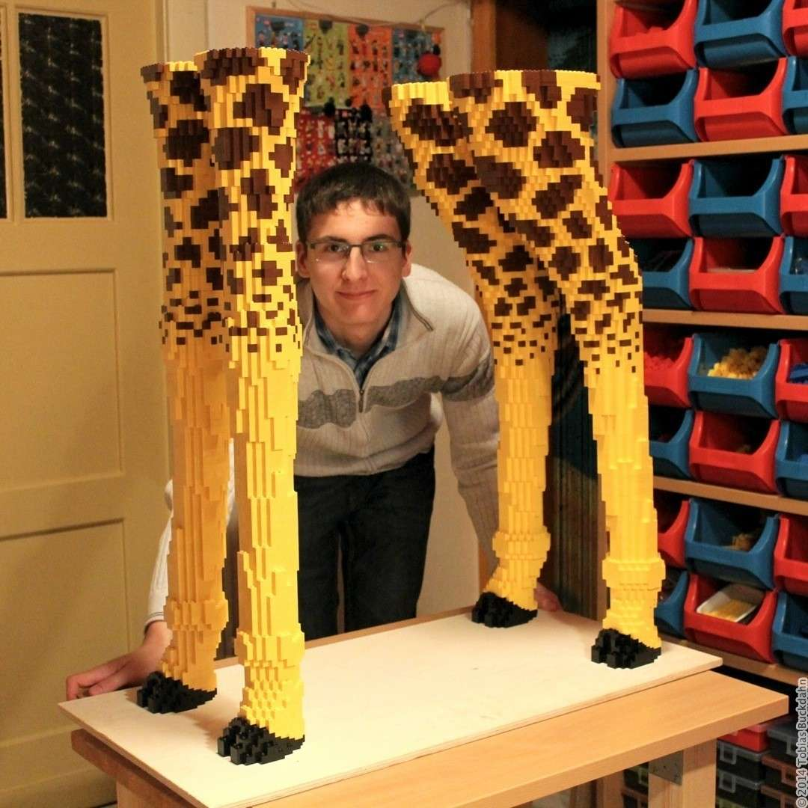
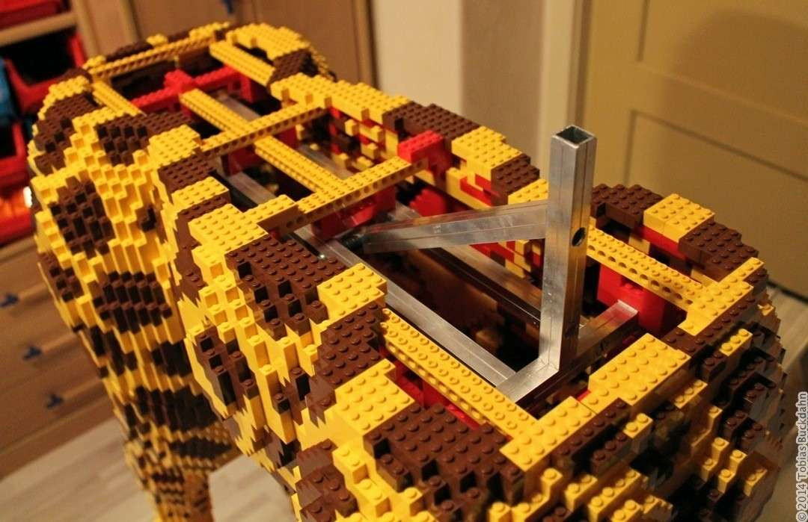
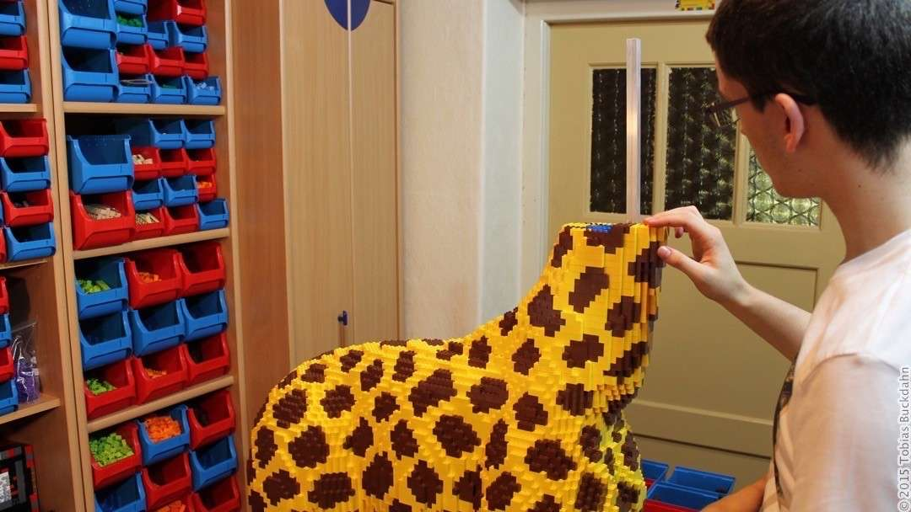
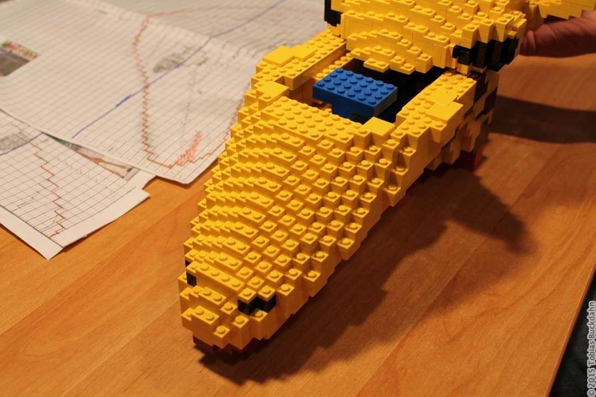

---
categories:
  - lego
  - skulptur
cover:
  alt: komplette Giraffe
  image: IMG_2873.jpg
date: "2015-01-30T09:40:44+00:00"
tags:
  - braun
  - gelb
  - tier
title: Giraffe
url: /2015/giraffe
---

**Aus der Frühlingskollektion "versteinerte Zootiere"** präsentieren wir Ihnen stolz das Modell Giraffenbaby. Farbecht und garantiert flusenfrei besticht es durch seine Lebensgröße und das zeitlos-stylische Fleckenmuster.

Nach 16 Monaten der Planung und Steinebeschaffung, des Aufbauens, Wieder-Einreißens und Neubauens ist mein bisher größtes Projekt endlich vollendet. Das folgende Video zeigt den Bau im Zeitraffer. Allerdings lief dieses Projekt nicht so reibungslos, wie es sich im Film darstellt. Im Folgenden alle Details.

_Das Video ist leider nicht mehr online._

### Wie alles begann

**Wir schreiben das Jahr 2013:** knappe 13,8 Milliarden Jahre nach dem Urknall sitzt ein tatenfroher Legofan inmitten seiner Sammlung und grübelt über sein nächstes Modell nach. Sein Blick fällt auf die randvollen Kisten gelber Steine ... es muss etwas gelbes werden ... gelb, gelb, gelb, hmm ... zack, boom, eine Giraffe - der Fall ist klar.

Ohne böse Vorahnung steht plötzlich die Frage im Raum, wie groß eigentlich eine Giraffe wird. Eine Recherche im [Standard-Nachschlagewerk eines Studenten](https://de.wikipedia.org/wiki/Giraffe "Wikipedia-Artikel zu Giraffen") offenbart die beeindruckende Größe von bis zu sechs Metern. Ein satter Dämpfer für das ergeizige Vorhaben. Aber ein Jungtier ist "nur" ungefähr **1,80m groß**. Ein Hoch auf die Jugend ... !

Mit einer großen Ladung Optimismus startete ich in mein bisher größtes Projekt, welches mich einiges an Zeit und Nerven kosten sollte ... aber dafür umso mehr Spaß und Spannung bereithielt.

### Der erste Versuch

Der erste Monat verging allein für die **Planung**. Bildmaterial zusammentragen, Zeichnungen erstellen, Körpermaße berechnen. So entstand schließlich eine **Seitenansicht in Originalgröße** \- allein dieser wirkte bereits durchaus beeindruckend.

Für die **Konstruktion** der Giraffe hatte ich mir überlegt, die Beine mit senkrechten [Techniksteinen](http://www.bricklink.com/catalogItem.asp?P=32278 "Techniksteinen") zu stabilisieren (im Nachhinein betrachtet eindeutig nicht meine beste Idee). Zuversichtlich ging ich ans Werk. Schicht für Schicht entstanden in den ersten Monaten die Vorderbeine der Giraffe. Alles verlief traumhaft ... doch dann kamen die Hinterbeine!

Bis dato hatten die zierlichen Plastik-Techniksteine die massiven Beine aufrecht halten können. **Die hinteren Oberschenkel** allerdings überforderten diese Bautechnik maßlos. Auch ohne das Zusatzgewicht des Oberkörpers bogen sich die Hinterbeine gefährlich nach vorne durch. Die Physik tanzte meinem Bauvorhaben auf der Nase herum, also blieb mir nichts anderes übrig, als meine Vorgehensweise zu überdenken.

### 

### Der zweite Versuch

Bei dieser Größe scheint die Umsetzung als eine reine Legokonstruktion ein hoffnungsloses Unterfangen. Da ich von grundauf neu anfangen musste, begann ich, die Beine Schicht für Schicht wieder abzubauen. Jede Schicht wurde dabei auf Papier genau dokumentiert.

Um bei der Stabilität keine Rückschläge mehr zu erfahren, entstand ein **metallenes, modulares Gestell**. Als Rohmaterial dienten hohle Vierkant-Aluminiumrohre, die im Querschnitt beinahe exakt die Größe eines 2x2-Steines besitzen. Über gebogene Stahlstücke ließen sie sich miteinander verbinden. Kurzgesagt: Eine massive Konstruktion, die es mit jeder Plastikmasse aufnehmen kann ...

Derart aufgerüstet war der Neubau der Beine relativ problemfrei. Mit den Bauplänen aus dem ersten Versuch entstanden die vier Giraffenbeine innerhalb von 3 Wochen komplett neu. Mit diesem Projektstand endete das Jahr 2013. Bis zu diesem Zeitpunkt hatte ich übrigens **ca. 8.000 Legosteine** für dieses Projekt angeschafft.

### Der Oberkörper

Im Februar 2014 begann schließlich die nächste Bauphase der Skulptur: Der Oberkörper. Innerhalb von zwei Monaten fanden zwölf Kilogramm Legosteine ihren Weg an das solide Metallgestell. Zusammen mit diesem lasteten inzwischen **circa 15 Kilogramm** auf den schlanken vier Giraffenbeinen.

Einen weiteren Monat später kam ein 3 Kilogramm schwerer Hals hinzu. Doch noch immer war der Steinehunger des Modells nicht gestillt.

### 

### Der Kopf

Der Bau des Kopfes war ein Teil des Projektes, den ich lange hinaus gezögert habe. Schließlich ist er maßgeblich dafür, ob das gesamte Modell am Ende gut wirkt ... wer möchte schon eine Giraffe mit Picasso-Kopf.

Ich plante lange hin und her, um mir ein gutes Bild von dem fertigen Kopf zu machen. Da mir die Form jedoch recht schwer erschien, unterteilte ich den Bau in zwei Hälften. Zunächst ging es an die obere Hälfte mit Augen und Ohren. Die - für mich schwierigere - untere Hälfte folgte danach. Sie musste sowohl zum oberen Part als auch zum bereits entstandenen Hals passen. An dieser Stelle waren besonders die braunen Flecken auf dem Fell nicht zu unterschätzen.

Ich war überglücklich, als ich am 22.09.2014 den letzten Stein setzen konnte. Ein wirklich tolles Gefühl, so etwas großes zu vollenden.
