---
category:
  - lego
  - programmierung
  - roboter
cover:
  alt: Screenshot-20230801210254-1910x1075_copy
  image: Screenshot-20230801210254-1910x1075_copy.jpg
date: "2023-08-01T19:21:06+00:00"
tag:
  - schwarz
  - weiß
title: Glockenspieler
url: /2023/glockenspieler
---

In diesem Artikel möchte ich die Entstehungsgeschichte meines Glockenspiel-Roboters mit euch teilen. Das [Coding zum Roboter](https://github.com/brickup-de/glockenspieler) findet sich auf Github. Hier verlinkt findet ihr [eine ungeschnittene Aufnahme vom letzten Stand](https://www.youtube.com/watch?v=fla_-r296p8) des Roboters:

[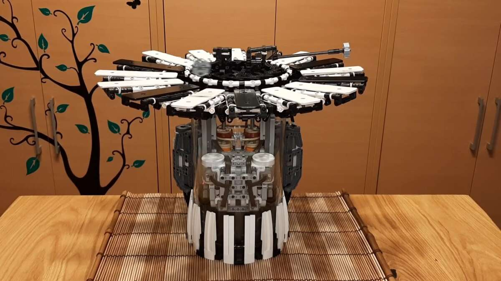](https://www.youtube.com/watch?v=fla_-r296p8?t=244) _Ungeschnittene Aufnahme des Glockenspielers_

---

### Die Inspiration

Im Januar 2022 bin ich auf Youtube über [dieses](https://www.youtube.com/watch?v=uozoLwVdnQo#) [Video](https://www.youtube.com/watch?v=uozoLwVdnQo#) des [Kanals TechNewRobot](https://www.youtube.com/@technewrobot2147/videos) gestolpert. Dort spielt ein Lego-Roboter souverän ein klassisches Lied (Bach Menuett in G-Dur) auf einem Glockenspiel.

[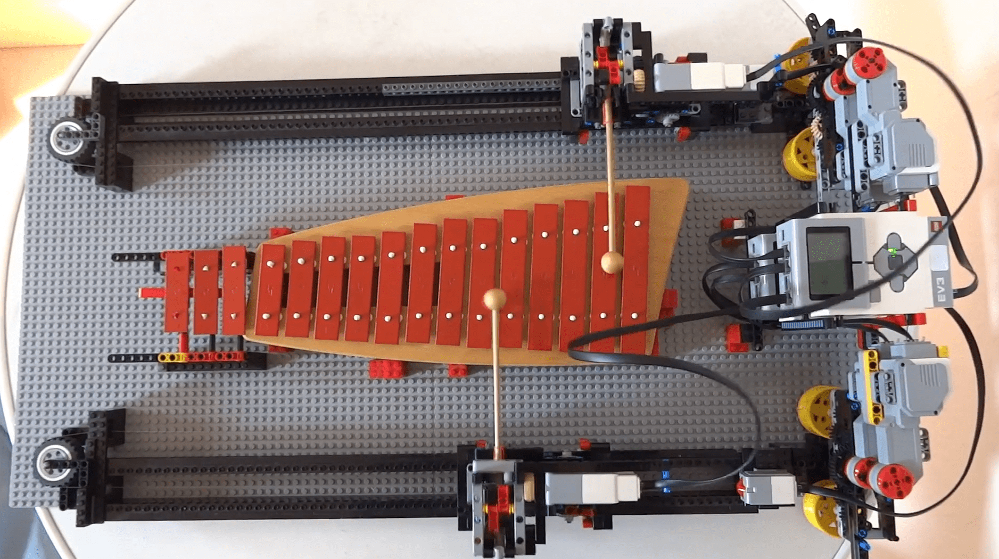](https://www.youtube.com/watch?v=uozoLwVdnQo)_"Lego mindstorms robot playing Bach..." - by TechNewRobot_

Besonders faszinierend finde ich die elegante Umsetzung: Die Schlägel sitzen auf zwei **parallelen zum Instrument verlaufenden Schienen**, auf denen sie per Seilzug bewegt werden. Jeder Schlitten umfasst ein Schlagwerk mit Motor. Durch deren Konstruktion ist nur eine halbe Motorumdrehung ohne Richtungswechsel für **sehr kräftige Schläge** notwendig:

[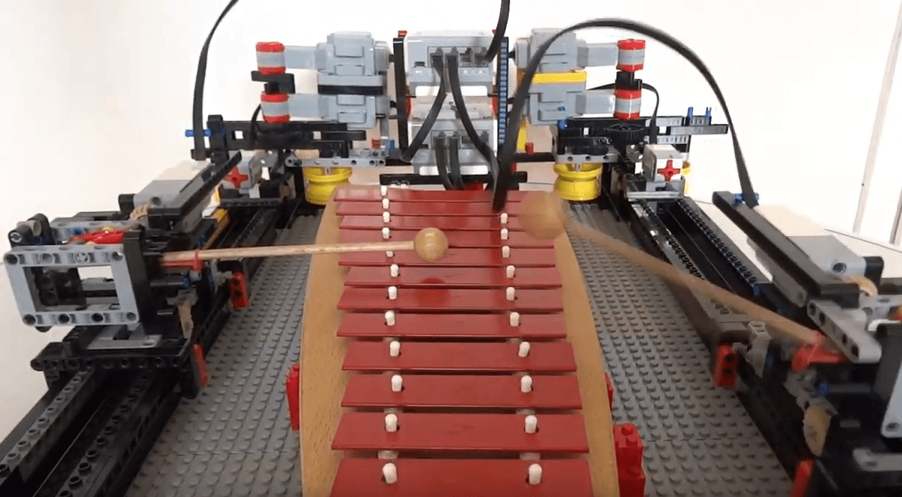](https://www.youtube.com/watch?v=uozoLwVdnQo) _Frontansicht_

Ferner muss so **relativ wenig Masse bewegt** werden - was [gegenüber komplett fahrenden Robotern](https://www.youtube.com/watch?v=gY7URM9KEUI) schnellere Lieder ermöglicht. Und durch die gradlinige Schlittenbewegung wird jeder Klangstab genau in der Mitte getroffen - was [ohne Umherfahren schwierig](https://www.youtube.com/watch?v=lQLhOskZf24) ist.

### Mein selbstgestecktes Ziel

Ich habe mir dieses Video immer und immer und immer wieder angeschaut - einfach wundervoll! Doch was mir auffiel: Um die "zuschlagenden" Motoren auf ihren Schlitten schnell zur richtigen Note zu fahren, braucht es die Kraft von **vier** Motoren. Ließe sich dieser Kraftaufwand vermeiden?

Und warum muss sich der Roboter überhaupt so sehr der Form des Instruments anpassen? **Könnte sich das Instrument nicht dem Roboter anpassen?**

Man könnte doch auch zum Beispiel die Klangstäbe um den Roboter herum anordnen. Wie es unter anderem [in diesem Video von faian000re](https://www.youtube.com/watch?v=bZuUAe4BuUY) zu sehen ist:

[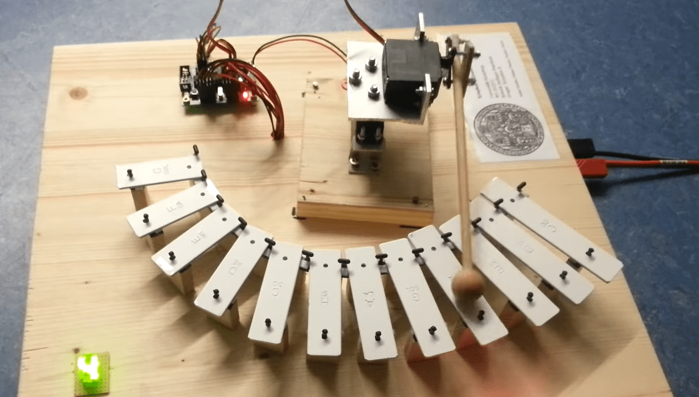](https://www.youtube.com/watch?v=bZuUAe4BuUY)_"Presentation of the xylophone robot" - by faian000re_

Bisher schien niemand die "Schlagkraft" [aus dem genannten Lego-Video](https://www.youtube.com/watch?v=uozoLwVdnQo#) mit solch einer kreisförmigen Anordnung kombiniert zu haben. Natürlich gibt es bereits andere, [echt beeindruckende Glockenspielroboter](https://www.youtube.com/watch?v=69pGYTYSEug) da draußen. Aber eben keine kreisrunden lautstarken aus Lego.

[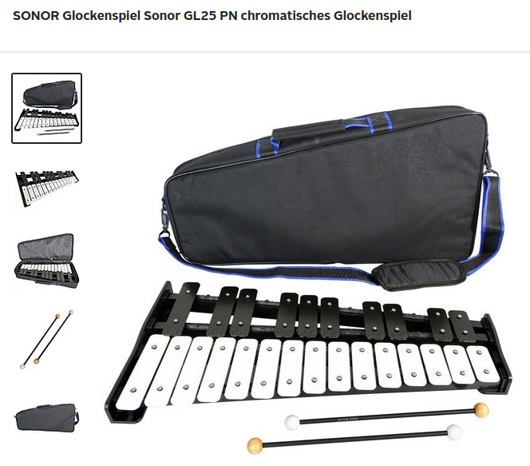](https://www.otto.de/suche/sonor%20chromatisches%20glockenspiel%20gl25%20pn) _Mein Glockenspiel auf Otto.de_

Die Idee faszinierte mich. Und so kam es dann, dass ich mir Ende Februar 2022 [bei Otto ein Glockenspiel](https://www.otto.de/suche/sonor%20chromatisches%20glockenspiel%20gl25%20pn) bestellte. Es war **der Beginn meiner mehrmonatigen Reise** an die Grenzen meiner mechanischen, musikalischen und informationstechnischen Fähigkeiten, die ich hier mit euch teilen möchte.

### Die ersten Ideen

Eines war mir direkt klar: Wenn ich die Klangstäbe schon frei anordne, dann sollen sie einen Kreis bilden. Denn es gibt keine elegantere Form als einen Kreis ( [Hexagons einmal ausgenommen](https://www.youtube.com/watch?v=thOifuHs6eY)).

Auf dieser Grundlage entstand der erste greifbare Entwurf...

[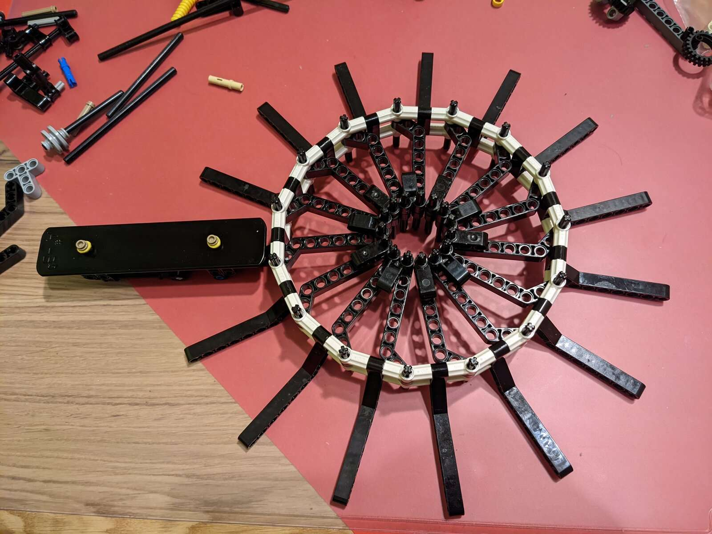](PXL_20220223_220652941_copy.jpg)

... verbunden mit der rein ästhetischen Frage, wie die Klangstäbe später angeordnet sein sollten. Eine Entscheidung von absolut niedriger Priorität ... aber sie regt die Fantasie an.

[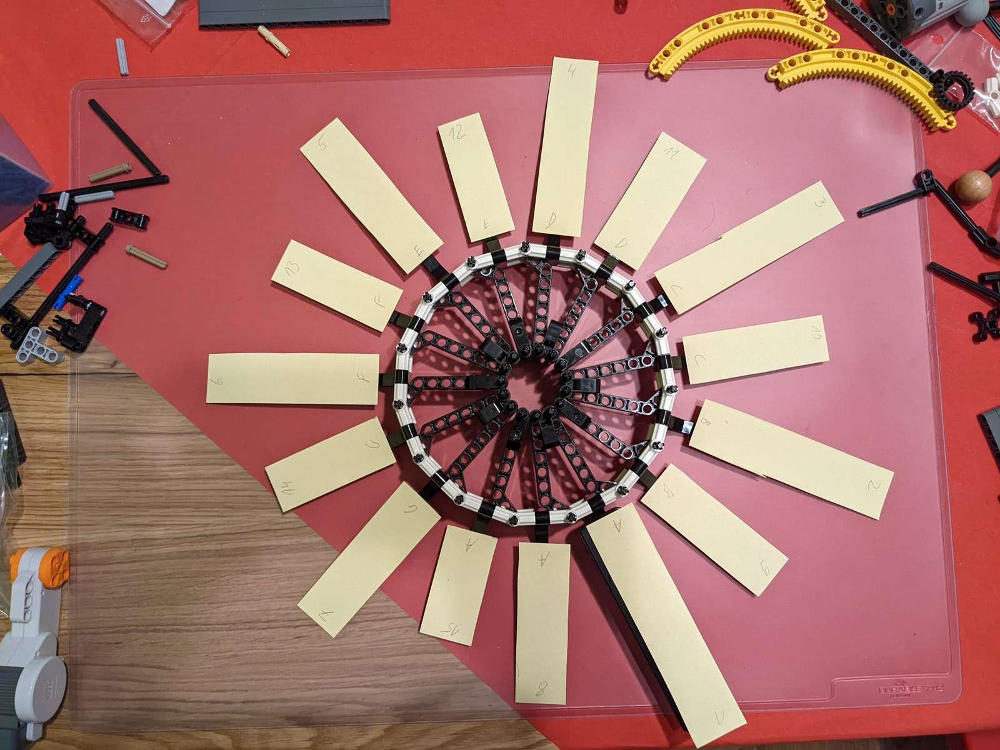](PXL_20220224_223647417_copy.jpg)[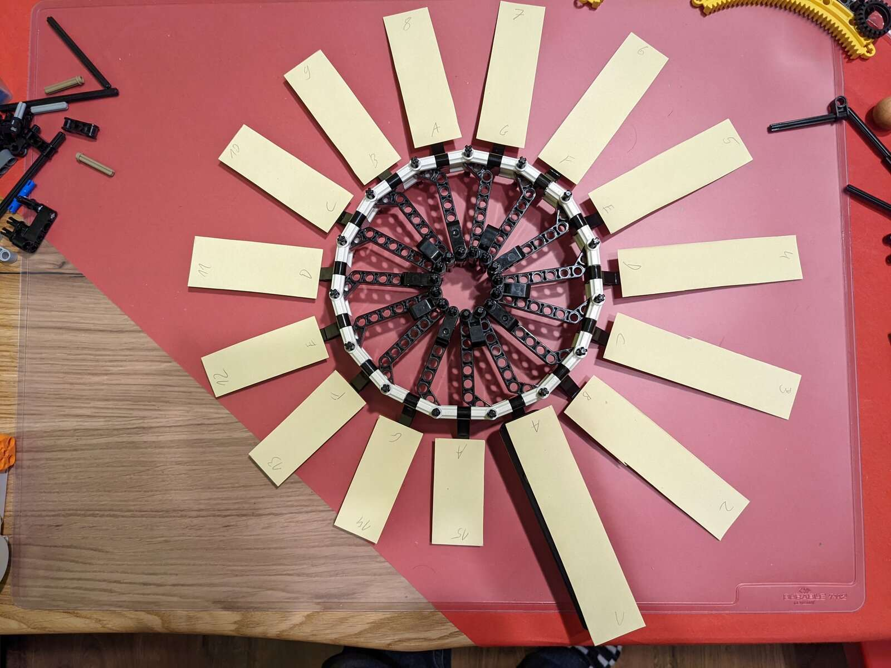](PXL_20220224_223312404_copy.jpg)

**Das große Problem** wurde aber schon jetzt ersichtlich: Wie soll der notwendige Elefant an Mechanik in den kleinen Porzellanladen in der Mitte passen? Von [den keulenförmigen NXT-Motoren](https://www.bricklink.com/v2/catalog/catalogitem.page?S=9842-1) ganz zu schweigen.

**Idee #1:** Wie wäre es mit einer Konstruktion, bei der jeder Klangstab seinen eigenen Schlägel fest verbaut bekommt? Dieser wäre per Angelsehne oder ähnlichem mit der eigentlichen Mechanik "unter der Oberfläche" verbunden. Das Problem, schnell die richtige Note anzusteuern, ließe sich so an eine Stelle verlagern, an der mehr Platz für dessen Lösung ist.

[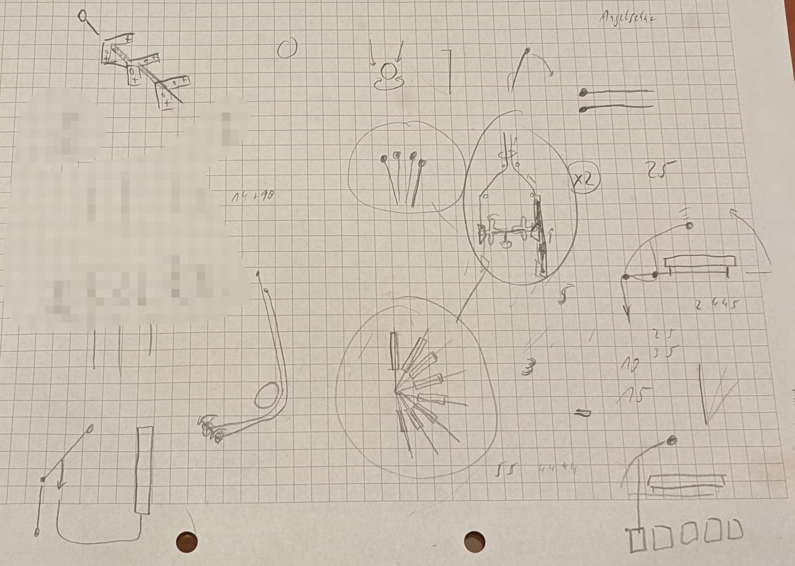](PXL_20220223_220726684_copy.jpg) _Meine damaligen Skizzen zu der Idee_

... ein wesentlicher Bestandteil wäre dann wohl aber ähnlich [der Konstruktion aus diesem Video](https://www.youtube.com/watch?v=mXg1gSwyfe0) aufgebaut - nur in Kreisform.

[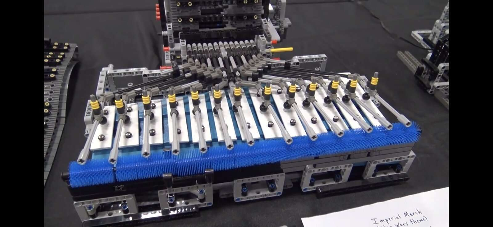](https://www.youtube.com/watch?v=mXg1gSwyfe0)_"Self-Playing LEGO Xylophone" - by Kevin Darke_

**Ja, aber:** Möchte ich wirklich ein Dutzend Angelsehnen (oder ähnliches) quer durch die Mitte meines Modells spannen? Ein Zerlegen des Roboters für den Transport wäre damit unmöglich. Und wartbar klingt das auch nicht. Hmm ... also weiter überlegen.

**Deshalb Idee #2:** Inspiriert von [einem meiner Lieblings-Youtuber](https://www.youtube.com/watch?v=IvUU8joBb1Q) habe ich mir sehr eine Lösung mit Murmeln gewünscht. So würde die Schwerkraft das Problem mit der Schlagkraft übernehmen. Die Mechanik müsste "nur" gefallene Murmeln durch die Mitte wieder nach nach oben "pumpen" ( [zum Beispiel so](https://www.youtube.com/watch?v=ErfxCg1pqMw)) und in die richtige Richtung fallen lassen.

[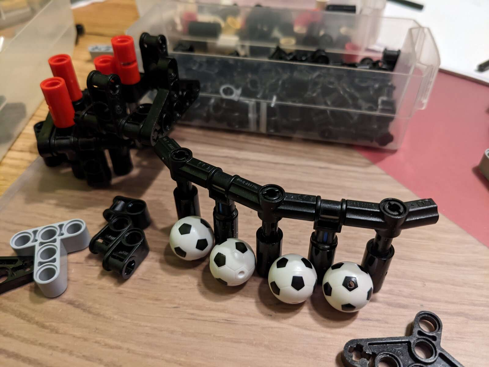](PXL_20220313_201159566_copy.jpg) _Idee für ein Murmel-Reservoir je Klangstab_

Hier ein Beispiel [aus](https://www.youtube.com/watch?v=S1r2nod1NoI) [d](https://www.youtube.com/watch?v=S1r2nod1NoI) [e](https://www.youtube.com/watch?v=S1r2nod1NoI) [m](https://www.youtube.com/watch?v=S1r2nod1NoI) [Video "legophone" von hugolinvh](https://www.youtube.com/watch?v=S1r2nod1NoI), wie so eine Konstruktion grob aussehen könnte:

[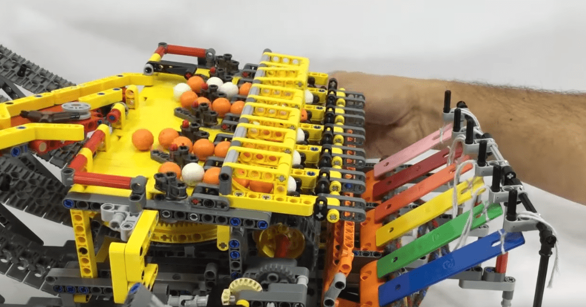](https://www.youtube.com/watch?v=S1r2nod1NoI) _legophone by hugolinvh_

**Ja, aber:** All das würde wohl viel mehr Probleme schaffen als überwinden. Hunderte lose Murmeln auf engstem Raum dazu zu bewegen, genau zur richtigen Zeit an die richtige Stelle zu rollen ... schwierig. Besser wäre, wenn alle Bestandteile mechanisch direkt verbunden wären.

**Damit zu Idee #3:** In der Mitte des Kreises wird eine Wippe aufgehangen, die an beiden Enden Schlägel befestigt hat. Daran werden zwei Motoren angeschlossen. Der eine dreht die komplette Wippe so, dass ein Ende auf die gewünschte Note zeigt. Der andere Motor kippt die Wippe derart, dass das richtige Ende auf die Note schlägt. Um beide Drehungen durch die gleiche Achse in der Mitte zu leiten wollte ich [das abgebildete "Turntable"-Bauteil](https://www.bricklink.com/v2/catalog/catalogitem.page?P=99009c01#T=C) und [zwei dieser 90°-Zahnrädern](https://www.bricklink.com/v2/catalog/catalogitem.page?P=32072&idColor=3#T=C&C=3) verwenden.

[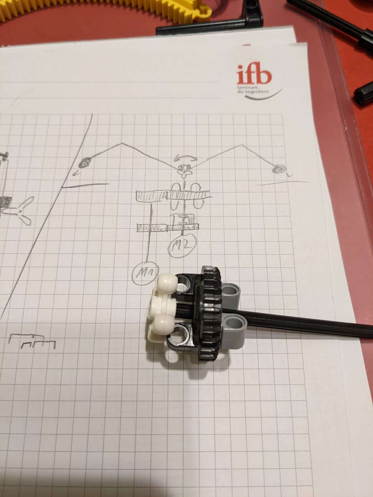](PXL_20220224_215256951_copy.jpg) _Damalige Skizzen und Bauteile für die Wippen-Idee_

**Diese Idee empfand ich als vielversprechend.** Mit nur zwei Motoren könnte ich damit schnell jede beliebige Note schlagen. Mehr als eine Viertel Drehung der Wippe sollte nie zur nächsten Note fehlen. Keine Schnüre, keine Murmeln, keine losen Bauteile, durchgängige mechanische Verbindungen.

Das sollte doch funktionieren ... ... oder nicht?

### Zwei Bewegungen mit einer Achse

Entsprechend dieser Idee habe ich zunächst versucht, **zwei Drehbewegungen um dem gleichen Mittelpunkt** herum zu erzeugen. Dabei kam folgender Motorblock heraus. Ein Motor dreht den schwarzen Außenrand des "Turntable"-Teils, der andere Motor dreht eine Achse in dessen Mitte.

[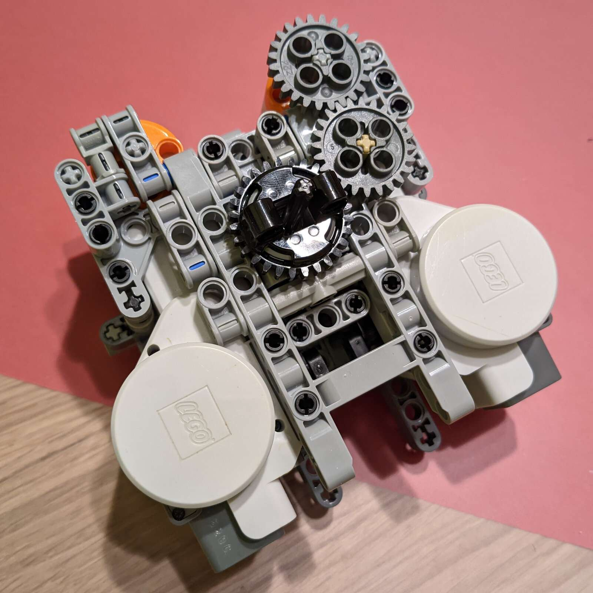](PXL_20220307_203403156_copy.jpg) **Oberseite**[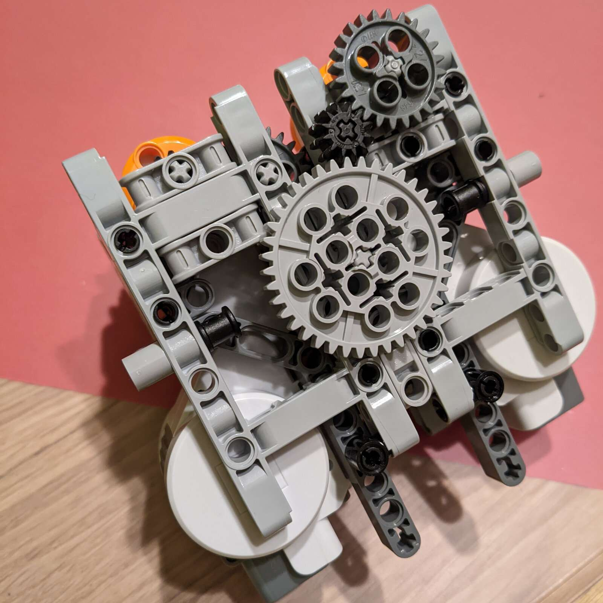](PXL_20220307_203414664_copy.jpg) **Unterseite**

**Nachteil hiervon**: Die äußere Drehachse lässt sich deutlich schwerer verlängern als die innere. Ergo müssten die Schlägel nahe am klobigen Motorblock liegen. Es wäre sehr viel praktischer, wenn man beide Bewegungen mit einer einzigen Technik-Achse übertragen bekäme.

Als einzige weiterer Bewegungsfreiraum einer rotierenden Achse fiel mir nur **Heben/Senken** ein. Ergo habe ich einen Prototypen genau dafür gebaut: Ein Motor dreht die Achse, der andere hebt und senkt sie.

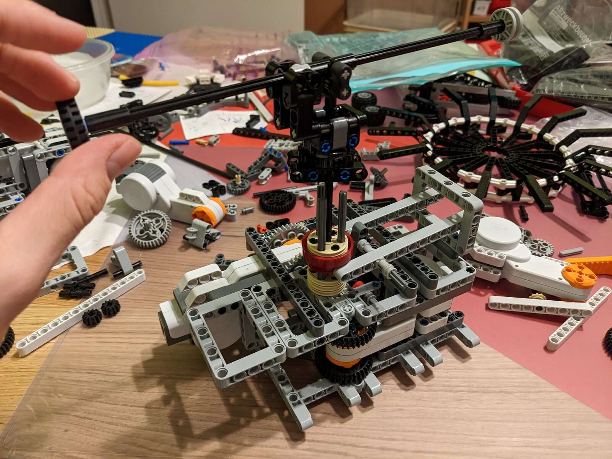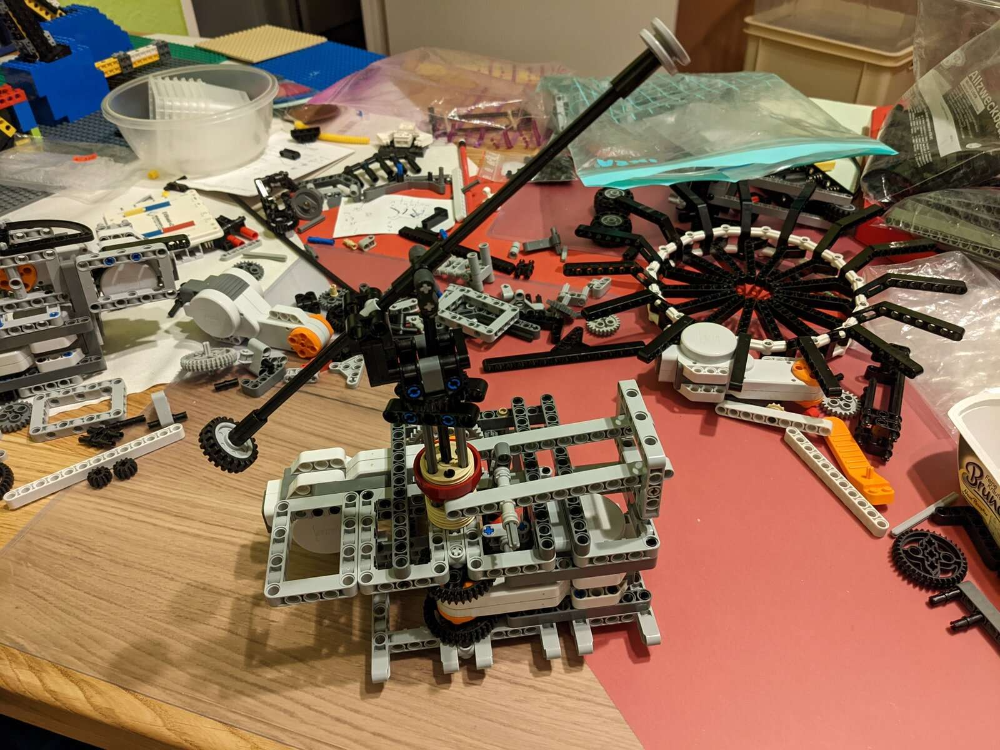

So kann der Motorblock beliebig weit von der Wippe entfernt sein. Zudem lassen sich auf diese Art und Weise die beiden **Bewegungen direkt auf die Wippe übertragen**, ohne zusätzliche Zahnräder. Damit wurde die Konstruktion simpler als ursprünglich gedacht.

[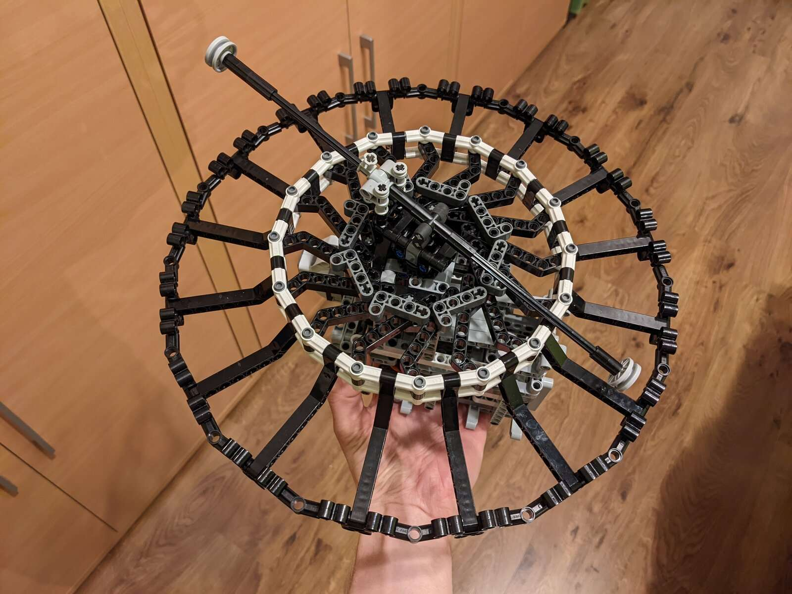](PXL_20220526_231706788_copy.jpg)[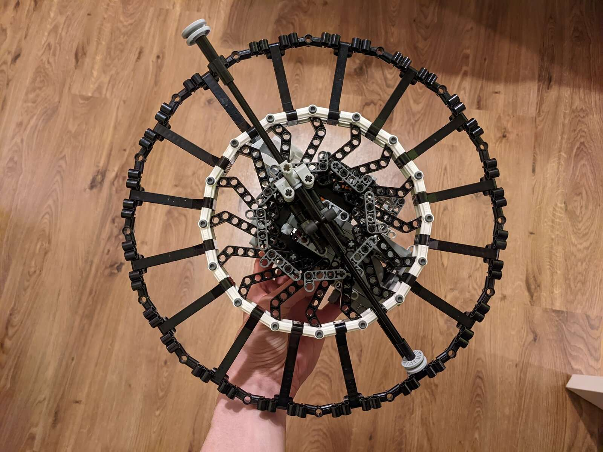](PXL_20220526_231828948_copy.jpg)[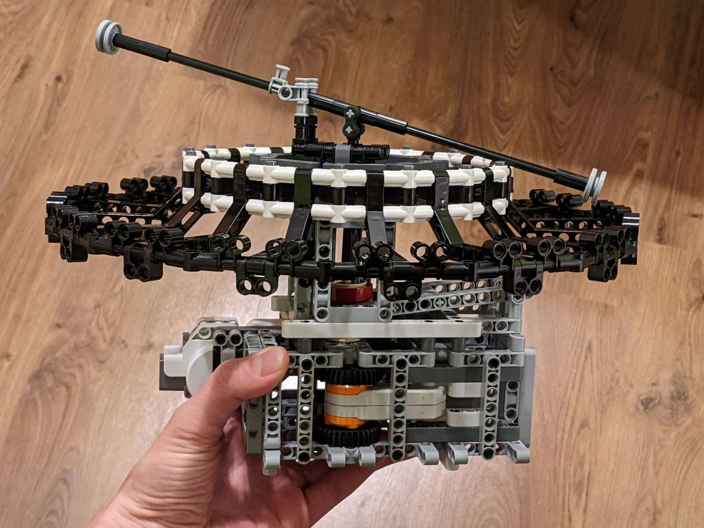](PXL_20220526_231748393_copy.jpg)

Dieser Aufbau schien soweit zu funktionieren. Nach einigem Umbauten konnte der Prototyp einen der (relativ schweren) Klangstäbe tragen, sodass **ein paar manuelle Tests** möglich waren. Hier ein Video davon.

Es war sehr schwer, manuell die Noten hörbar zu treffen. Erste Zweifel an diesem Mechanismus kamen in mir auf. Es bräuchte sehr kurze, kräftige Bewegungen anstelle der kontinuierlichen Drehung des Motors.

### Adios Wippe, hallo zweiter Arm

Im Laufe des Junis 2022 wollte ich den **Zuschlagmechanismus verbessern**. Zur gleichen Zeit fand ich auch ein Glasgefäß [in einem sehr coolen Gebrauchtwarenhaus](https://nochmall.de/) und habe mir fortan das Ziel gesetzt, dass der Mechanismus am Ende in dieses Glas passen muss.

[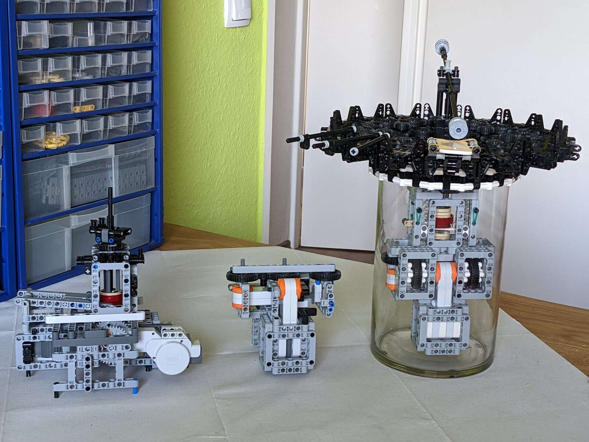](PXL_20220612_182259477_copy.jpg) _Iterationen des Wipp-Mechanismus_

Mir wurde langsam klar, dass eine "Wippe" (also zwei verbundene Schlägel) nicht funktionieren werden. Um die Noten hörbar zu treffen, muss der **Schlag per Gummizug verstärkt** werden. Dieser würde jedoch die Wippe permanent aus ihrem Gleichgewicht drücken - und das auch noch irgendwie in beide Richtungen gleichzeitig (blaue Pfeile). Es braucht aber dieses Gleichgewicht, wenn die Wippe zu einer anderen Note rotiert (grüne Pfeile).

[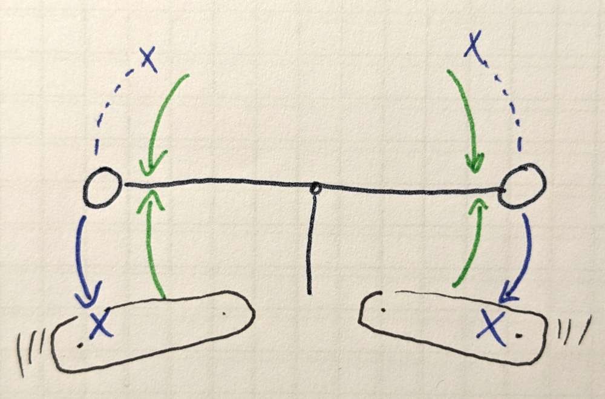](PXL_20230723_173757378-1.jpg) _Die Widersprüche bei einer Wippe_

Letztendlich konnte ich es per Gummizug nur ins Gleichgewicht ziehen. Weshalb der Roboter unterm Strich immer nach oben schlagen wollte. Mir wollte keine andere Lösung einfallen. Darum habe ich mich dafür entschieden, lieber **zwei voneinander unabhängige Schlägel** zu bauen. Ein paar Experimente in [LeoCAD](https://www.leocad.org/) zeigten, dass das grundsätzlich ins Glas passen müsste.

[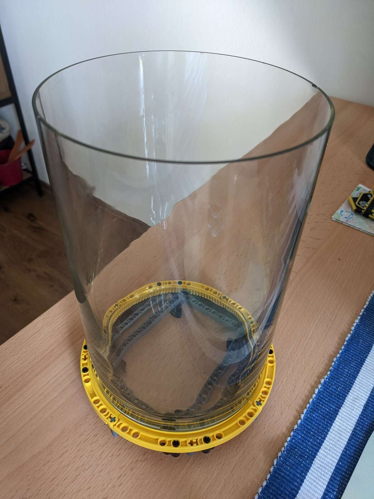](PXL_20220605_145532796_copy.jpg) _Das Glas hat fast perfekte Legomaße..._[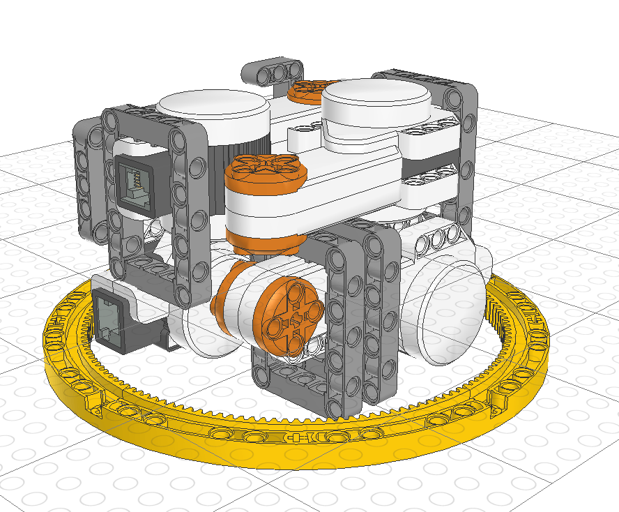](Screenshot-20220619230047-888x734-1.png)_... und laut LeoCAD passen auch vier Motoren hinein._

So entstand ein kleiner Mechanismus aus zwei gestapelten Motoren, der sehr gut funktionierte. Zusammen mit einem zweiten, spiegelverkehrt gebauten ergab sich ein **sehr kompakter Motorblock**, der perfekt ins Glas passte.

[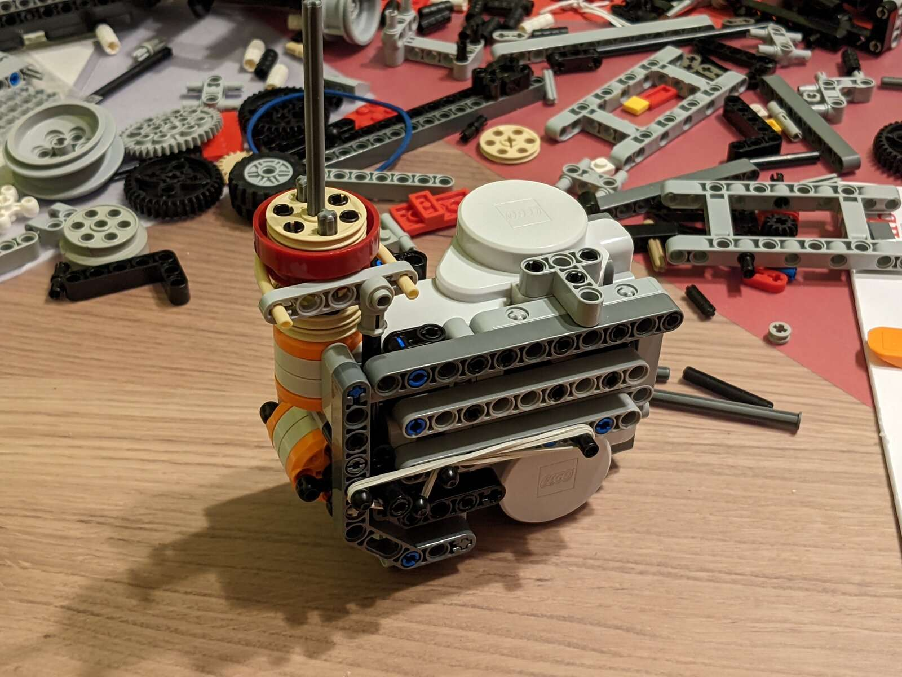](PXL_20220625_215553578_copy.jpg) **_Aus eins ..._**[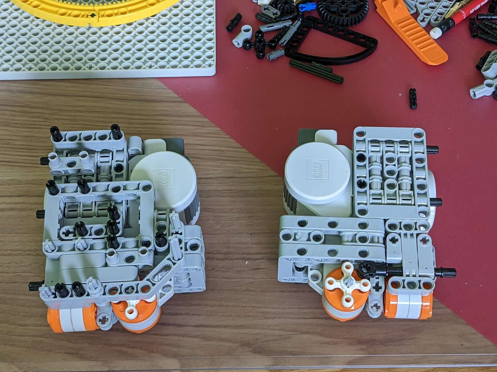](PXL_20220626_104043747_copy.jpg)_**... mach zwei**_[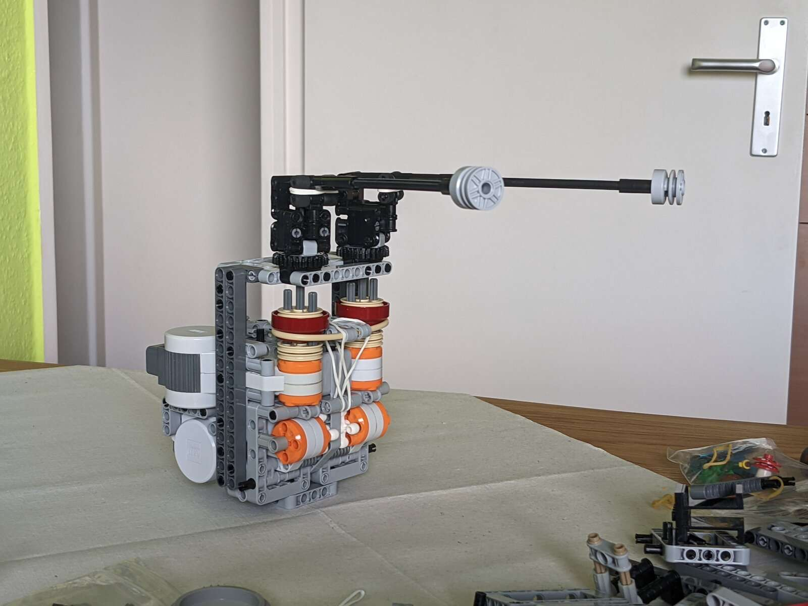](PXL_20220626_165209410_copy.jpg) _Motorblock inklusive Schlägeln_

Mit einigen Umbauten ließen sich an diesem Block dann auch die **Halterung für die Klangstäbe** befestigen. Jeder Klangstab wird auf zwei Schnipsgummis in der Schwebe gehalten, damit die Note klar und ungedämpft klingt. Ferner wird je [ein 3/4-Pin](https://www.bricklink.com/v2/catalog/catalogitem.page?P=32002#T=C&C=85) mit eingespannt um ein Verrutschen zu vermeiden. Das Gesamtgewicht der 16 Klangstäbe (ca. 1,2kg) wird primär vom Glas getragen.

[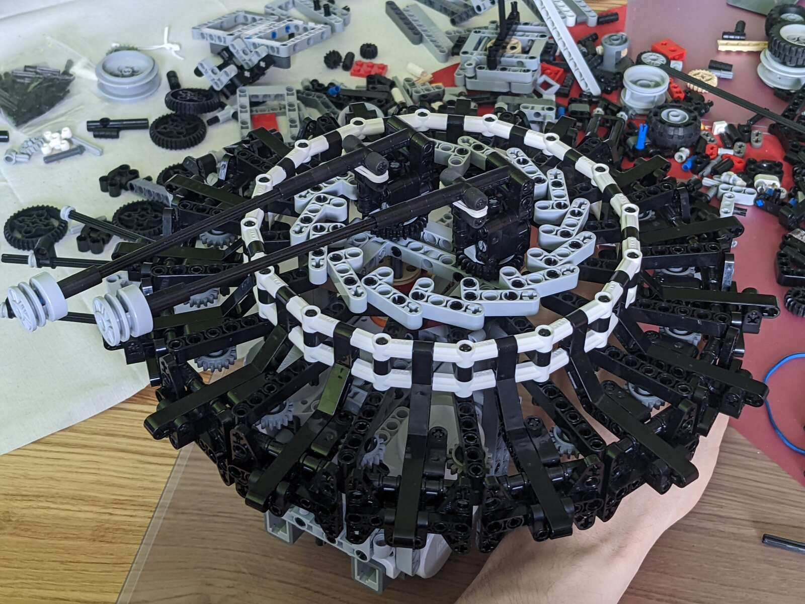](PXL_20220626_163902911_copy.jpg)[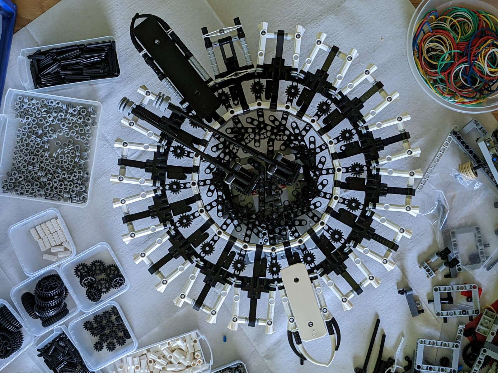](PXL_20220628_184022492_copy.jpg)[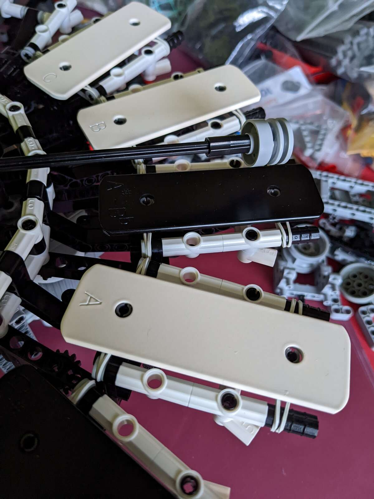](PXL_20220628_191800472_copy.jpg) Klangstäbe auf Schnipsgummis

Anfang Juli 2022 war es dann soweit: Vor mir stand ein - rein mechanisch betrachtet - funktionsfähiger Roboter. Nun musste ihm "nur" noch Leben eingehaucht werden.

### Die erste Programmierung

Die Programmierung des Roboters wollte ich **auf keinen Fall grafisch** in der von LEGO mitgelieferten Umgebung durchführen. Dort werden für jede Anweisung Blöcke per Drag-n-Drop in ein Gitter gezogen und anschließend per Formularen konfiguriert. Das ist zwar für Kinder als Einstieg gut, aber für größere Vorhaben extrem aufwändig und unübersichtlich.

[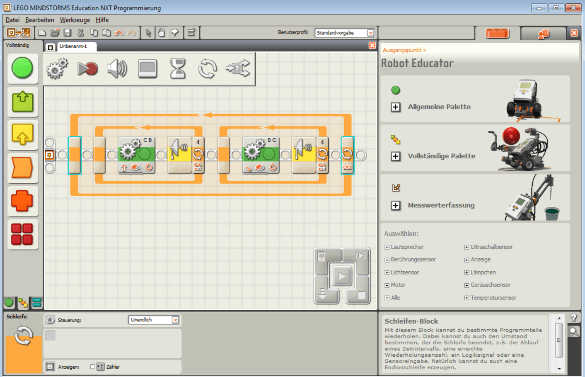](Screenshot-20230723204406-1412x909-1.png) Screenshot aus der NXT-G Programmieroberfläche

**Der ursprüngliche Plan** war die Nutzung des [EVShield v2 von mindsensors.com](http://www.mindsensors.com/search?search_query=evshield&orderby=price&orderway=desc) (absolut keine Kaufempfehlung!). Das ist ein Board, welches zusammen mit einem Arduino Uno den Lego-NXT als "Gehirn" des Roboters ersetzt. Zur Programmierung habe ich sowohl [VSCode](https://code.visualstudio.com/) als auch die [Arduino IDE](https://www.arduino.cc/en/software) ausprobiert. Anfangs sah das auch vielversprechend aus...

Je tiefer ich aber einstieg, desto mehr wurde mir die **unausgereifte Programmierbibliothek** des EV3-Shields zum Verhängnis ( [hier zu finden](https://github.com/mindsensors/EVShield)). Die Motoren ließen sich nur sehr ungenau steuern. Zum Beispiel hier beim Zeigen auf jede Note:

Manchmal machten die Motoren auch **komplett willkürliche Bewegungen**, die das Programm nicht ansatzweise vorgab. Beispiel:

Mir wurde schnell klar, dass ich mit diesen Problemen niemals ordentlich ein Lied spielen könnte. Ergo musste ich doch **die originalen NXT-Steine** als Steuerzentrale nutzen und programmieren. Die große Frage war: Wie?

Zum Glück fand ich **Bricx Command Center** \- eine Software, über das auch ältere Lego-Hardware normal programmiert werden kann ( [Homepage](https://bricxcc.sourceforge.net/)). Leider wurde es [seit Jahren](https://sourceforge.net/projects/bricxcc/files/) nicht mehr weiter entwickelt. Doch ich habe es in einer virtuellen Windows-7-Maschine auf meinem Linuxrechner zum Laufen bekommen, sodass ich mich dennoch für diese Option entschied.

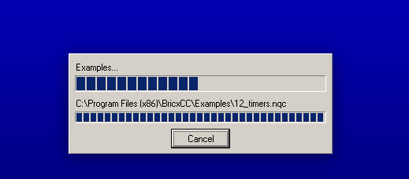

Über eine eigens entwickelte Sprache namens NXC - **Not eXactly C**, sprich: fast wie die Programmiersprache C - lassen sich hier alle Funktionen des NXT nutzen. Die Sprache ist zwar etwas eigen, aber hat sehr [verständliche Tutorials](https://bricxcc.sourceforge.net/nbc/nxcdoc/NXC_tutorial.pdf) und eine [gute Dokumentation](https://bricxcc.sourceforge.net/nbc/nxcdoc/nxcapi/lang.html).

Da ein NXT-Baustein nur drei Motoren steuern kann, brauchte es zwei NXTs für die vier Motoren. Ergo war irgendeine Art von **Kommunikation zwischen den NXTs** nötig. Eine direkte Kommunikation per Kabel habe ich nicht zum Laufen bekommen. Die einzige Alternative war Bluetooth, was dafür aber umso besser funktionierte. Mit regelmäßigen Pings (alle 100ms bei mir) bleibt die Verbindung zudem auch nach längerer Inaktivität sehr performant.

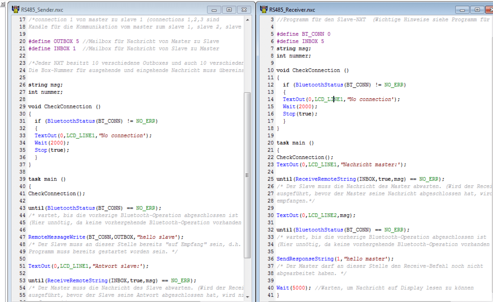_Bluetooth-Kommunikation in NXC_

Anschließend habe ich die Aufteilung der Logik auf die NXTs vorgenommen.

Der **sekundäre NXT** ist nur für das Schlagen auf die Klangstäbe zuständig. Ferner kalibiert er die beiden Motoren, die dies tun. All das geschieht nur auf Befehl via Bluetooth hin. Von selbst macht der Sekundäre NXT nichts.

Der **primäre NXT** übernimmt die komplette Steuerung. Auf ihm sind alle Lieder gespeichert. Er dreht die Schlägel zur richtigen Zeit zu den entsprechenden Noten, und gibt dem sekundären NXT anschließend den Befehl zum Schlag mit dem richtigen Schlägel.

Durch diese Aufteilung sind alle weiteren **Anpassungen nur auf dem primären NXT** durchzuführen. Ich brauche mich also, sobald die Bluetoothverbindung und die Steuerbefehle einmal programmiert sind, nie wieder mit dem zweiten NXT zu befassen.

Über diese Aufteilung konnte ich recht schnell Fortschritte machen und hatte Anfang Juli diese Methode der **Kalibrierung** zum Laufen gebracht: Die Arme werden in die gleiche Richtung gedreht, bis sie gegen den jeweils anderen stoßen. Dieser Punkt wird anschließend als Nullpunkt gesetzt, von dem aus der Winkel zu den Noten gemessen wird.

### Ein vollständiges Lied

Nach diesen grundlegenden Funktionen wollte ich dem Roboter ein erstes Lied beibringen. Schon von Anfang an hatte ich hierfür die [Spieluhr von "Davy Jones"](https://fluch-der-karibik.fandom.com/wiki/Davy_Jones%27_und_Calypsos_Spieluhr) aus "Fluch der Karibik" im Sinn. Sie hat einen ähnlichen Klang wie mein Glockenspiel.

Da ich selbst kein Instrument spiele und auch Noten nicht flüssig lesen kann, habe ich mir ein **freies Notensatzprogramm** namens [MuseScore](https://musescore.org/de) installiert. Anschließend kann man [eine passende MIDI-Datei](https://bitmidi.com/pirates-of-the-caribbean-davy-jones-mid) damit öffnen und kann die Noten bearbeiten und automatisch beschriften lassen.

[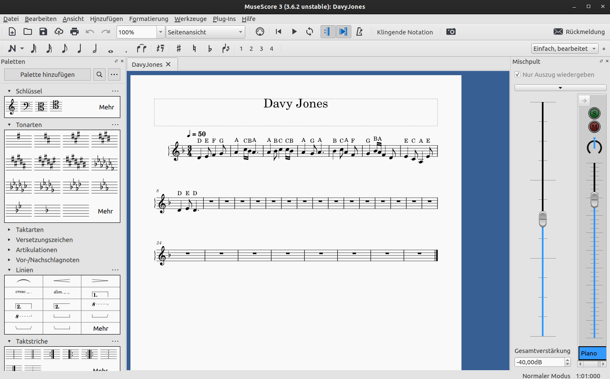](Screenshot-20230723225418-1450x903-1.png) _MuseScore mit angepassten Noten zu Davy Jones_

Da der Glockenspiel-Roboter **nur 16 Noten** hat, müssen häufig einzelne Noten oder komplette Lieder verschoben ("transponiert") werden, damit sie für den Roboter in Reichweite liegen. In MuseScore kann man sich diese Änderungen direkt anhören und auch Noten rot hervorheben lassen, die außerhalb einer bestimmten Spanne liegen. Super praktisch!

Zurück zur Programmierung: Dort wollte ich ein **einheitliches Format** für dieses und zukünftige Lieder. Deshalb habe ich mir eine eigene "Notation" für die Steuerung des Roboters während eines Liedes überlegt. Jedes Lied ist ein zweidimensionales Byte-Array. Es besteht aus Zeilen mit folgenden drei Angaben:

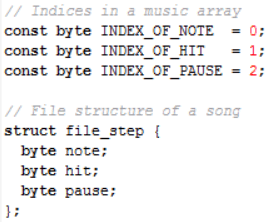

**NOTE:** Gibt an, welcher der zwei Schlägel sich zu diesem Zeitpunkt an welcher Note befinden soll.

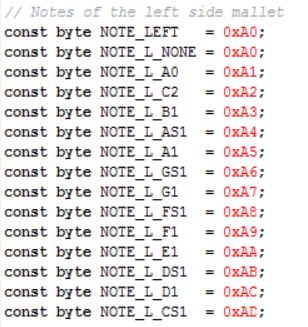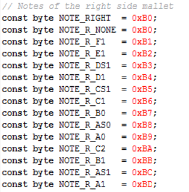

Wo sich welche Note physisch befindet ist über eine Liste von Winkelangaben je Schlägel hinterlegt. Index 0 ist die Ausgangsstellung nach dem Kalibrieren.

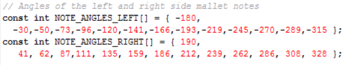

**HIT:** Gibt an, ob keiner, einer oder beide Schlägel zuschlagen sollen. "Keiner" kann für Ausweichmanöver oder vorausschauende Routenplanung sinnvoll sein.

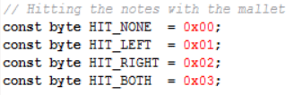

**PAUSE:** Gibt an, wie lange mit dem Befehl in der nächsten Zeile zu warten ist. Die Konstanten orientieren sich an der Dauer von Pausen/Noten aus der Musik ( [Triolen](https://de.wikipedia.org/wiki/Notenwert#Triole) wurden erst viel später für ein anderes Lied hinzugefügt).

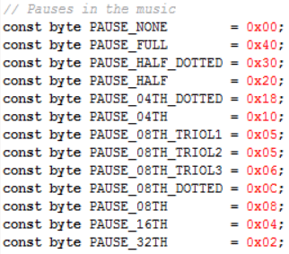

So startete ich schließlich mit dem **Coding für "Davy Jones"**. Die Kommentare rechts sind die Taktnummern. Ohne sie wurde es schnell zu unübersichtlich - denn ja, ich habe das manuell runtergeschrieben, nicht generiert.

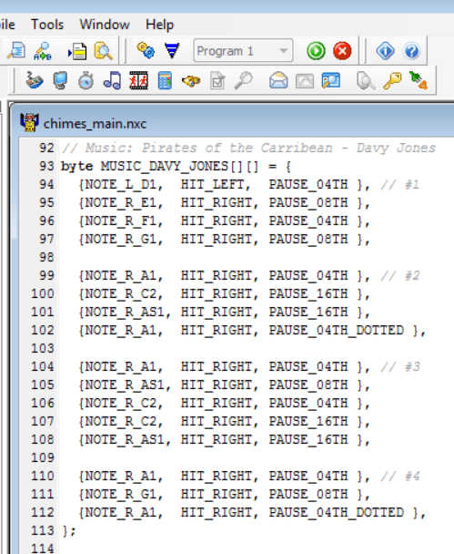**Erster Versuch...**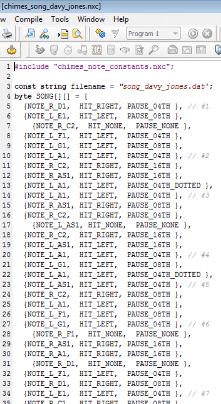**... und finale Version**

Viele Messungen, Anpassungen, Performanceverbesserungen und Frickeleien später konnte der Roboter **das Lied fließend spielen**.

https://www.flickr.com/photos/brickbucki/52206133012/

### **Mehrere Lieder organisieren**

Nun war der Roboter endlich in der Lage fehlerfrei zu spielen. Allerdings nur ein Lied. Als nächstes schrieb ich **weitere Lieder** in oben gezeigter Notation nieder: Harry Potter - Hedwig's Theme, Für Elise, ...

Anfangs fügte ich alle diese Lieder direkt in das Hauptprogramm ein. Ab einem bestimmten Punkt lies sich dieses aber nicht mehr compilieren und auf den NXT-Stein herunterladen. Das **Programm war zu groß**, aufgrund der großen Lieder-Arrays.

Deshalb musste ich eine Lösung programmieren, bei der die **Lieder in externen Binärdateien** ausgelagert werden. Mit den _CreateFile_ und _Write_-Befehlen war das nach etwas Gefrickel leicht umzusetzen:

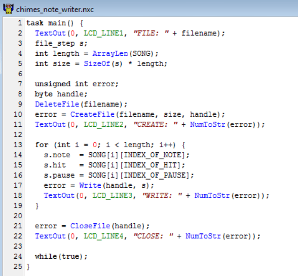Lied-Array in Binärdatei schreiben

Zum **Exportieren eines Liedes** in eine Binärdatei kombinierte ich dieses Coding als Include mit jedem Lied in ein eigenständiges Programm. Dieses war nur dafür da, genau dieses Lied als Binärdatei auf den NXT zu schreiben...

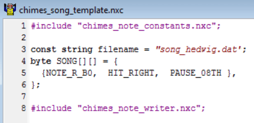Vorlage für eine Lieddatei

... und nachdem dies für alle Lieder gemacht war, sah es auf dem **Dateisystem des NXT** wie folgt aus:

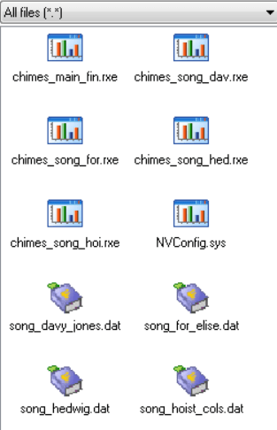Lieddateien (.rxe) und erzeugte Binärdateien (.dat) auf dem NXT

Zum **Einlesen eines Liedes** zur Laufzeit wurde anschließend die gewünschte Binärdatei wieder geöffnet (per _OpenFileRead_) und Zeile für Zeile (per _Read_) eingelesen und verarbeitet:

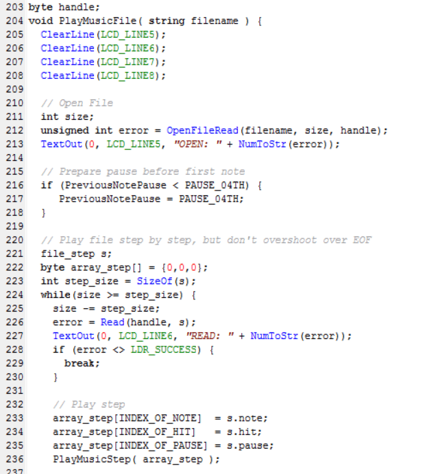

Anfangs hatte ich noch das komplette Lied mit einem Mal in den Speicher geladen, doch **"Für Elise" sprengt den Speicher**. Auch zeilenweise will dieses Lied immer noch nicht komplett funktionieren. Anscheinend stoße ich an irgendeine andere Beschränkung des NXT, die ich aber bisher nicht herausfinden, geschweige denn verhindern konnte.

### Automatische Wiedergabe

Mit einem vollen Speicher an Liedern war es nun endlich soweit: Der Roboter war ausgereift genug, um ausgestellt zu werden. Für Ausstellungen brauchte es nur noch ein Programm, um dauerhaft **eigenständig Lieder abzuspielen**.

Die erste Ausstellung war der **11\. Berliner SteineWAHN!** im September 2022. Ich war am Vorabend des Aufbautags mit den letzten Liedern und Kalibrierungen fertig geworden. Zu dieser Zeit hatte ich einprogrammiert, dass der Roboter dauerhaft Lieder abspielte. Zwischen den Liedern machte er ein paar technische Vorführungen z.B. die Arme hin und her drehen oder einmal jede Note spielen.

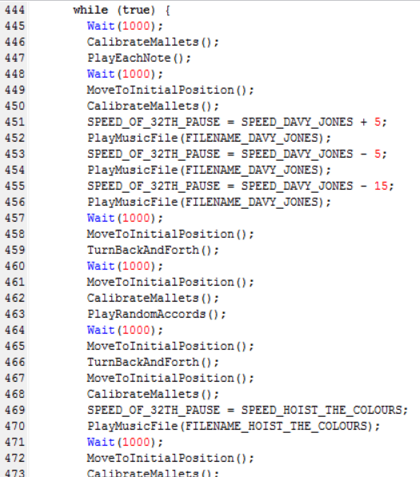Endlosschleife mit Liedern und "zufälligen" technischen Demos

So wirklich prickelnd war das aber nicht: Wenn Zuschauer zum Modell kamen, war der Roboter teilweise gerade mitten im Lied - oder am Ende bzw. Kalibrieren. Auch für umstehende Aussteller war die Dauerbeschallung nicht optimal. Trotzdem hatte ich lange keine bessere Lösung, sodass er auch auf der **spielmesse Dresden** im November 2022 und auf der **BrickBits** **Cremlingen** im Januar 2023 ebenso funktionierte.

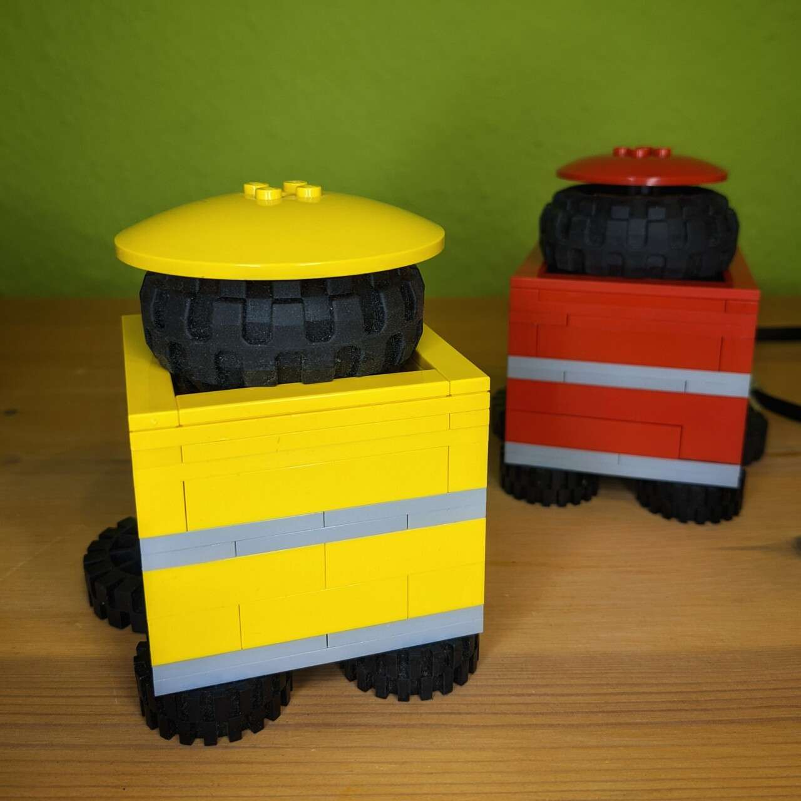NXT-Buzzer für Musik auf Knopfdruck

Für die **BrettspielCon Berlin** im Juli 2023 hatte ich schließlich die Idee, den Roboter mit einem NXT-Buzzer zu kombinieren. Zwei davon hatte ich eigentlich für Spieleabende gebaut. Doch sie erwiesen sich als stabil genug, um sie auch auf Kinderhände bei Ausstellungen loszulassen. Ergo habe ich das Programm so angepasst, dass es bis zum Buzzerdruck mit dem Beginn des nächsten Liedes wartet.

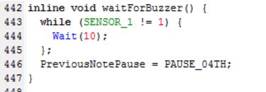Das Warten auf den Buzzer ...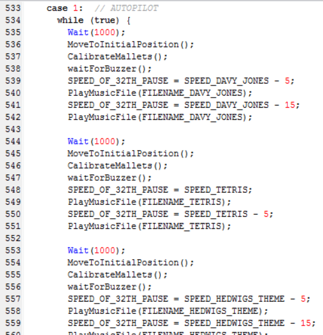... und dessen Verwendung in der Endlosschleife aus Liedern.

### Das Wintergatan Community Meetup

Was ich bisher verschwieg: **Die größte Inspiration**, überhaupt ein musikalisches Projekt dieser Art anzugehen, waren die Projekte von Martin Molin bzw. Wintergatan. Seiner [unglaublichen Marble Machine](https://www.youtube.com/watch?v=IvUU8joBb1Q) folgte eine jahrelange Reise über hunderte Youtube-Videos hinweg zur [zweiten Version, MMX](https://www.youtube.com/watch?v=tVbh_FEiF2E). Ich verfolgte [jedes Video in der Bauserie](https://www.youtube.com/playlist?list=PLLLYkE3G1HED6rW-bkliHbMroHYFf4ukv) und seine Überlegungen für einen dritten Anlauf. Absolut beeindruckend!

Aus diesem Grund zog es mich auch vom 4. bis 6. August 2023 auf das **Wintergatan Comunity Meetup** in Rüdesheim. Meinen Glockenspieler inklusive Buzzer hatte ich mit im Gepäck. Und direkt am ersten Tag durfte ich sogar meinen Roboter in einem Livestream präsentieren.

[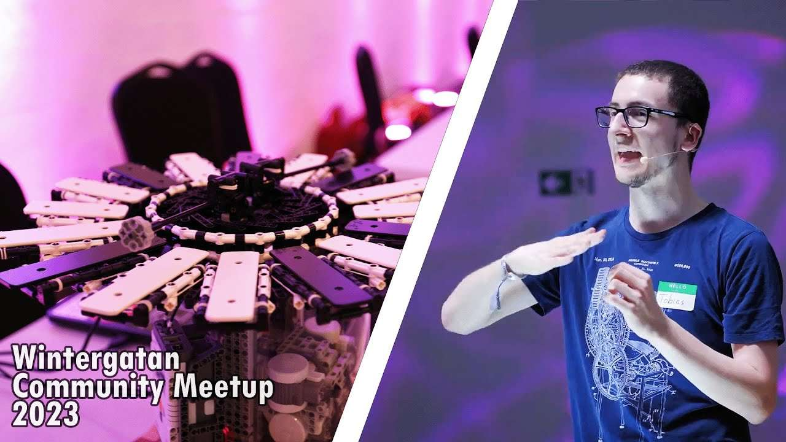](https://www.youtube.com/watch?v=9RHDle1dvmw) Link zur Aufzeichnung des Talks

Die **Hilfsbereitschaft und Kreativität** auf diesem Meetup hat mich komplett überwältigt. Nach dem Talk kamen direkt mehrere Leute zu mir an den Ausstellungstisch und boten ihre Hilfe für verschiedene Probleme des Roboters an. Zwei davon haben sogar richtig lange an den Herausforderungen mitgeknobelt:

Zum einen **Doim**, der mir als Muse-Score-Profi viele Eigenheiten und Möglichkeiten der Software aufgezeigt hat. Wir haben zusammen ein Template erstellt, mit dem man direkt in MuseScore die Verteilung der Noten auf die beiden Roboterarme planen kann. Physisch unmögliche Noten werden dabei direkt farblich hervorgehoben. Danach hat er damit sehr viele Lieder überarbeitet oder gleich komplett selbst für den Roboter angepasst bzw. übersetzt. Darunter natürlich auch der ikonische Song der Marble Machine:

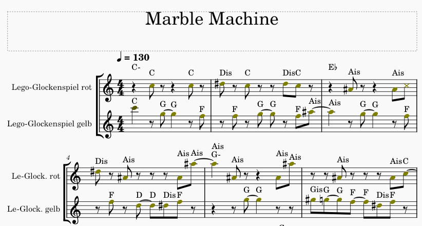"Marble Machine"-Song in MuseScore

Zum zweiten **Alex**, der sich als Programmierer direkt an einen [Konverter von MuseScore-Dateien](https://github.com/brickup-de/glockenspieler-muse-converter) zu Glockenspieler-Lied-Arrays setzte. So musste ich endlich nicht mehr jedes Lied händisch aus MuseScore in Programmcode abtippen. Nach einigen Iterationen hatte er nicht nur meine spezielle Formatierung des Codes übernommen. Wir haben sogar gemeinsam noch neue Funktionalitäten hinzugefügt, wie die dynamische Anpassung des Liedtempos.

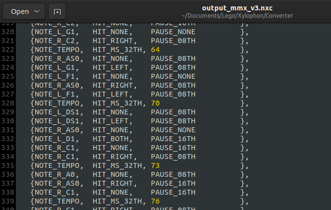Konvertierter Song mit Ritardando am Ende

**Ein riesiges Dankeschön** an die beiden, und natürlich auch an alle weiteren Teilnehmenden und das Orga-Team des Meetups. Es waren drei wunderbare Tage, an denen ich viele Ideen und Inspirationen einsammeln konnte. Hoffentlich findet dieses Meetup auch die nächsten Jahre wieder statt. [Siegfrieds Mechanisches Musikkabinett](https://www.smmk.de/) ist auf jeden Fall mehrmals die Reise wert!

### Ausblick

In meinen Augen ist der Roboter in seiner aktuellen Erscheinungsform jetzt ausgereift. Doch in meinem Kopf brodelt es bereits seit Monaten, in welche Richtung es nun weitergeht. Ich würde gerne **weitere Instrumente** ergänzen - und ich wäre gerne flexibler in deren Anordnung.

Eine Idee, die sich fest in meinen Gedanken hält, ist eine Version, die über **"Seilzüge" aus Angelsehne** arbeitet. So ließen sich die Klangstäbe flexibler zueinander anordnen und die Mechanik wäre in einem zentralen Block unter dem Roboter.

**Ein erster Entwurf** in LeoCAD würde über eine Art "Schlitten" funktionieren. Dieser wird per Motor und Angelsehne vor das Register der gewünschten Note gezogen wird. Anschließend wird die Achse gedreht, an welcher der Schlitten entlang läuft, um das Register anzuheben. Das Register wiederum ist per Angelsehne mit einem Schlägel an der entsprechenden Note verbunden. Nach einer viertel Drehung fällt das Register zurück in seine Ausgangslage.

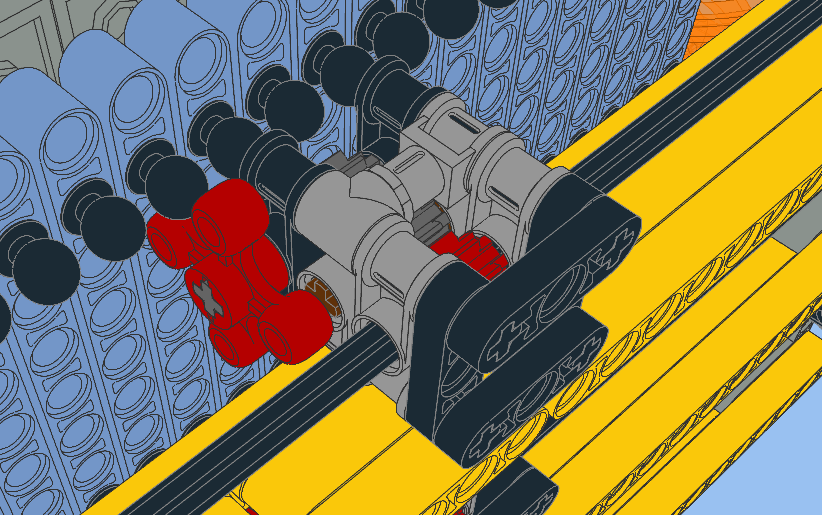 Schlitten an einer 32er-Achse

Durch die Nutzung mehrerer, voneinander unabhängiger Schlitten können mehrere Noten zeitgleich gespielt werden. Und es ist **keine Routenplanung/Kollisionsvermeidung** mehr nötig.

 Drei Schlitten vor einer hellblauen Registerwand

Vermutlich wird das in dieser Form nicht funktionieren, da sich die langen Technikachsen - aufgrund der Belastung - vermutlich auf Dauer verbiegen würden. Deshalb überlege ich, auch das Auslösen des Registers per Angelsehne umzusetzen.

So oder so, ich bin gespannt wohin es mich mit diesem Projekt noch trägt.
