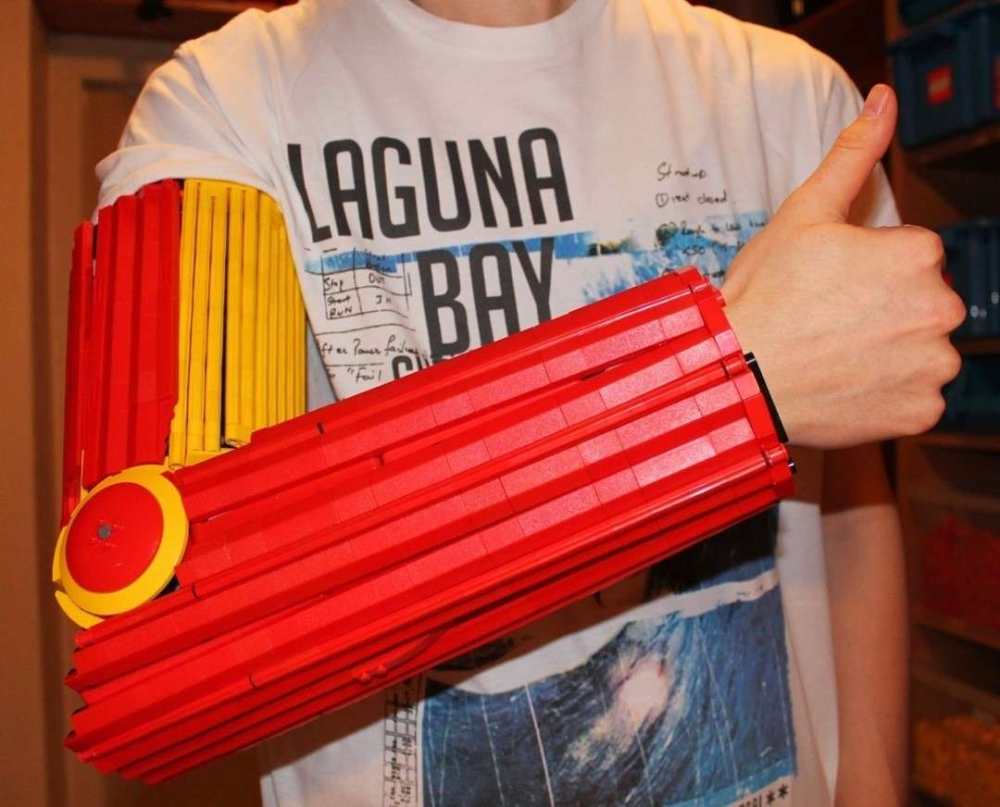
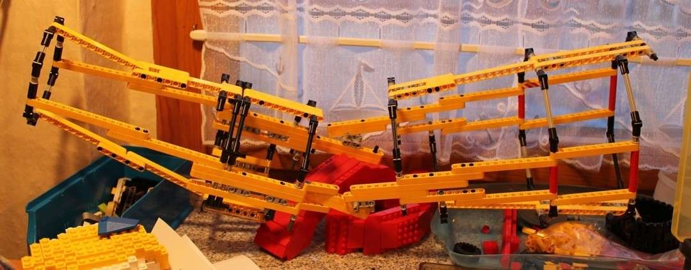
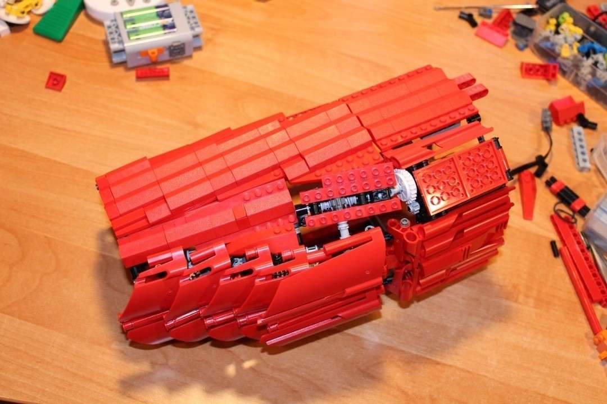
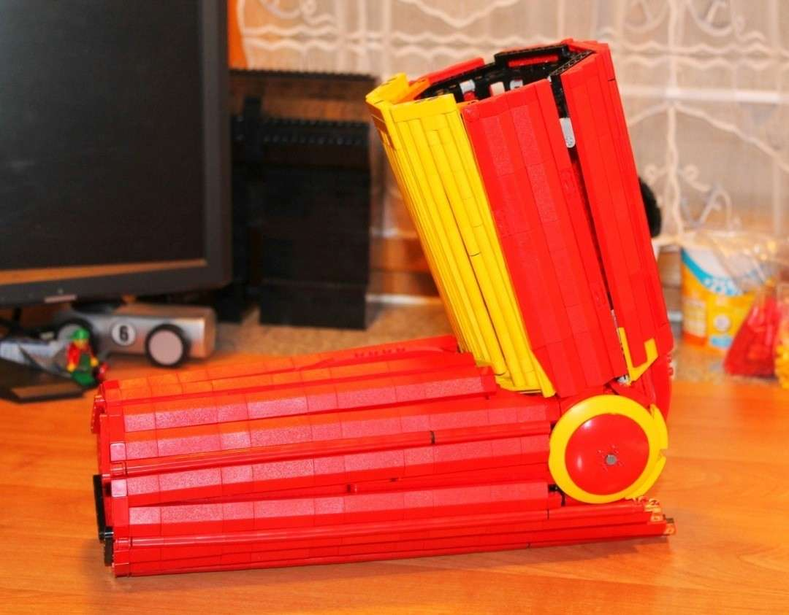

---
categories:
  - roboter
cover:
  alt: Ironman WIP
  image: 6785928616_174967e7a0_o.jpg
date: "2012-02-08T14:30:43+00:00"
tags:
  - gelb
  - rot
title: Projekt Ironman
url: /2012/ironman
---

**"Manchmal muss man rennen bevor man laufen kann"** \- Irgendwie passt dieser Satz zu dem, was ich mir hier vorgenommen hatte. In mir kam immer wieder die Idee auf, einen tragbaren Ironman-Anzug bauen ... und zwar aus Lego. Ich hatte so etwas in der Art noch nie vorher gebaut. Aber das es eine coole Vorstellung war, es zu besitzen, brauche ich glaube ich nicht zu erwähnen. Die Entwurfs- und Bauphasen haben entsprechend viel Spaß gemacht.

Es war dabei für mich von Anfang an vorhersehbar, dass ich das Projekt niemals komplett beenden würde. Aber das war auch nicht mein Hauptziel - ich wollte es einfach probiert haben. Und immerhin ein kompletter Arm und ein halbkomplettes Bein sind die Erfolge. Der Arm hat einen überraschend hohen Tragekomfort (dafür, dass er aus Lego ist). Die Flügelteile am Unterschenkelschutz können außerdem über zwei Motoren gehoben und gesenkt werden.

Ich habe bei diesem Projekt viele neue Techniken gelernt. Und wer weiß, vielleicht baue ich ja irgendwann doch noch einmal weiter - die Zukunft wird es zeigen ...

