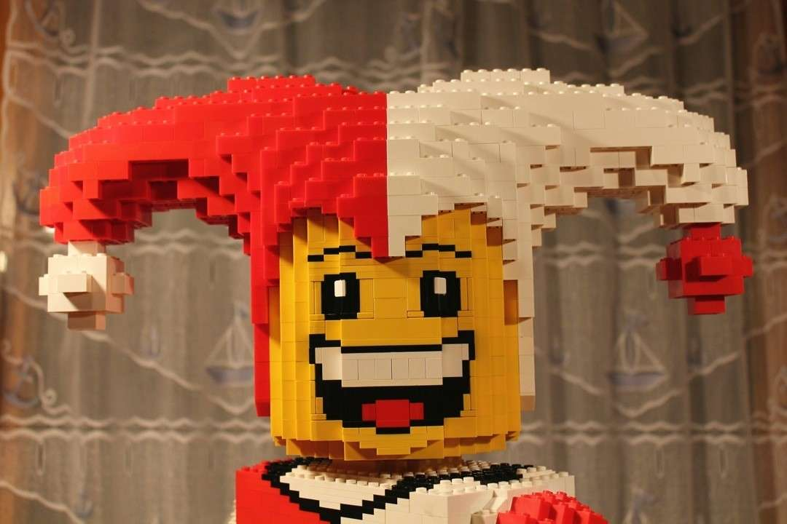
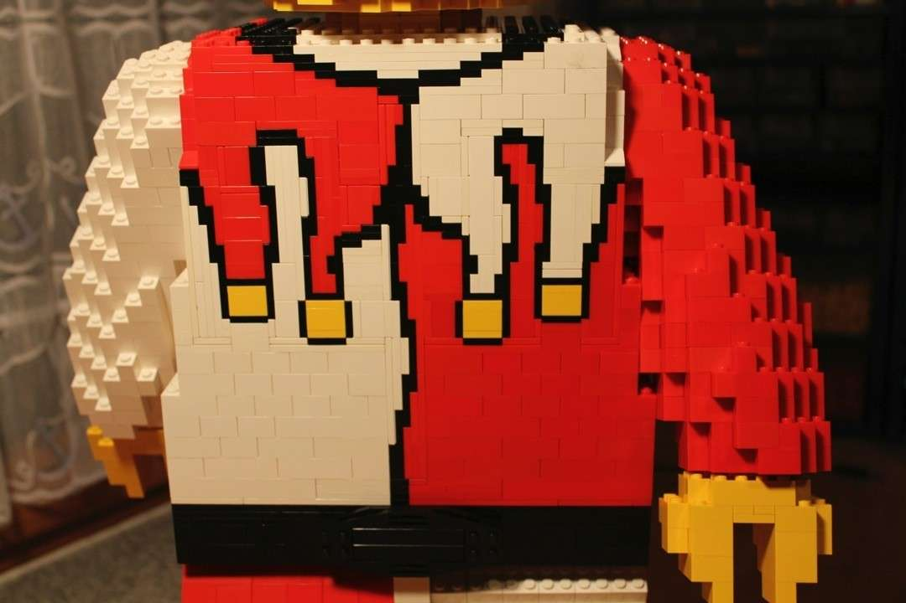
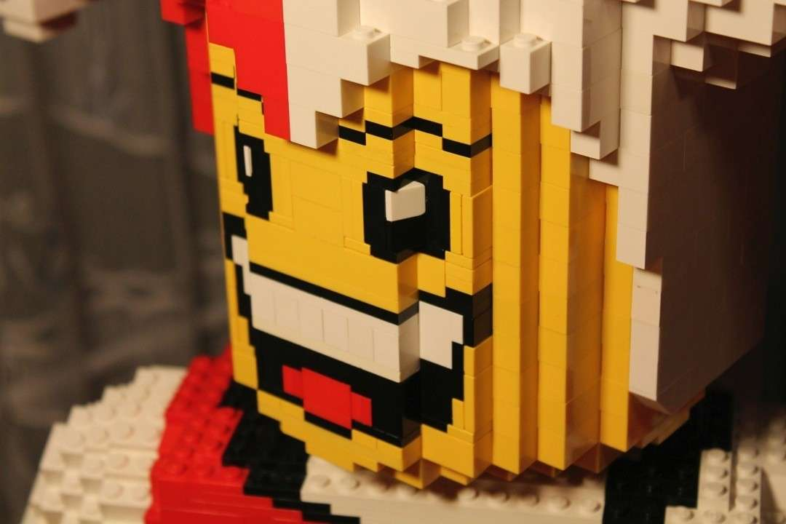

Hier zu sehen ist meine absolute Lieblingsskulptur unter all meinen bisherigen Projekten. Im Gegensatz zu anderen Modellen habe ich es bisher nicht wieder auseinander genommen - und habe dies auch in Zukunft nicht vor. Der Optimismus und die Selbstironie dieses Modells haben dieses Schicksal nicht verdient.

