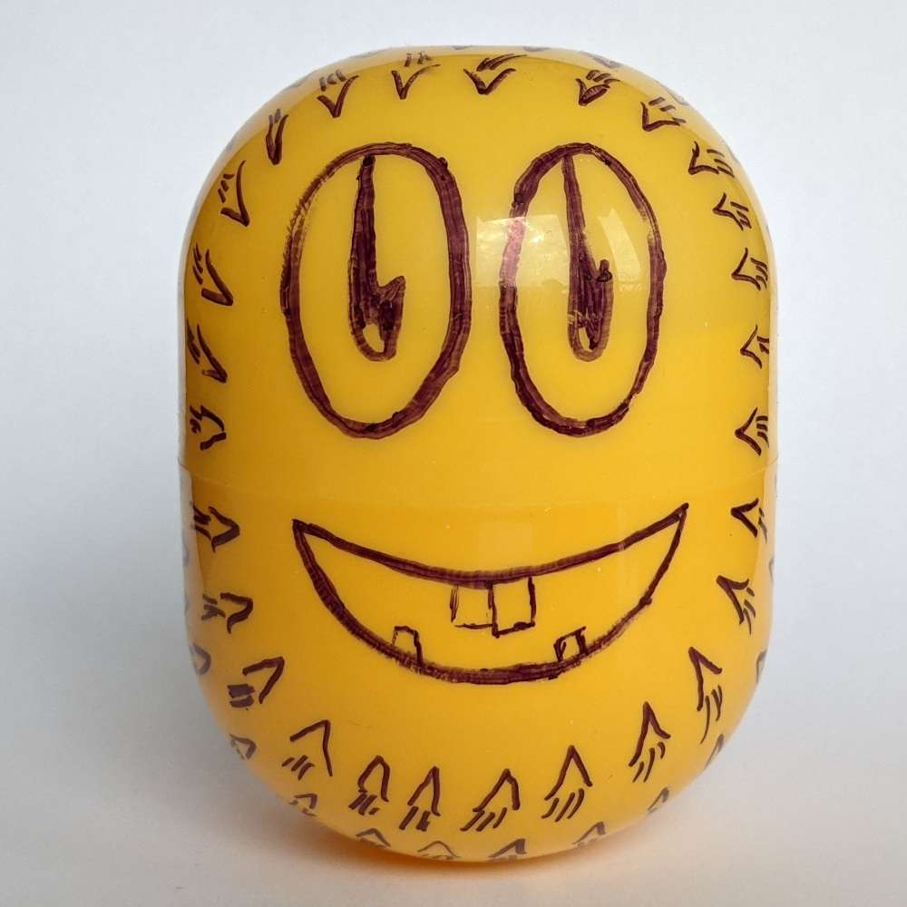
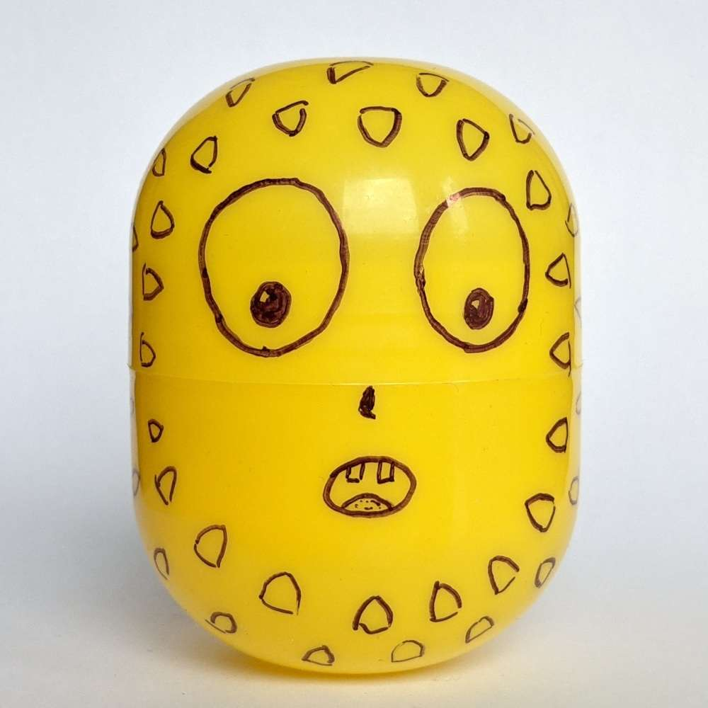
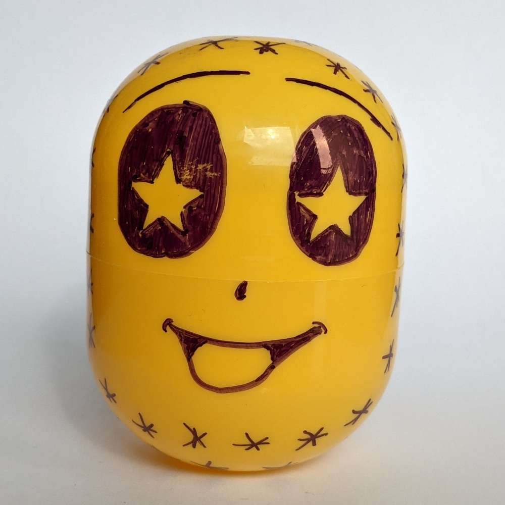
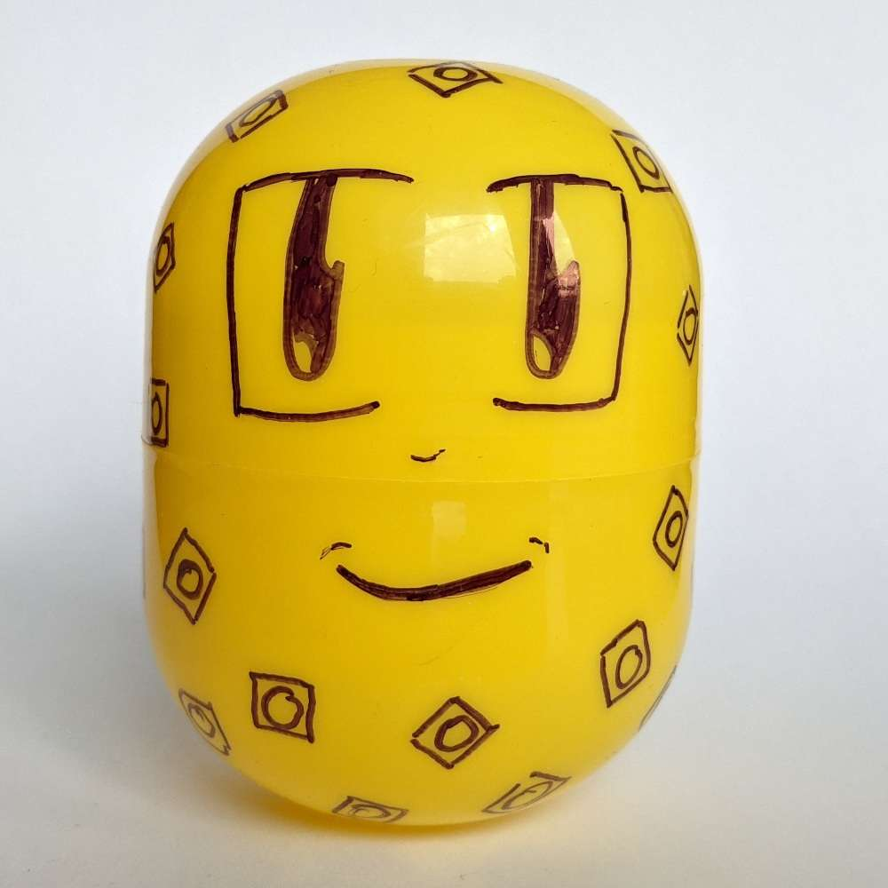
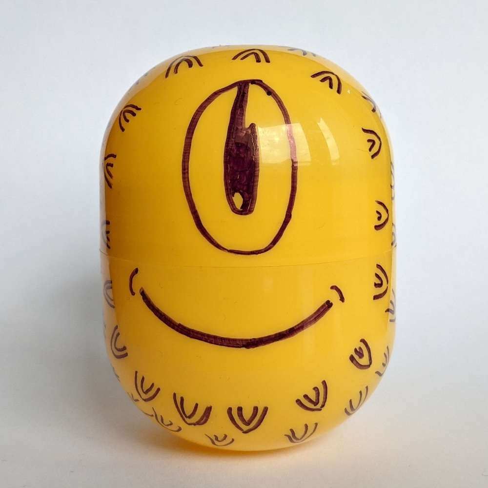
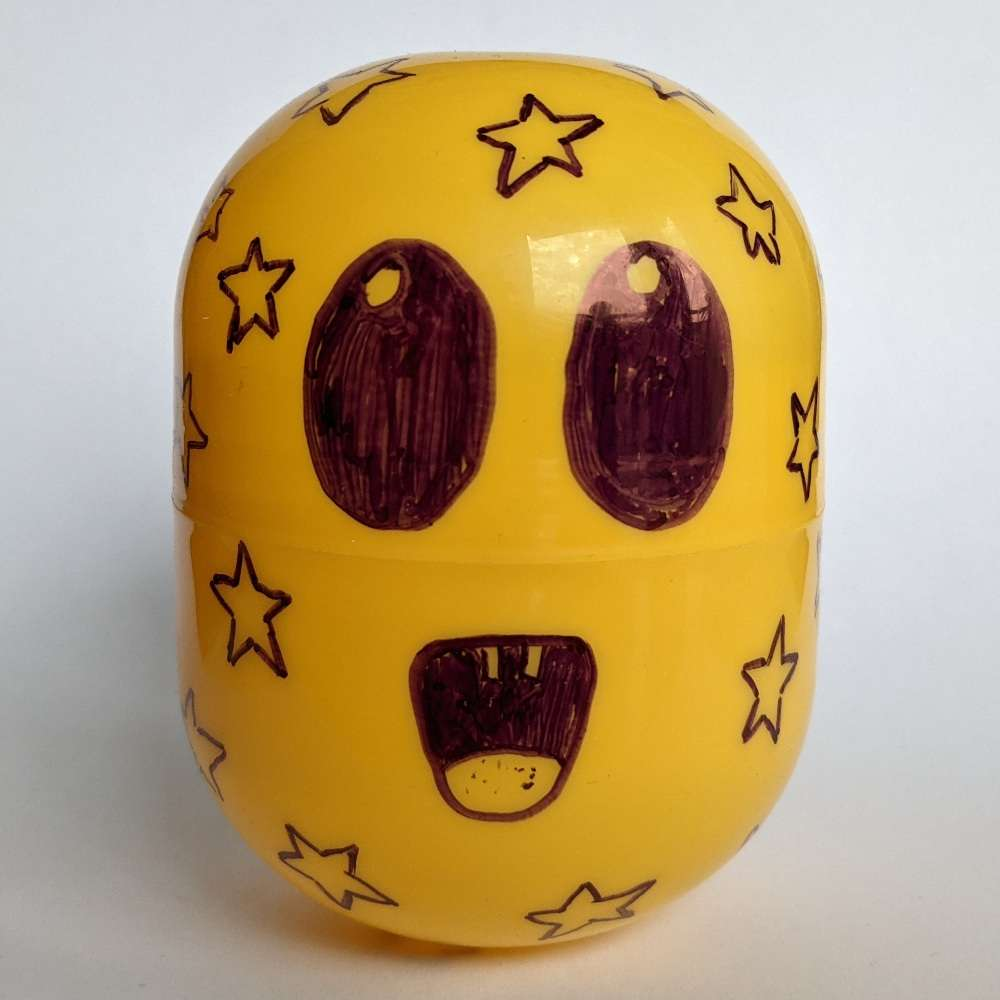

Da mir im Lockdown etwas langweilig war, habe ich für Ostern ein paar Plastikkapseln mit Permanentmarker bemalt und je ein Lego-Modell in ihnen versteckt 😊

PS: Falls Du hier bist weil Du eine der sieben Kapseln gefunden hast: Sehr gut! [Schreib mir gerne Feedback](/kontakt) zu der Aktion 😊

## Nr. 1



## Nr. 2



## Nr. 3



## Nr. 4



## Nr. 5



## Nr. 6



## Nr. 7


