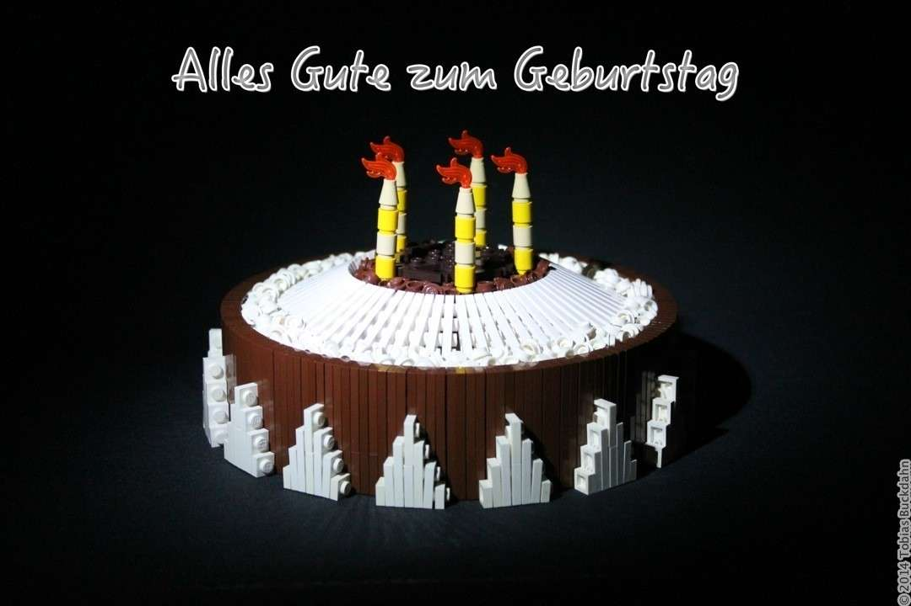
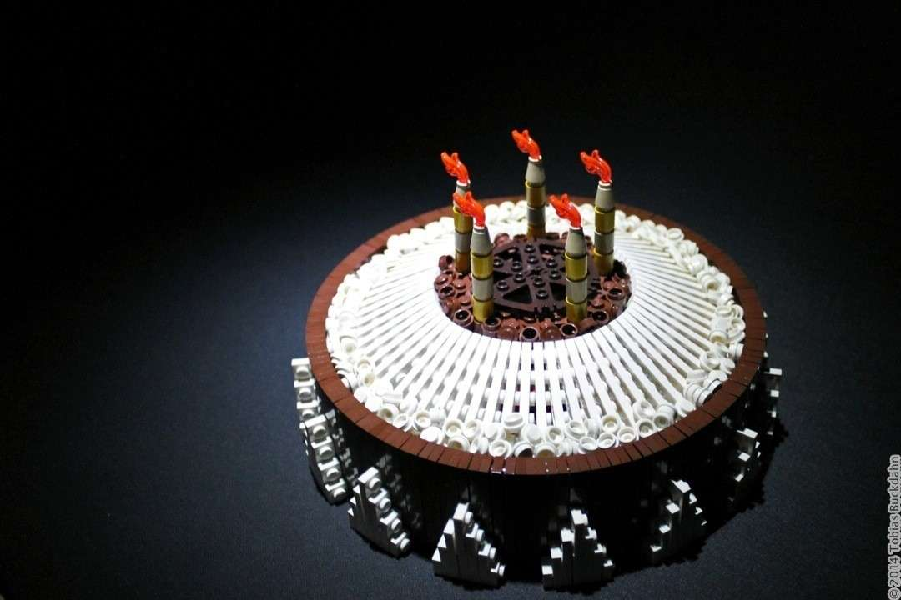
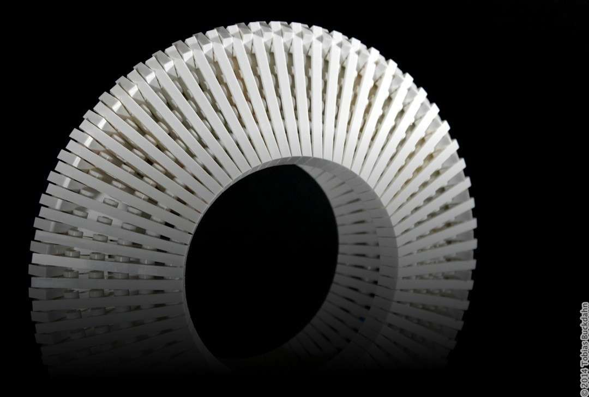

---
categories:
  - skulptur
cover:
  alt: Lego Torte
  image: LegoTorte.jpg
date: "2014-05-03T13:50:03+00:00"
tags:
  - braun
  - plate-bending
  - weiß
title: Kuchen
url: /2014/kuchen
---

Eine weitere Torte für einen weiteren Geburtstag. Es war [nicht die erste](https://www.flickr.com/photos/brickbucki/8511244330/ "Happy Birthday - Legokuchen auf Flickr") und wird sicher auch nicht die letzte sein. Ich wünsche hiermit allen Lesern vor- / zu- / nachträglich alles Gute zum Geburtstag :D

Die Idee für das Modell entstand, als ich ein paar 1x6-Platten auf eine (für mich) neue Art und Weise kombinierte. Auf Basis dieser weißen Linse formte sich schließlich der gesamte Kuchen.

