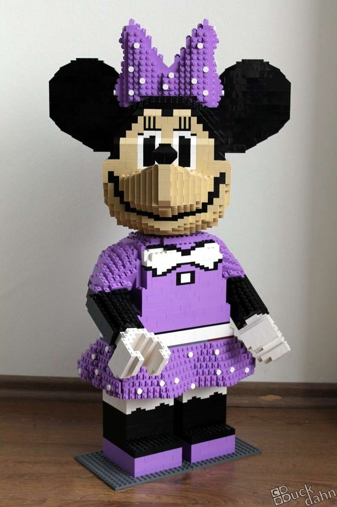
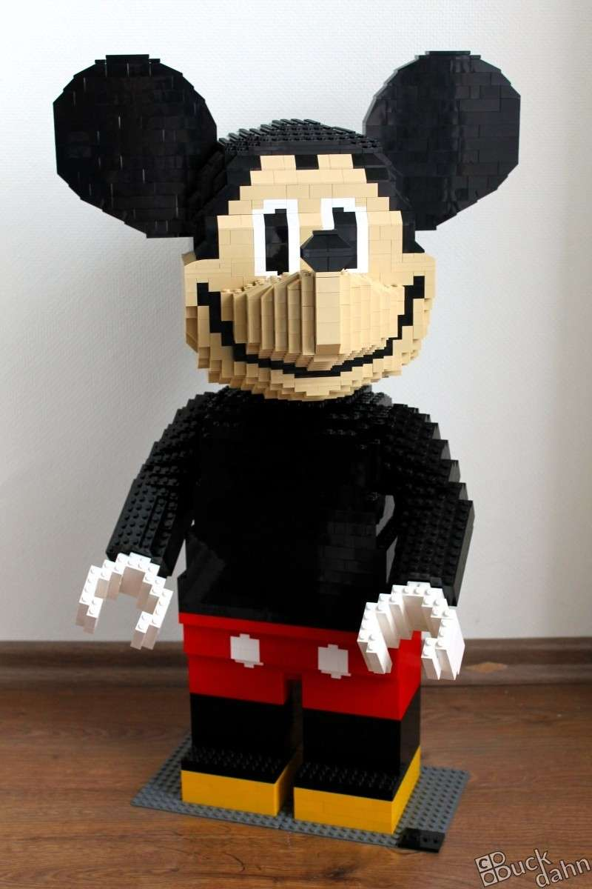
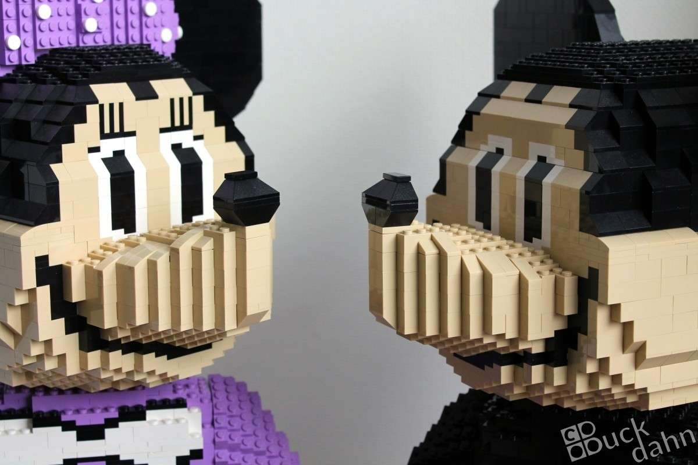
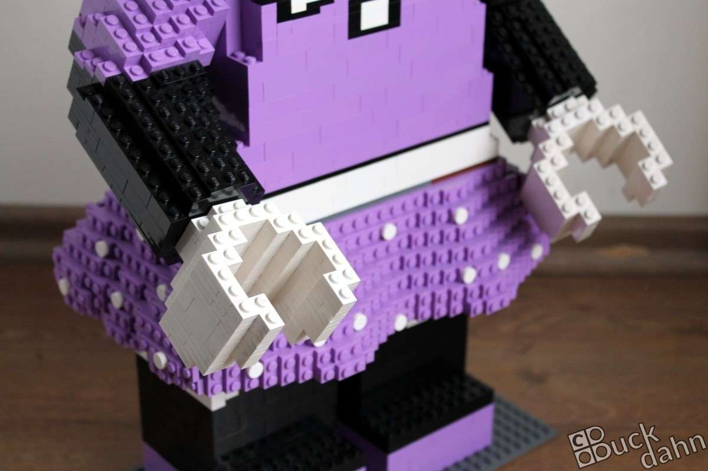

Hier ein weiterer Gastbeitrag meiner Mutter - Micky und Minnie Maus. Diese beiden hübschen Figuren sind in Anlehnung an die entsprechenden Minifiguren aus der [Disney-Sammelserie](https://www.bricklink.com/v2/catalog/catalogitem.page?S=71012-1) entstanden.

 

Da ich diese Lego-Skulpturen nicht selbst gebaut habe, kann ich leider wenig darüber berichten. Aber meine Idee war es, sie Händchen halten zu lassen ... immerhin :-D

 
