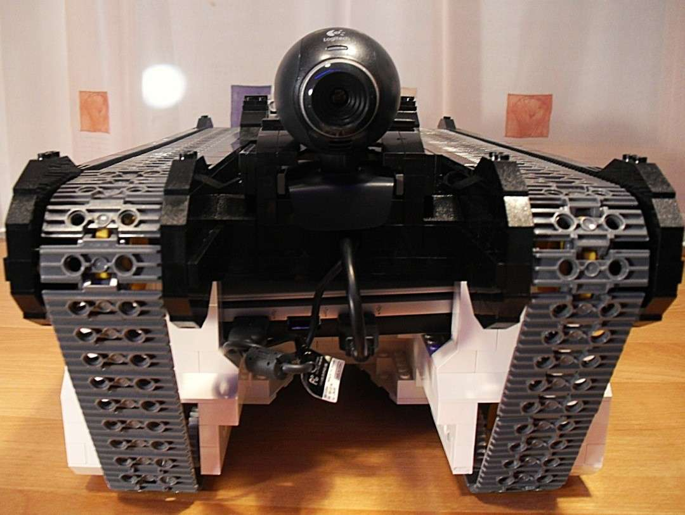
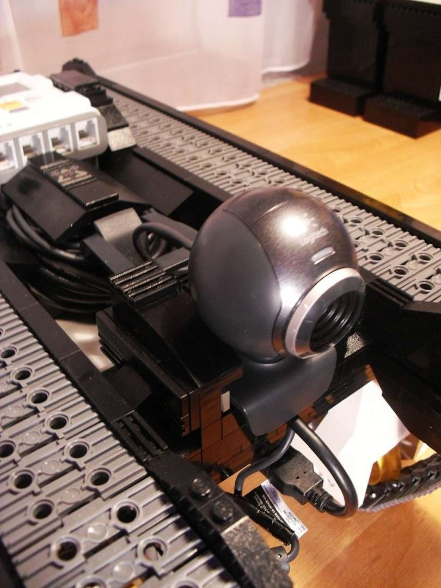
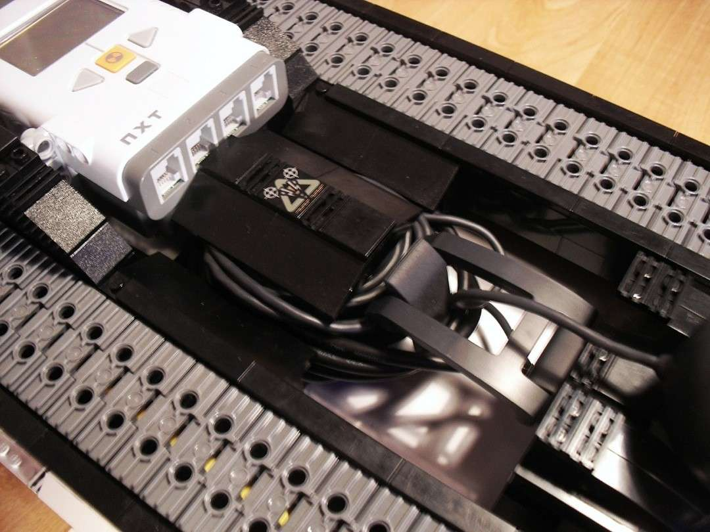
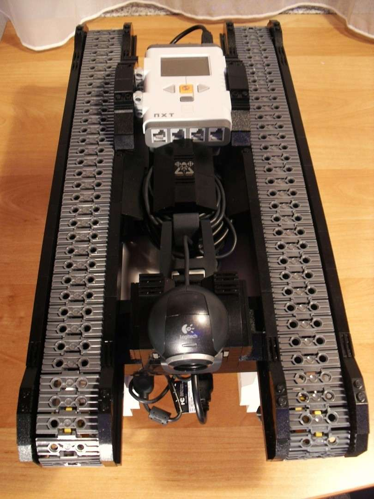
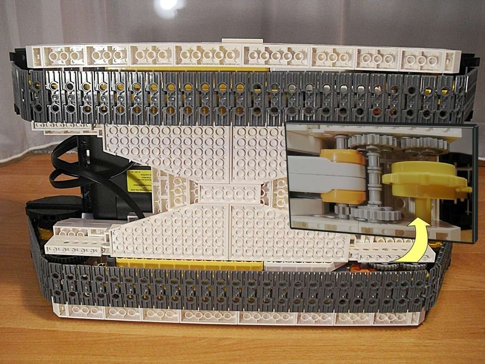
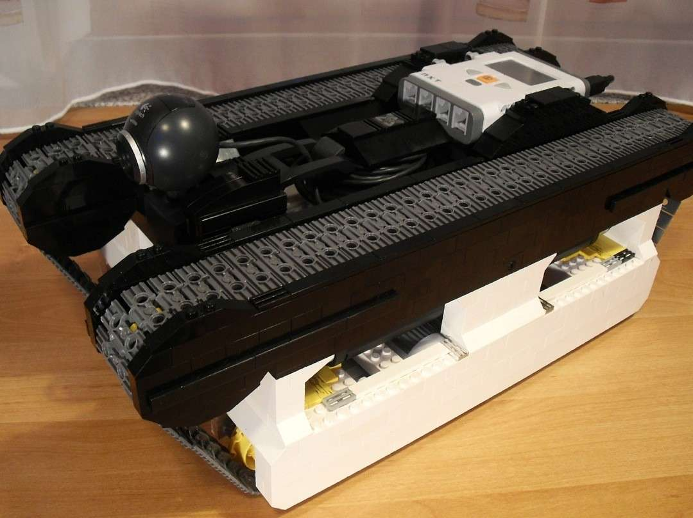
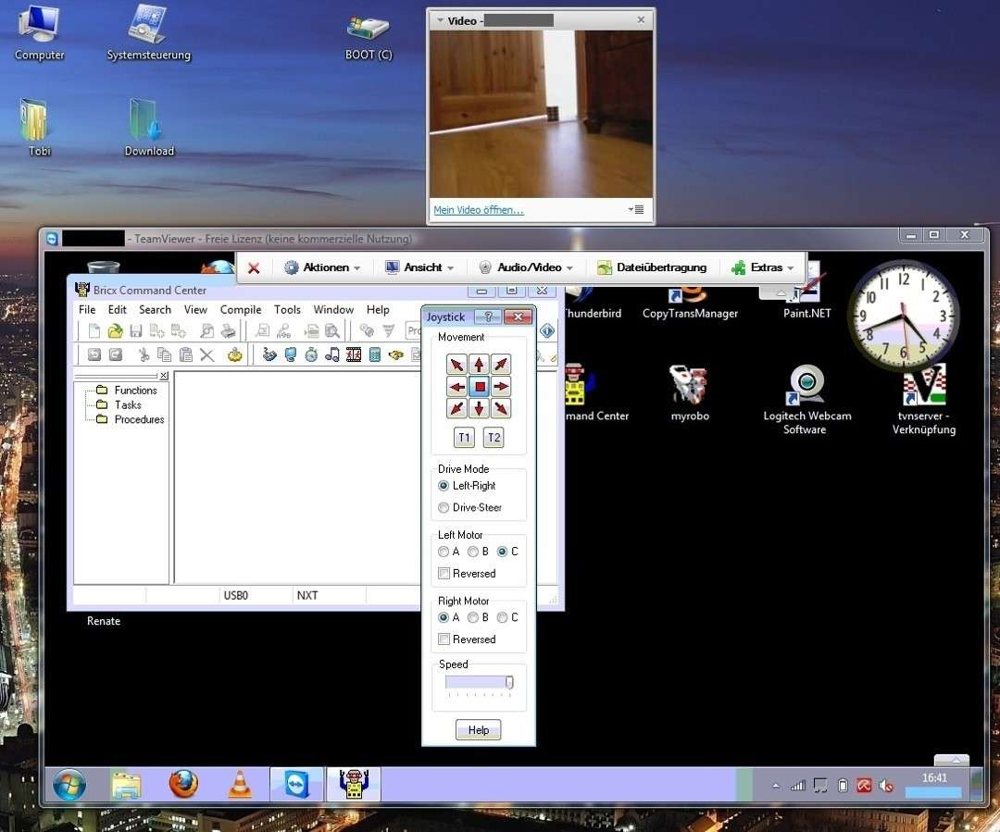

---
category:
  - roboter
cover:
  alt: MobilBot
  image: DSCI0068.jpg
date: "2010-10-01T12:23:27+00:00"
tag:
  - grau
  - schwarz
  - weiß
title: MobilBot
url: /2010/mobilbot
---

Dieses Kettenfahrzeug entstand aus der Idee heraus, einen fernsteuerbaren Lego-Roboter zu bauen. Ich baute also Kettenungetüm um ein Netbook herum. Letzteren verband ich per USB mit dem NXT-Stein. Dieser steuert die Motoren des Fahrzeugs. Weiterhin baute ich auf der Forderseite eine Webcam an, und verband diese ebenfalls mit dem Netbook.

Am Ende ließ sich über das Bricx Command Center auf dem Netbook der "Panzer" steuern. Das Netbook habe ich wiederum per TeamSpeak übers lokale WLAN kontrolliert. Und dank der Webcam wusste ich sogar, wo es lang geht ... tschaka laka!

