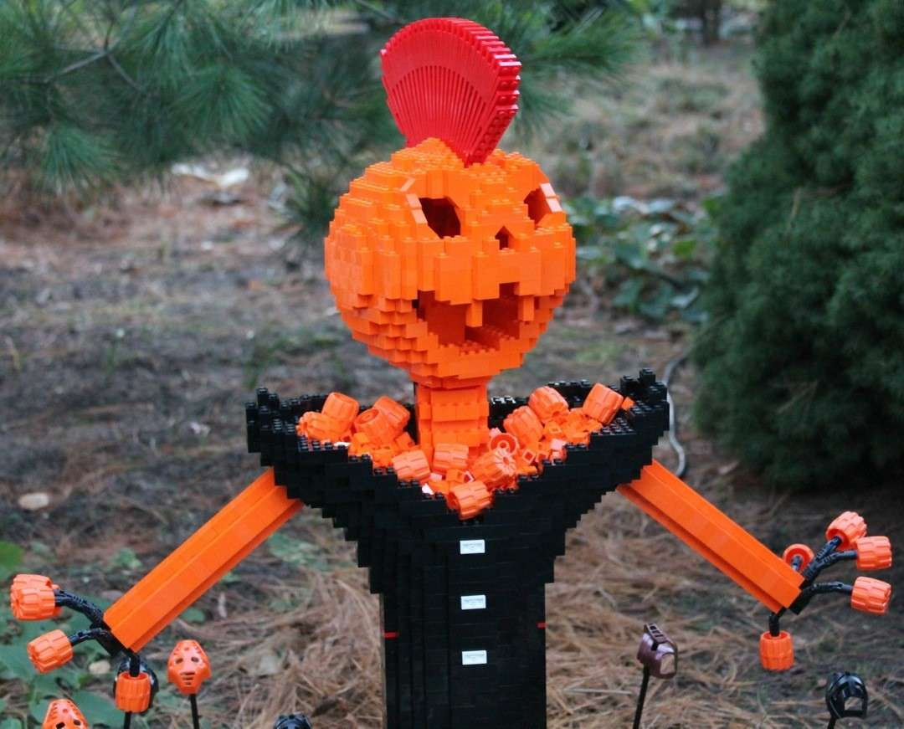
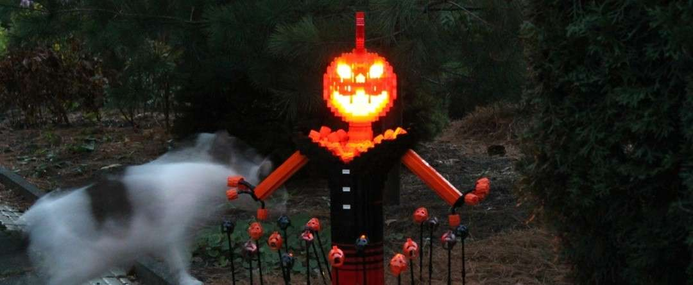
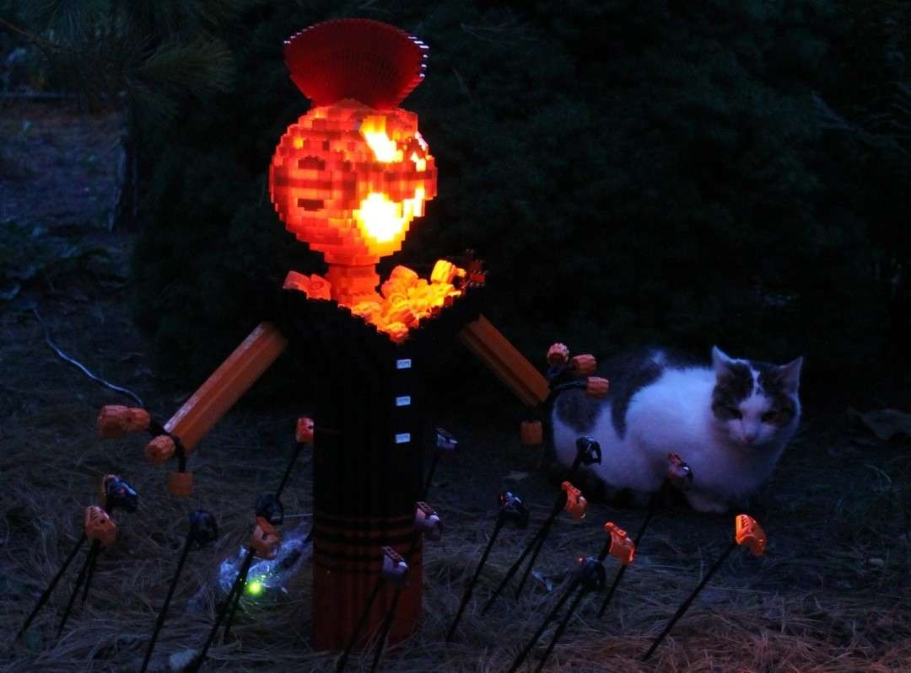
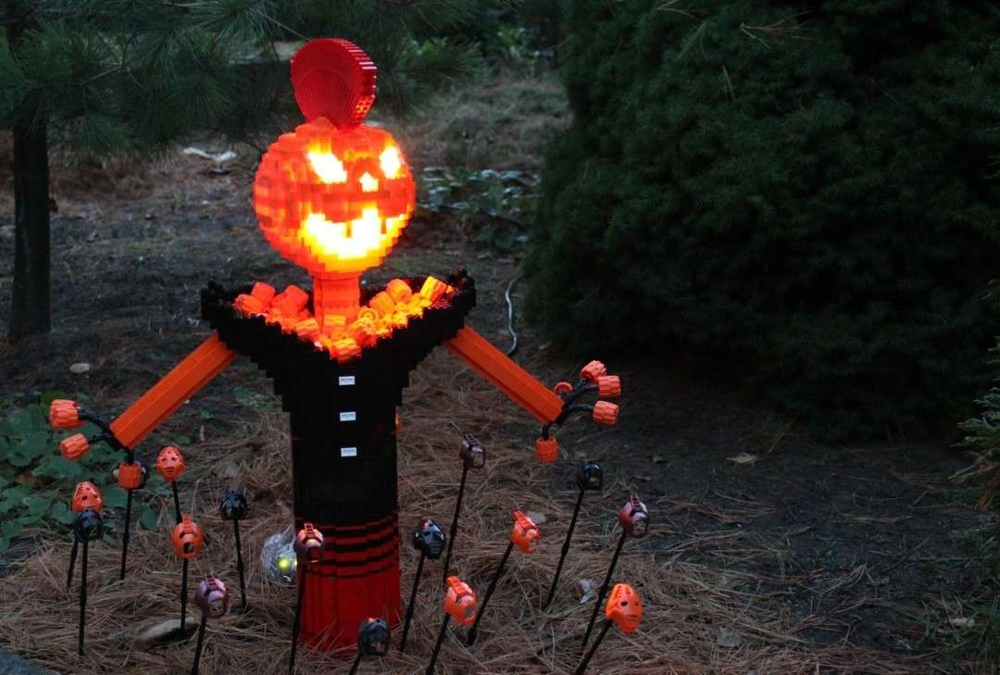
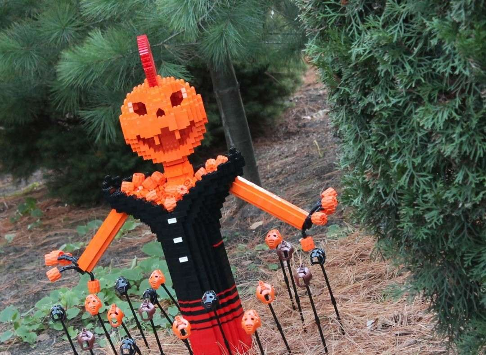
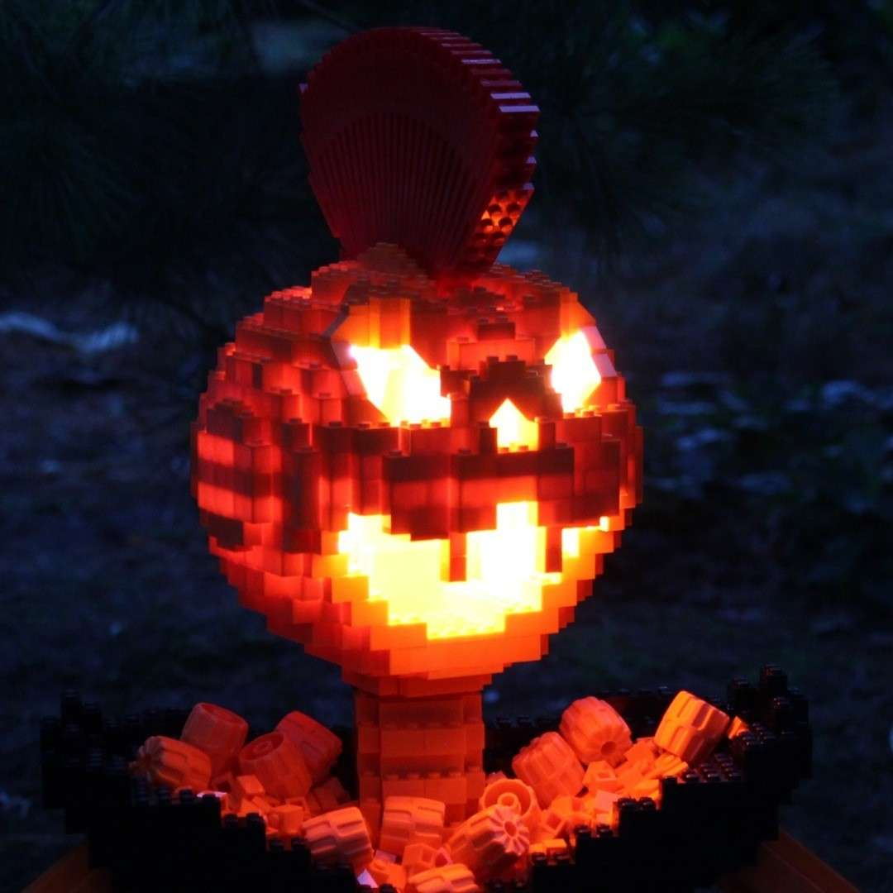

**Ein schreckliches Halloween wünsche ich euch allen !**

Natürlich war es schon lange mal wieder Zeit für eine neue Legoskulptur. Entsprechend habe ich Halloween als Anlass genommen, mich erneut kreativ zu betätigen. Diese verrückte Figur sollte ursprünglich ein kleiner Kürbis mit einem Gespenst daneben werden. Aber dann hat mir der Kürbis so gut gefallen, dass ich noch einen Körper dazu gebaut habe.

Nach dem "Fotoshooting" war ich leicht erstaunt: Auf den Tageslicht-Bildern sieht dieses Wesen irgendwie freundlich aus. Das war so aber nicht gewollt ...!

