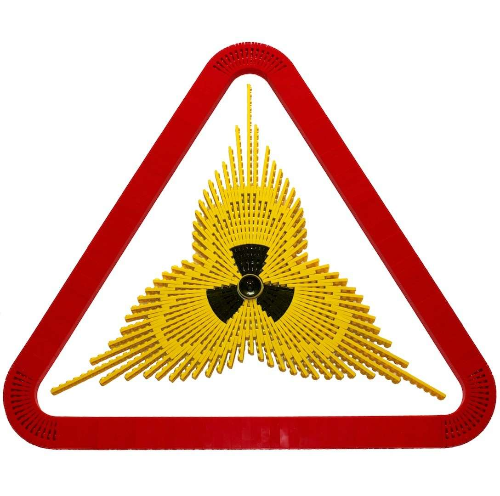
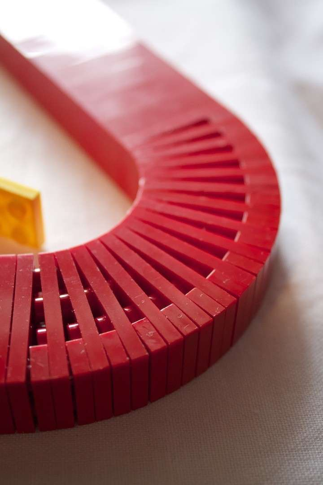
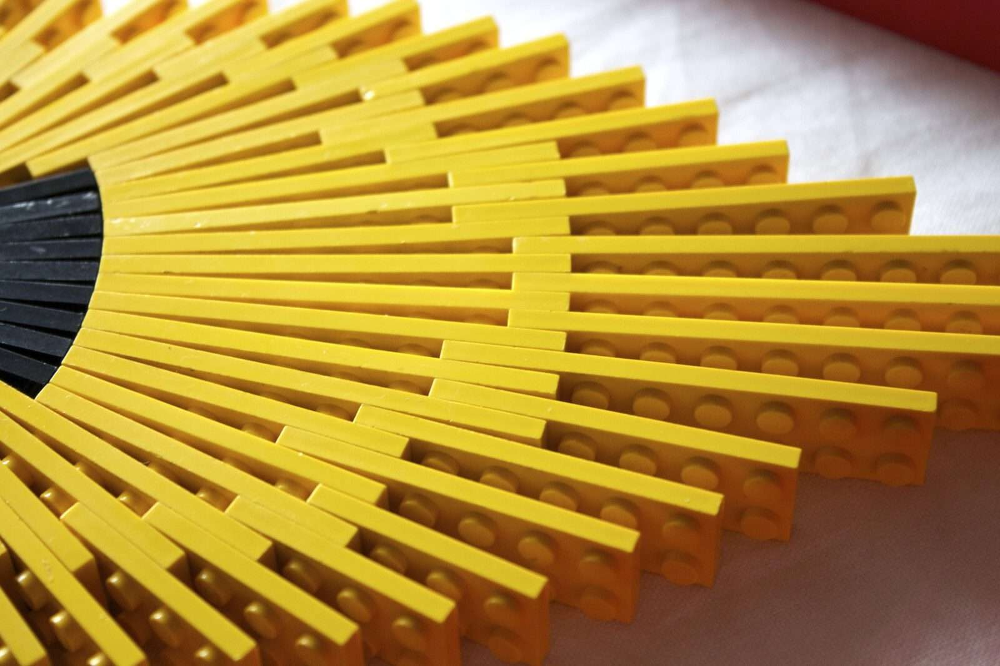
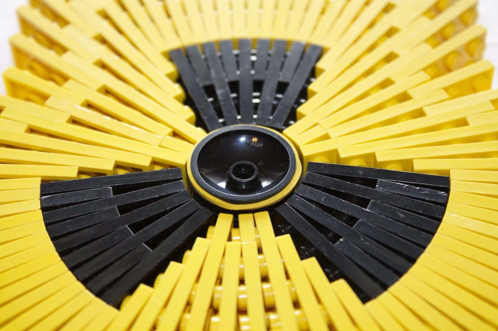
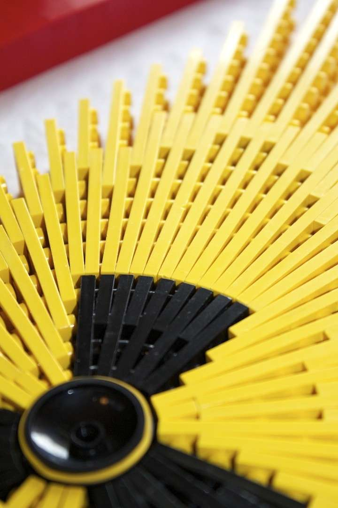
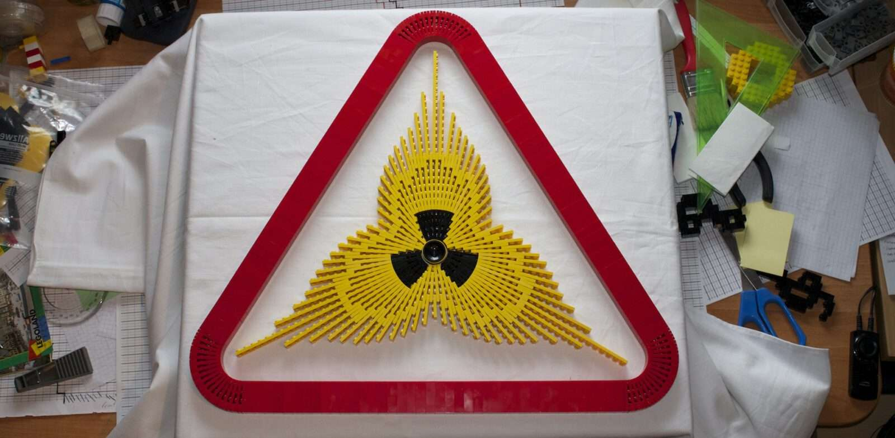

---
category:
  - legebild
cover:
  alt: Strahlung
  image: IMG_2200.jpg
date: "2013-07-01T10:02:12+00:00"
tag:
  - gelb
  - plate-bending
  - rot
  - schwarz
title: Radioaktiv
url: /2013/radioaktiv
---

**Sommer in Deutschland.** Die Temperaturen klettern ihren Höchstwerten entgegen. Da das bauen (bzw. wohl eher "überleben") unter diesen Bedingungen immer schwerer fällt, gehe ich es ruhig an. Ich experimentiere ein wenig mit verschiedenen Techniken.

Die gelben Steine sollten zunächst eine Kerzenflamme formen. Doch dann habe ich mich gefragt, wie es wohl als geschlossener "Kreis" aussieht. Dabei sind zufällig die inneren Ausbuchtungen entstanden, die unheimliche Ähnlichkeit mit dem Kernenergie-Logo hatten. Ich habe dann das ganze so umgebaut, dass die Ähnlichkeit deutlicher wurde. Als Abrundung noch das rote Schild drumherum und fertig. So entstand dieses bizarre Modell.

