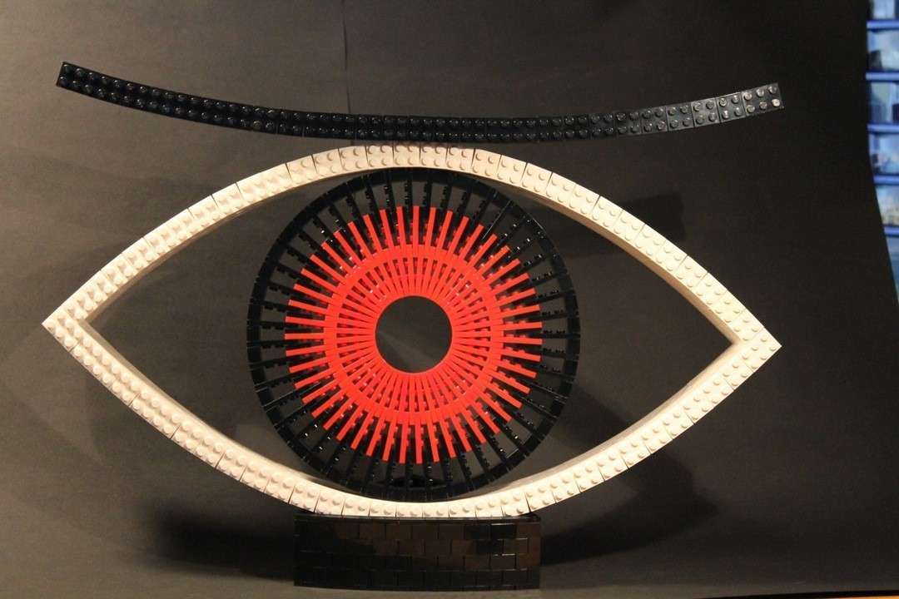

---
category:
  - skulptur
cover:
  alt: Red Eye
  image: RedEye.jpg
date: "2011-09-08T13:53:45+00:00"
tag:
  - brick-bending
  - plate-bending
  - rot
  - schwarz
  - weiß
title: Red Eye
url: /2011/red-eye
---

Dieses rote Auge ist sehr spontan entstanden. Ich hatte einige rote Platten übrig und formte daraus einen Ring. Der Rest geschah im Affekt. Umso überraschter war ich, als dieses Modell - als mein erstes überhaupt - bei [TheBrothersBrick](http://www.brothers-brick.com/2011/09/18/the-eye/) vorgestellt wurde.

