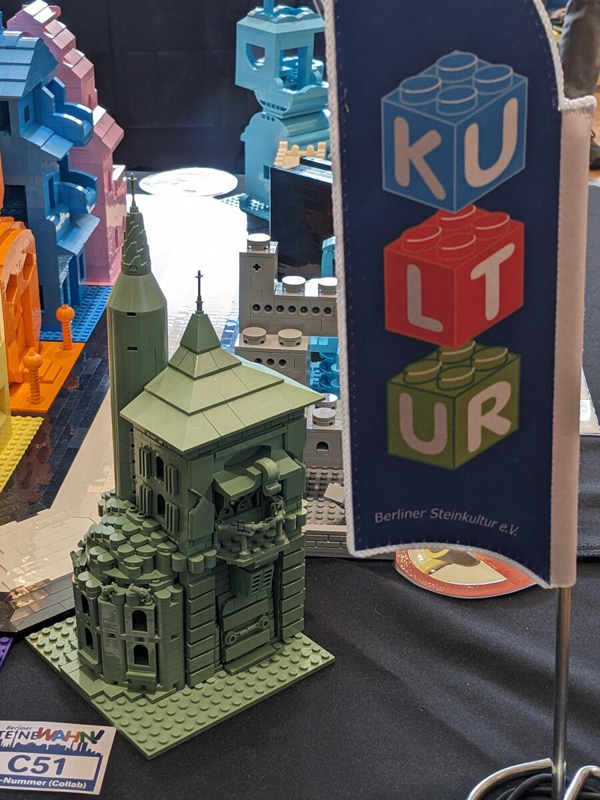
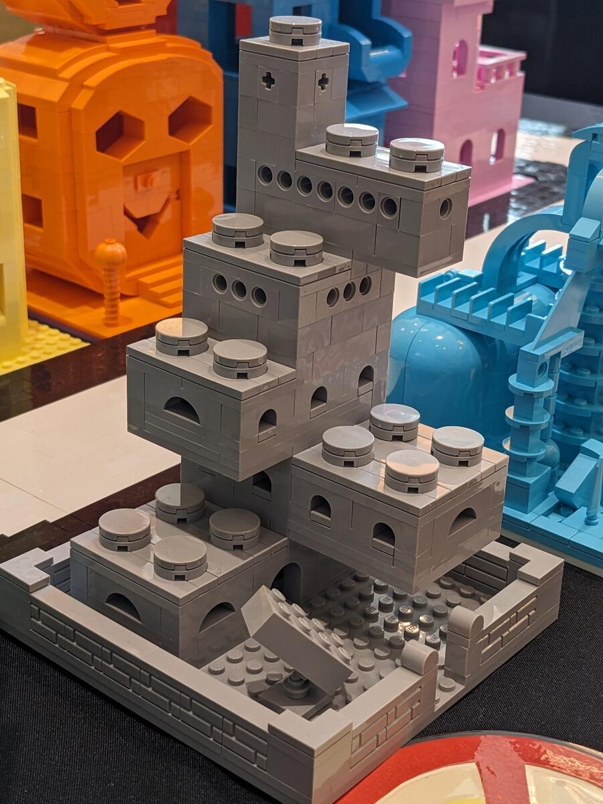
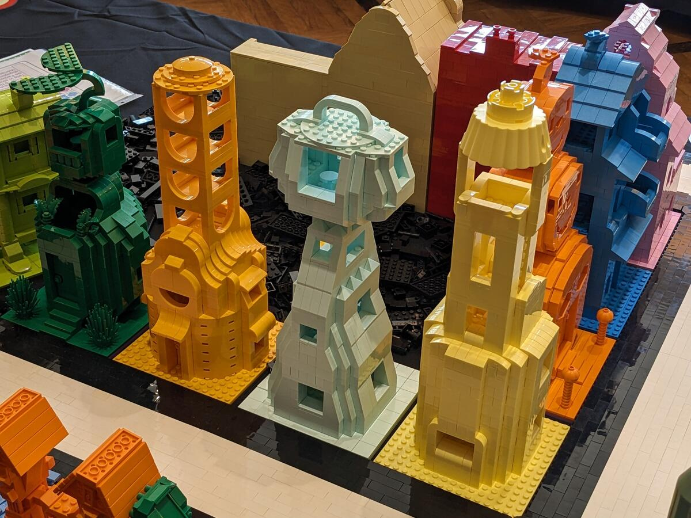
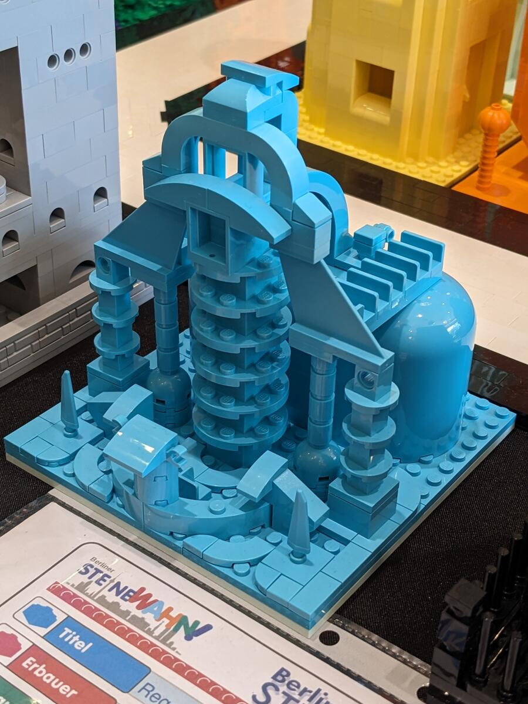
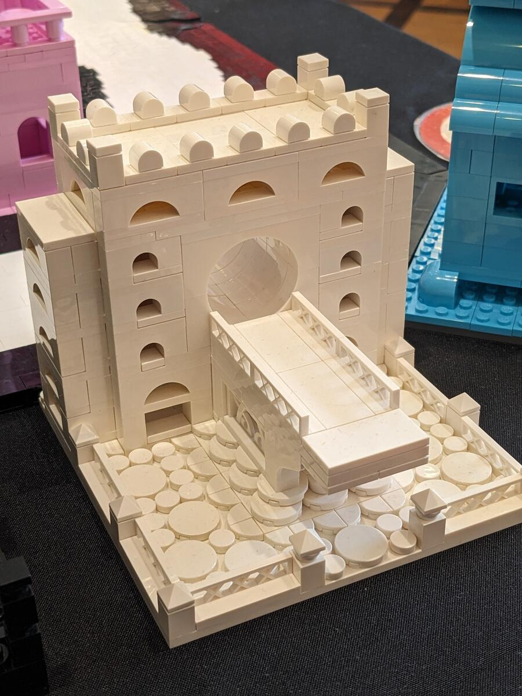
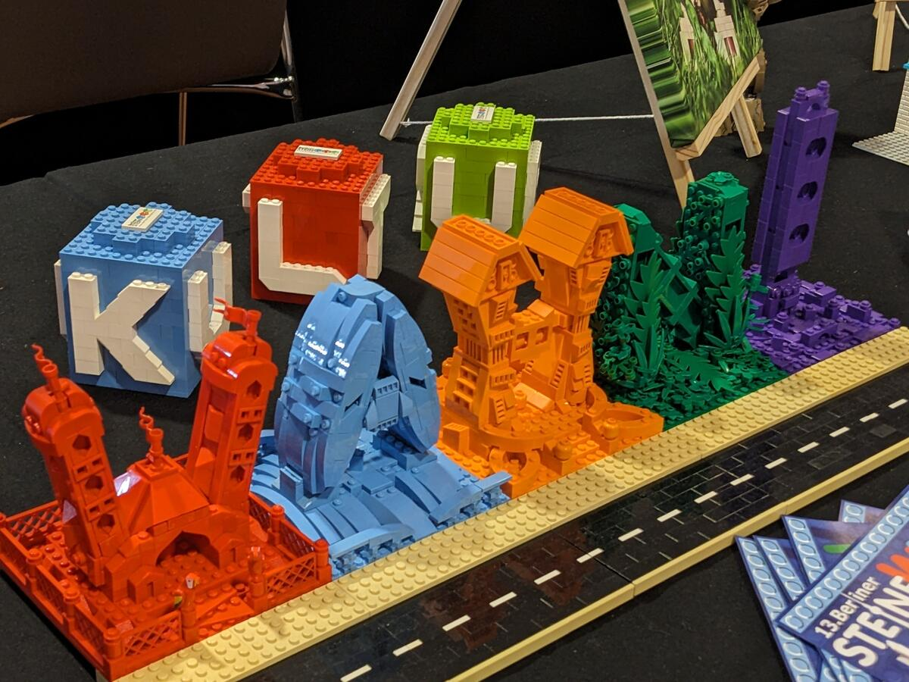

---
author:
  - Tobias Buckdahn
  - Renate Buckdahn
colours:
  - blau
  - orange
  - grün
  - beige
  - rot
cover:
  image: regenbogen-09.jpg
date: "2024-09-13"
tags:
  - lego
  - vignette
title: Regenbogen-Allee
url: /2024/regenbogenallee
---

Für den 13. Berliner [SteineWAHN!](https://steinewahn.de) habe ich eine eine gemeinsame Bauaktion namens "Regenbogen-Allee" organisiert. Aufgabe war es, jeweils ein Haus auf einer 16x16-Platte in nur einer Farbe zu bauen. Alle Modelle wurden vor Ort zu einem Straßenzug bzw. einer Stadt kombiniert.

 

 

Mein Beitrag zur Aktion war dieser WAHN!-Schriftzug.

