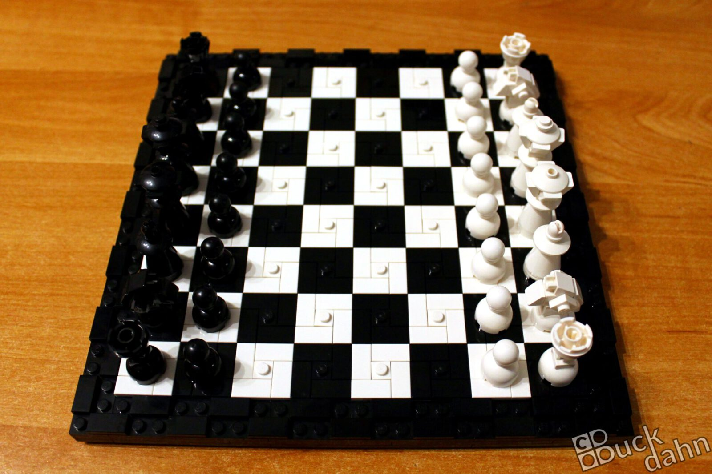
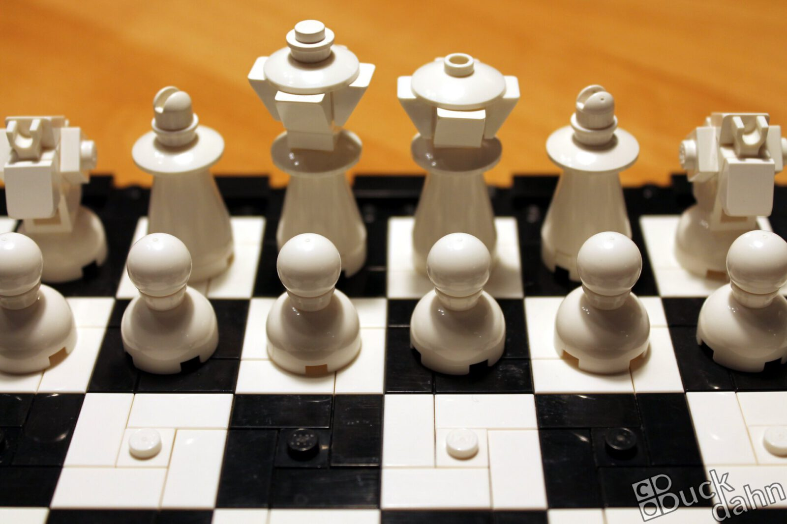
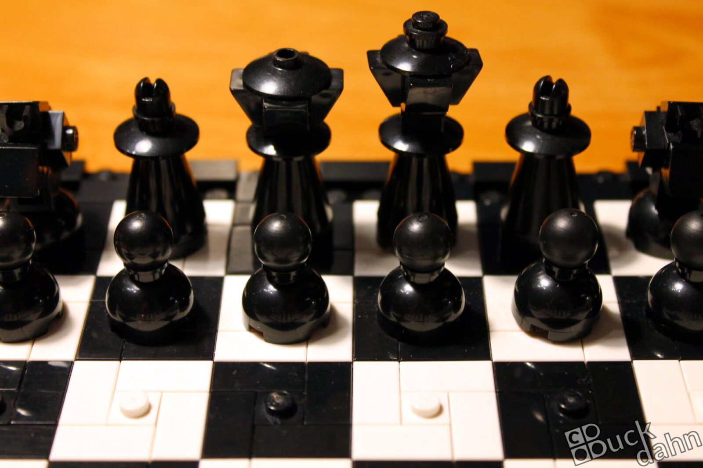
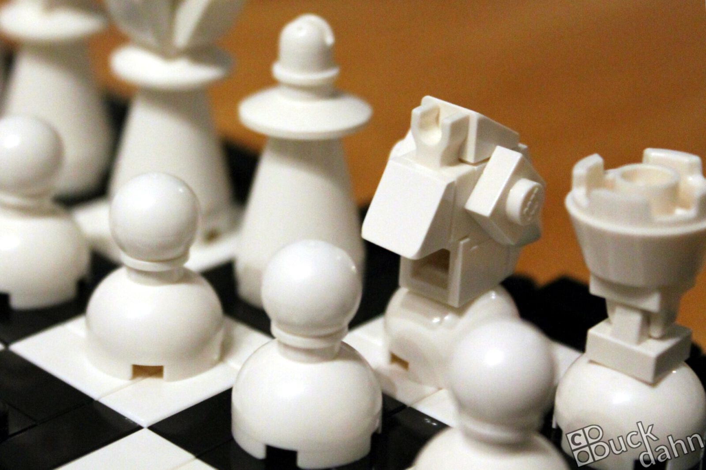
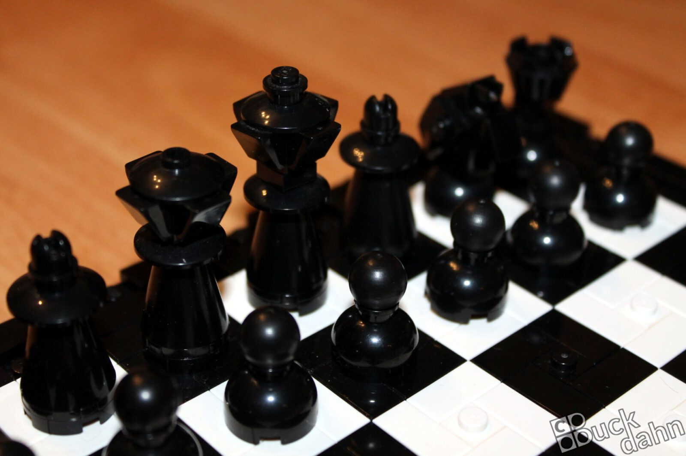
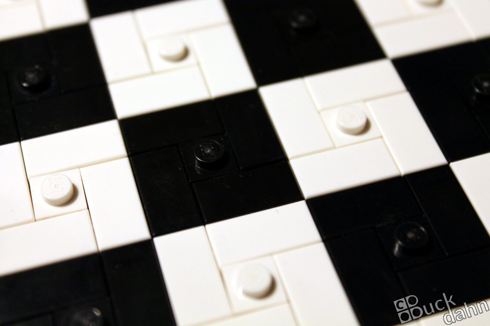

Dieses Schachspiel habe ich als Geburtstagsgeschenk für einen passionierten Schachspieler gebaut. Die Bauernfiguren haben hierbei die Größen der restlichen Figuren und des Spielbretts diktiert, da sie mir als erstes in den Sinn kamen.

Die Idee für König und Königin ließ anschließend nicht lange auf sich warten. Bei den Türmen dauerte es anschließend jedoch eine Weile, ehe ich auf die Idee mit den [Kissing-Clips](https://brick.camp/de/tech/clip-kiss) kam.

Die Springer habe ich mehrfach überarbeitet und umgebaut, ehe ich wirklich mit ihnen zufrieden war. Als schließlich alle Figuren und das Brett fertig waren war das eine riesige Freude für mich ... und wenig später auch für den Beschenkten ;-)

