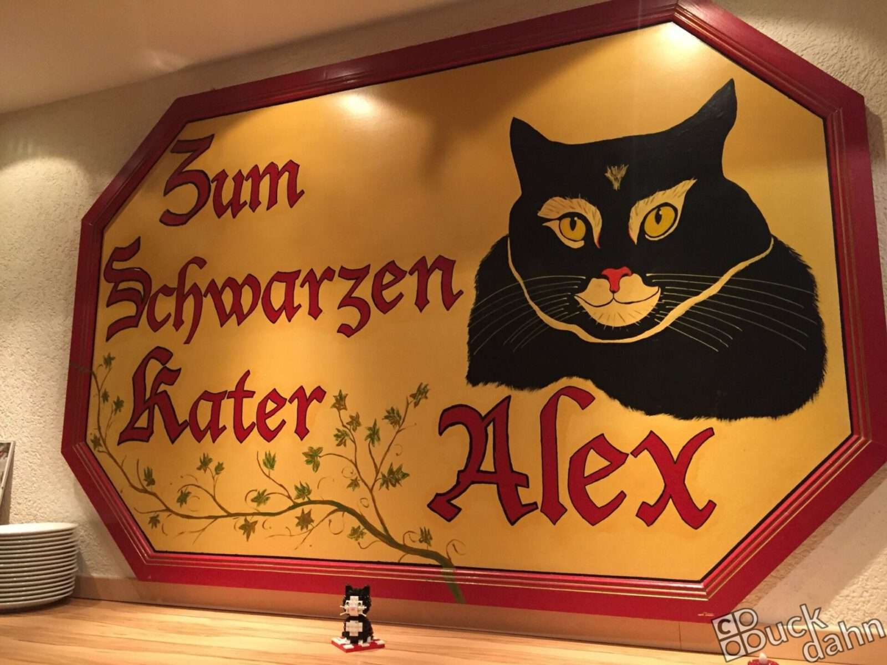
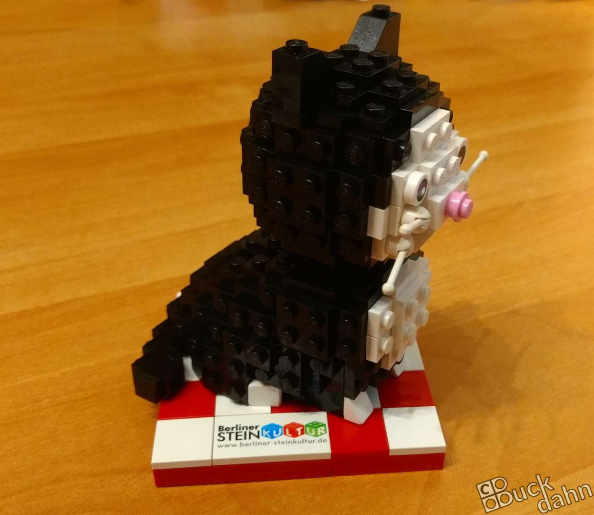

**Die [Berliner Steinkultur](http://berliner-steinkultur.de/)** ist ein eingetragener Verein, der sich voll und ganz dem Thema Lego widmet. Wir treffen uns regelmäßig zu Stammtischen an den verschiedensten Orten Berlins.

 

Ein besonderer Ort ist hier unser **Stammlokal "Zum Schwarzen Kater Alex"**. Da wir dort stets willkommen sind und Raum finden für die ein oder andere skurrile Lego-Aktion, wollten wir uns mit einem kleinen Geschenk für die Gastfreundschaft erkenntlich zeigen.

So kam es, dass ich dieses kleine Kätzchen mit unserem Vereins-Emblem gebaut habe. Die Gastwirtin hat sich sehr darüber gefreut. Und so hat dieses Kätzchen seinen Stammplatz im Lokal gefunden.
