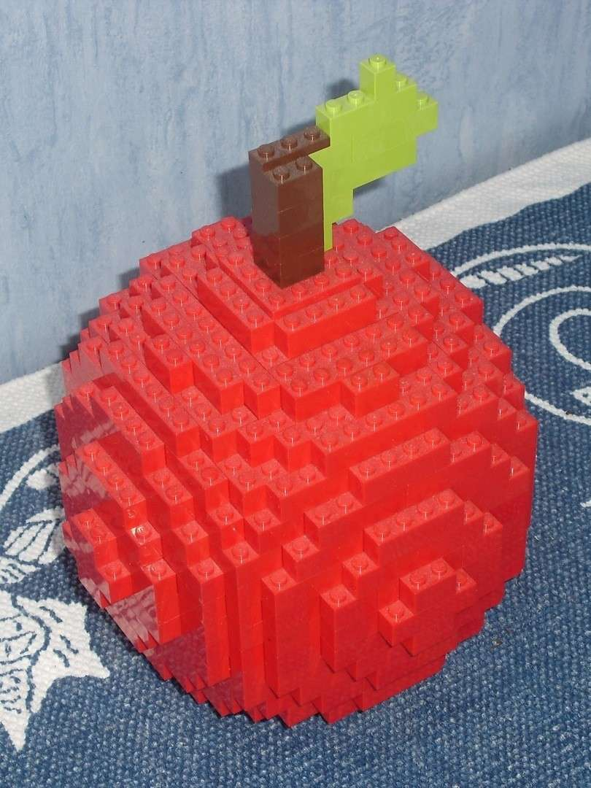
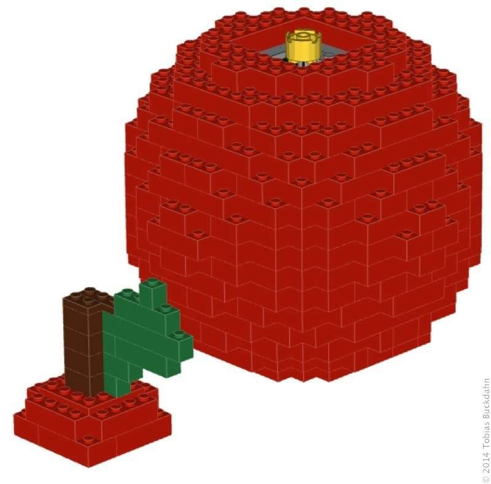
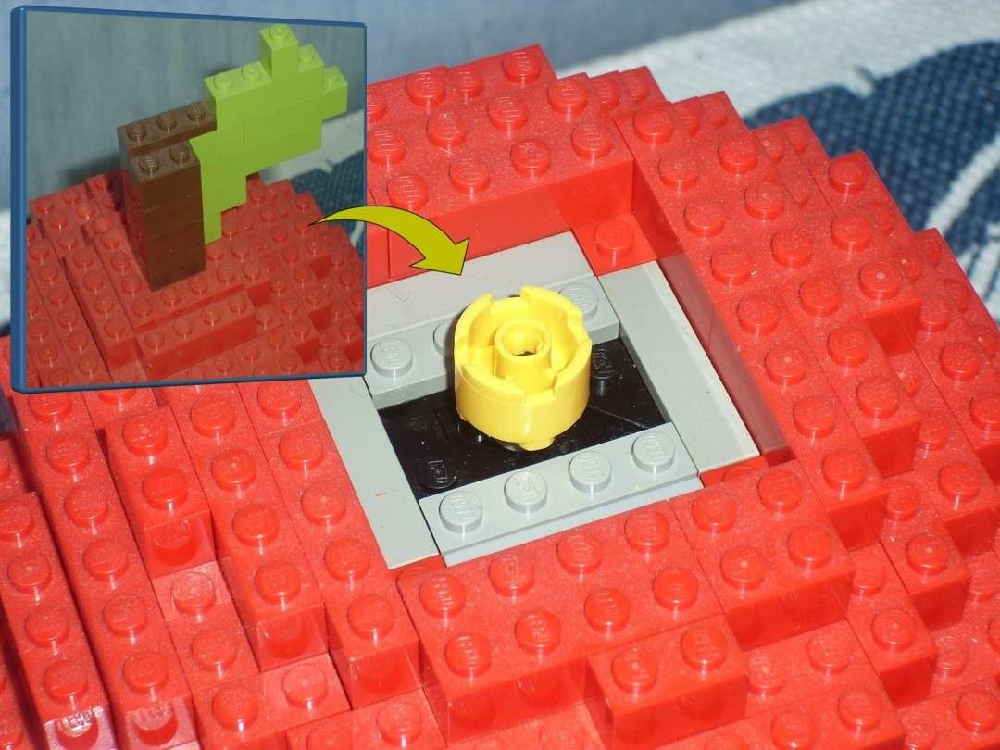
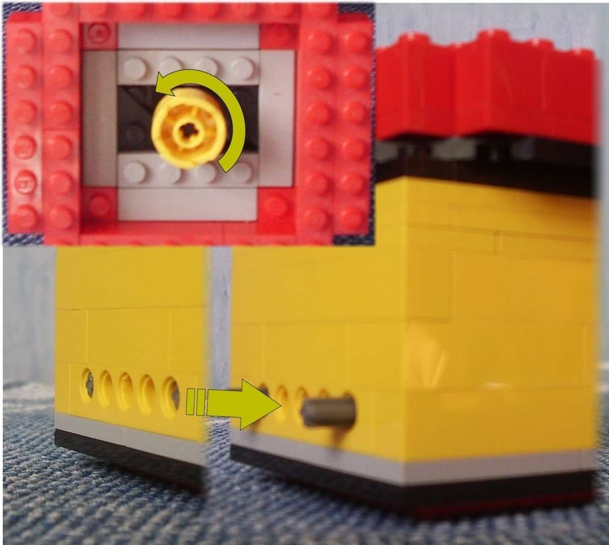
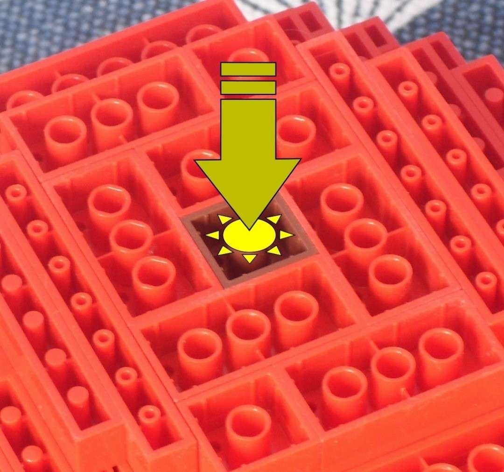
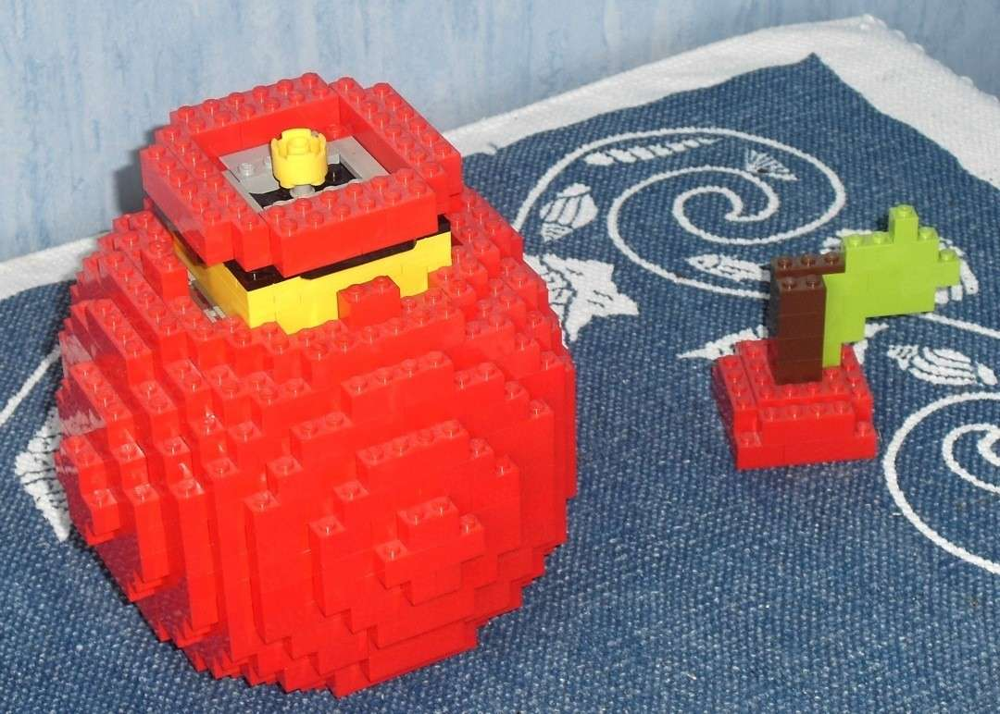
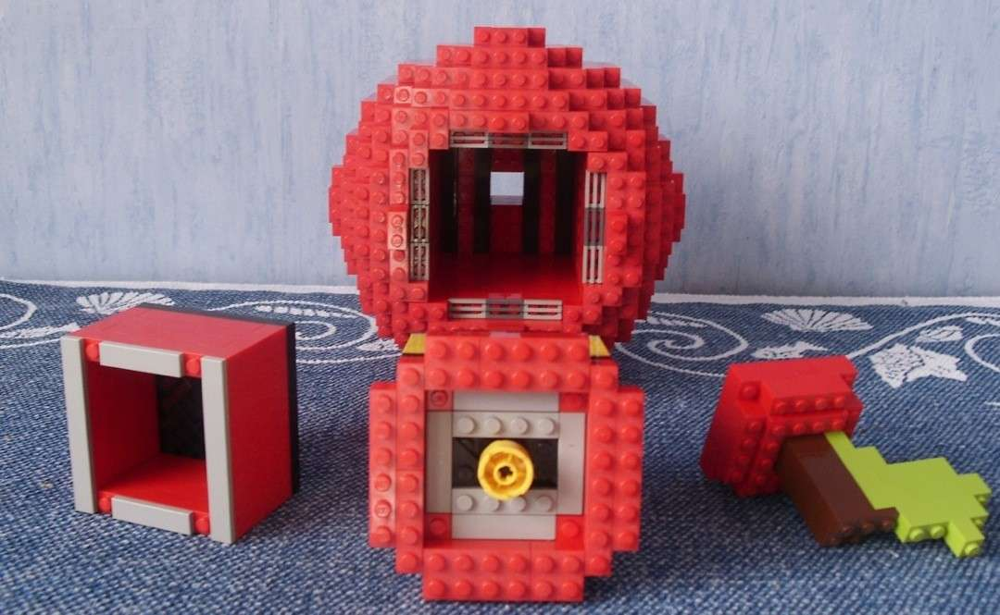

---
categories:
  - lego
  - skulptur
cover:
  alt: Secret Apple
  image: DSCI0042.jpg
date: "2010-09-01T12:21:01+00:00"
tags:
  - gelb
  - rot
title: Secret Apple
url: /2010/apple
---

**Es ist mehr als nur ein Apfel.** Es ist mehr als nur irgendein Legomodell. Es ist ... beides. Außerdem besitzt es ein Geheimfach im Inneren. Deshalb sollte man den Wert dieser kleinen Frucht nicht unterschätzen.

### Bauanleitung

Hier findet ihr die Bauanleitung zu diesem Legomodell. Es ist mein erster Versuch, etwas entsprechendes für eines meiner Modelle zu erstellen. Solltet ihr Schwierigkeiten haben oder Fehler in der Anleitung finden, dann [informiert mich gerne darüber](/kontakt/ "Kontakt").

[Download](Bauanleitung_SecretApple.pdf "Download der Lego-Bauanleitung")

_**Steine einsparen:** Wer nicht alle benötigten Teile aufbringen kann, der sollte die Außenhülle (abweichend von der Bauanleitung) teilweise hohl bauen und versuchen, fehlende Steine durch ähnliche zu ersetzen._

### Geheimfach öffnen

Schritt 1: Verschlusskappe abnehmen

Schritt 2: Knauf drehen

Schritt 3: Geheimfach von unten herausdrücken

Schritt 4: Fach öffnen

