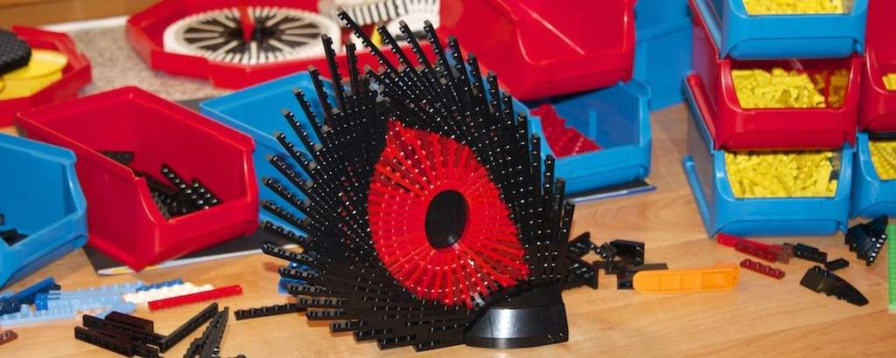

---
categories:
  - skulptur
cover:
  alt: Watch Out
  image: WatchOut.jpg
date: "2013-08-01T09:21:46+00:00"
tags:
  - plate-bending
  - rot
  - schwarz
title: Watch out!
url: /2013/watch-out
---

In Anlehnung an [mein erstes rotes Legoauge](/2011/red-eye/ "Red Eye") sowie spätere Modelle, habe ich auch dieses Modell mit angewinkelten Legoplatten gebaut. Mir gefällt diese Technik richtig gut, weil sie die starren, eckigen Formen von Lego perfekt verbirgt. Ich habe vor, noch weitere Modelle dieser Art zu bauen.

