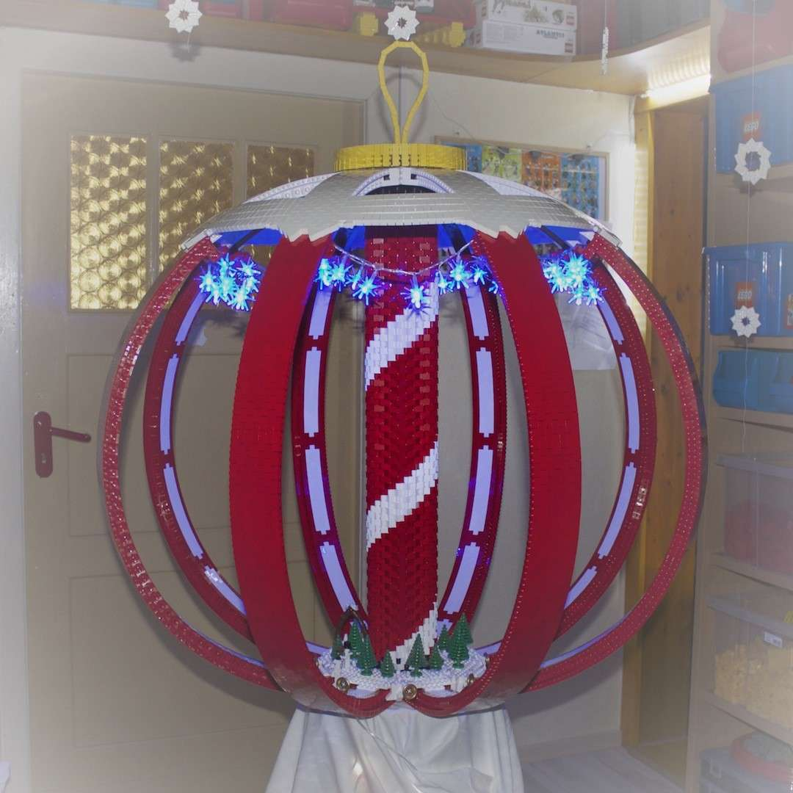
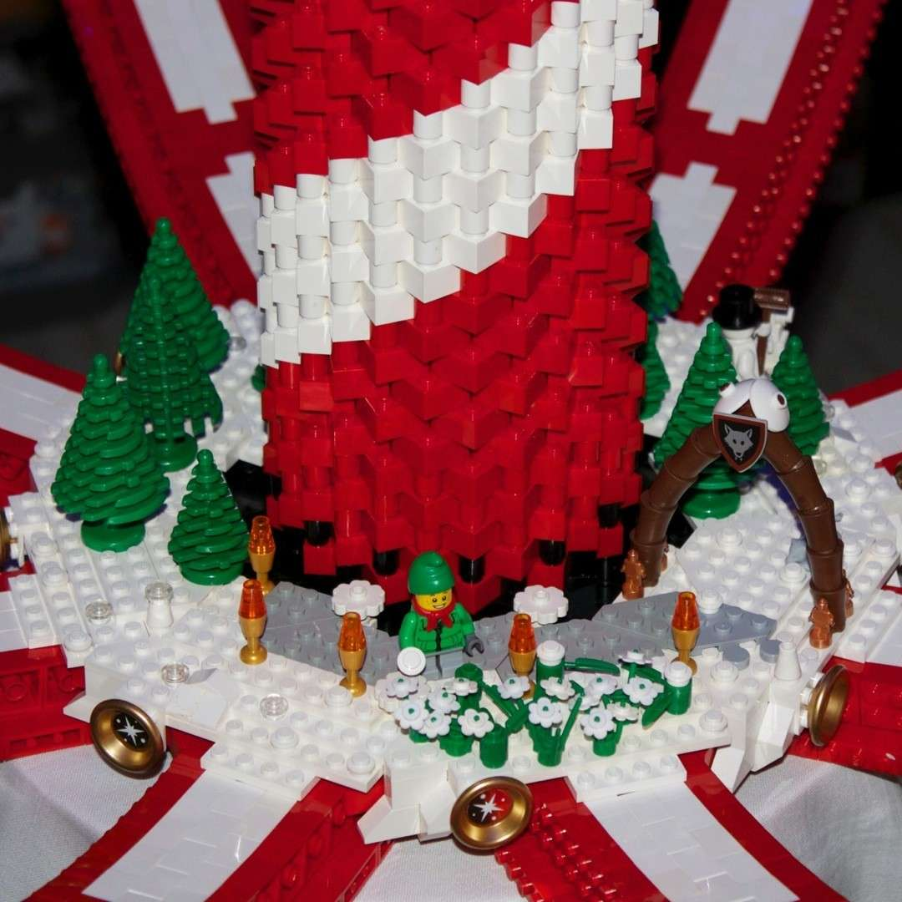
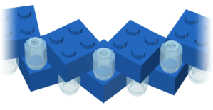
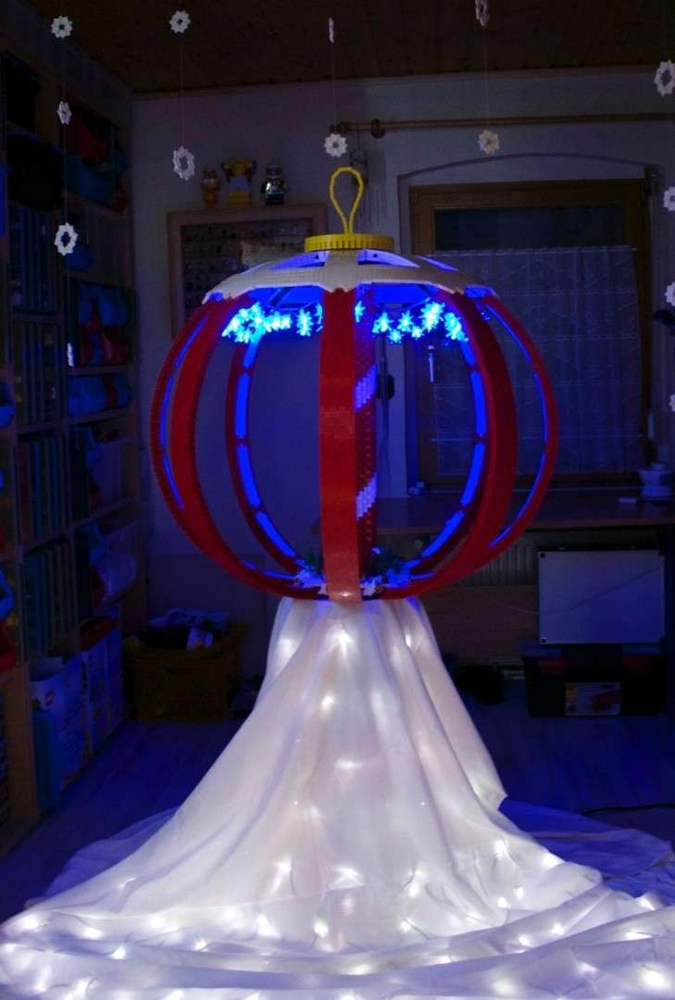

---
categories:
  - skulptur
cover:
  alt: Weihnachtskugel
  image: Bild3.jpg
date: "2012-12-24T16:15:50+00:00"
tags:
  - brick-bending
  - rot
  - weihnachten
  - weiß
title: Weihnachtskugel
url: /2012/weihnachtskugel
---

Die Quadratur des Kreises ist in der Mathematik als unmöglich bekannt. Mit Lego ist aber so etwas ähnliches bei Kugeln machbar. Ich wünsche euch allen ein Frohes Fest - egal, ob ihr diesen Text zu Weihnachten lest oder nicht.

