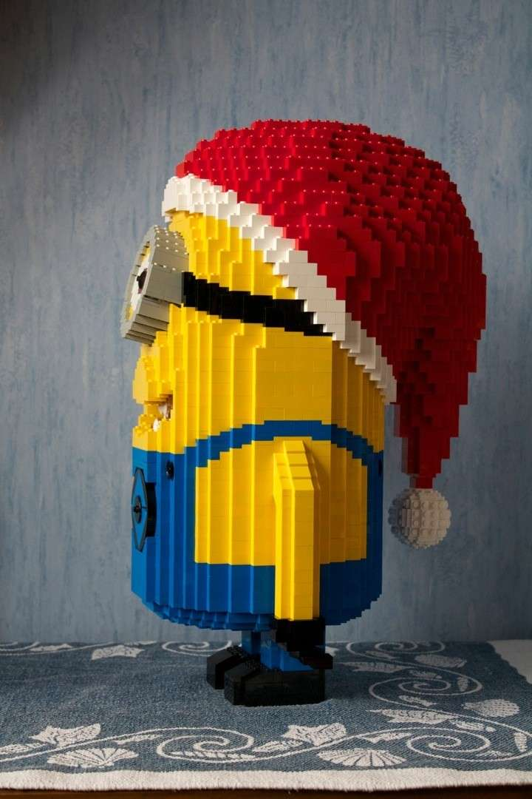
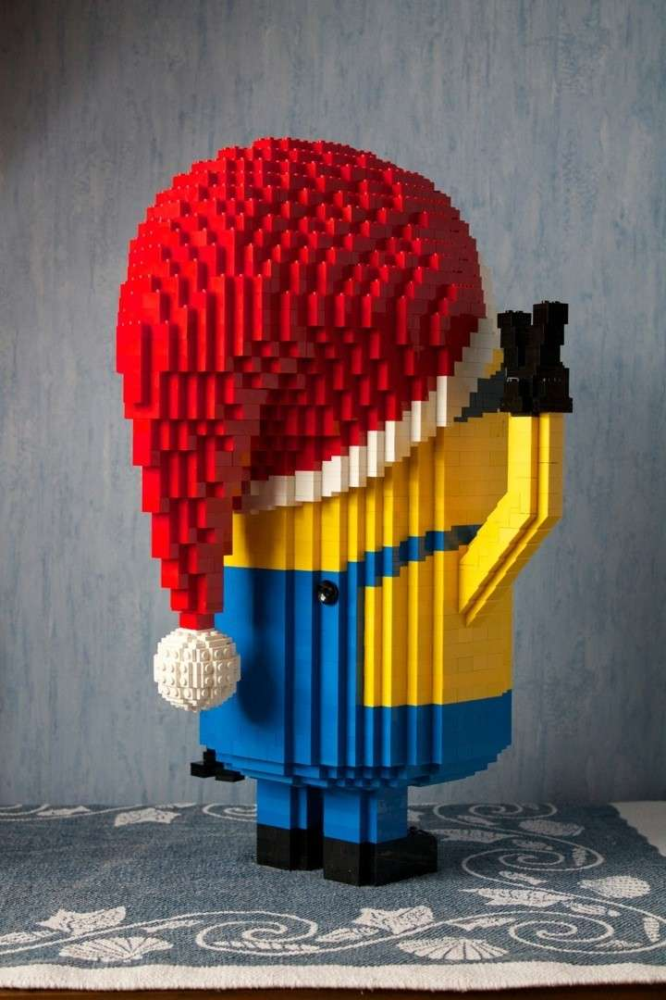
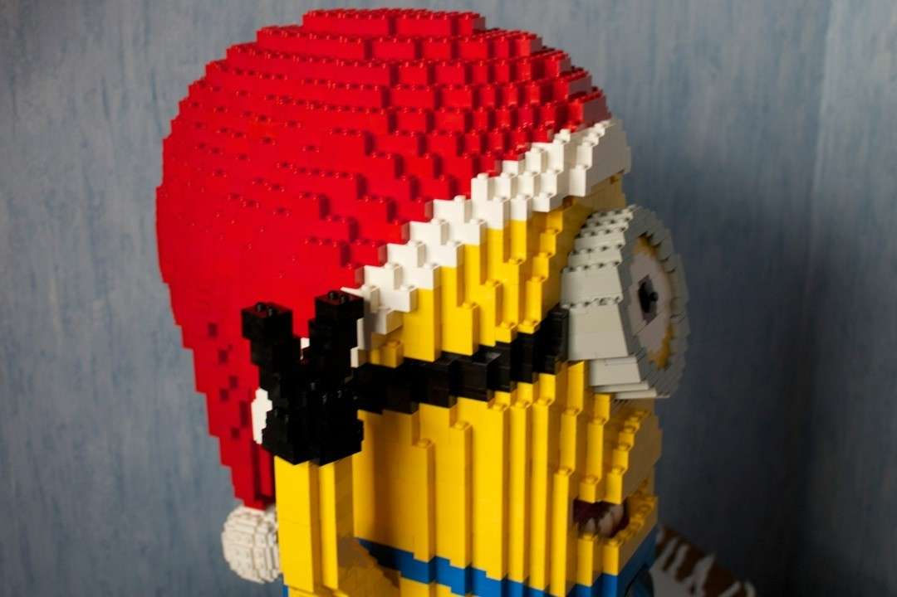

**Die Weihnachtszeit naht - jippie!** Ich wollte schon seit diesem Sommer einmal einen Minion bauen - sie sind einfach zu putzig, um nicht auf diese Idee zu kommen. Entsprechend habe ich mir für die Festzeit diesen Wunsch erfüllt.

Gebaut wurde diese Skulptur an zwei aufeinander folgenden Wochenenden. Derzeit verbringe ich die Wochentage fernab meiner Legosammlung. Entsprechend bemühe ich mich, an den Wochenenden möglichst viele Ideen in die Tat umzusetzen.

