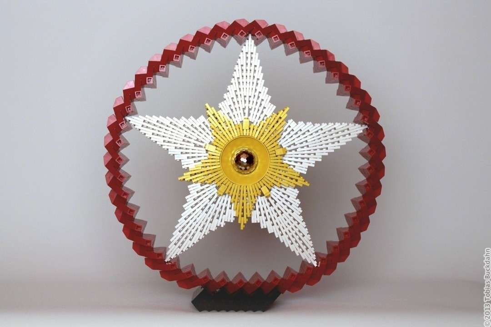
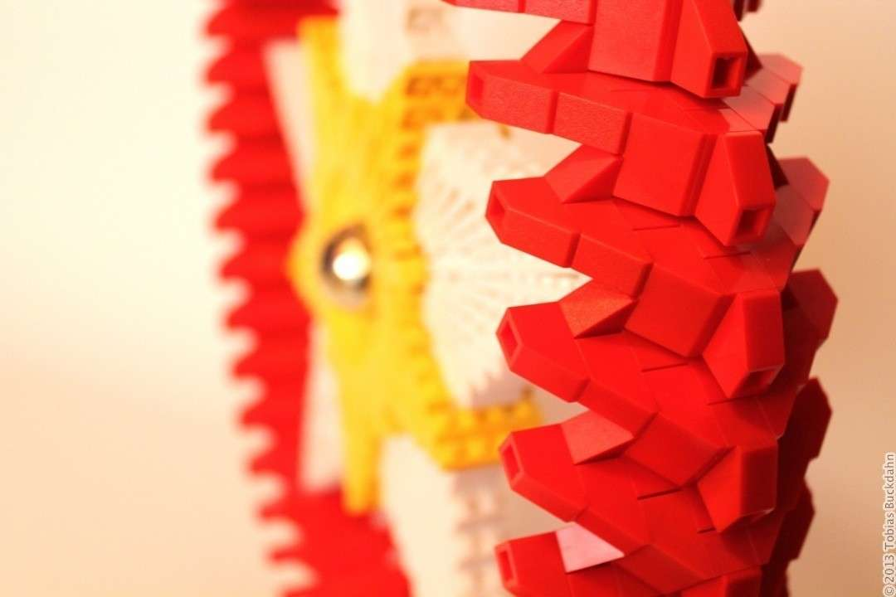
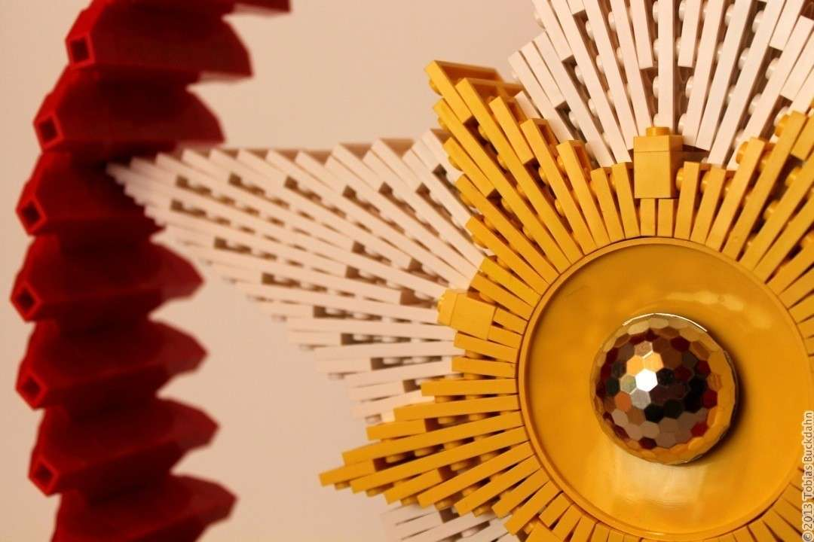

**Lego ist unglaublich vielfältig.** Das ist es, was mir beim Entwickeln von Modellen regelmäßig aufs neue klar wird. Als ich bei früheren Skulpturen mit angewinkelten Legoplatten experimentiert habe, war ich überrascht, dass die Resultate nicht auseinander brachen. Manchmal fielen die Platten einfach in sich zusammen, da keine feste Verbindung zwischen den Steinen bestand.

**Ganz anders jedoch dieses Modell:** Hier bin ich überrascht, dass es mir nicht beim Bauen explodiert ist. Der äußere Ring steht unter großer Spannung, um die fragile Konstruktion im Inneren zu fixieren. Jede Bewegung des Modells war ein Abenteuer für sich. Doch nun am Ende sitzt jeder Stein fest an seinem Platz ... allerdings traue ich mich nicht, einen Stein wieder zu lösen.

**Euch allen eine frohe Vorweihnachtszeit!**

