Trotz langer Untätigkeit auf dieser Webseite hab ich das Lego-Hobby nicht aus den Augen verloren. In der ersten Jahreshälfte habe ich diesen Weißstorch aus Lego gebaut. Die vier Monate Bauzeit könnt ihr hier im Schnelldurchlauf erleben:

_Dieses Video ist leider nicht mehr online._

Alles begann Anfang Dezember 2016 mit einer Anfrage des [Wildparks Eekholt](http://www.wildpark-eekholt.de/). Sie äußerten Interesse an einer Familie von Lego-Weißstörchen und ich war direkt begeistert von der Idee. Noch in der Vorweihnachtszeit begann ich mit den Recherchen und der Planung zum Bau eines Weißstorch-Männchens.

[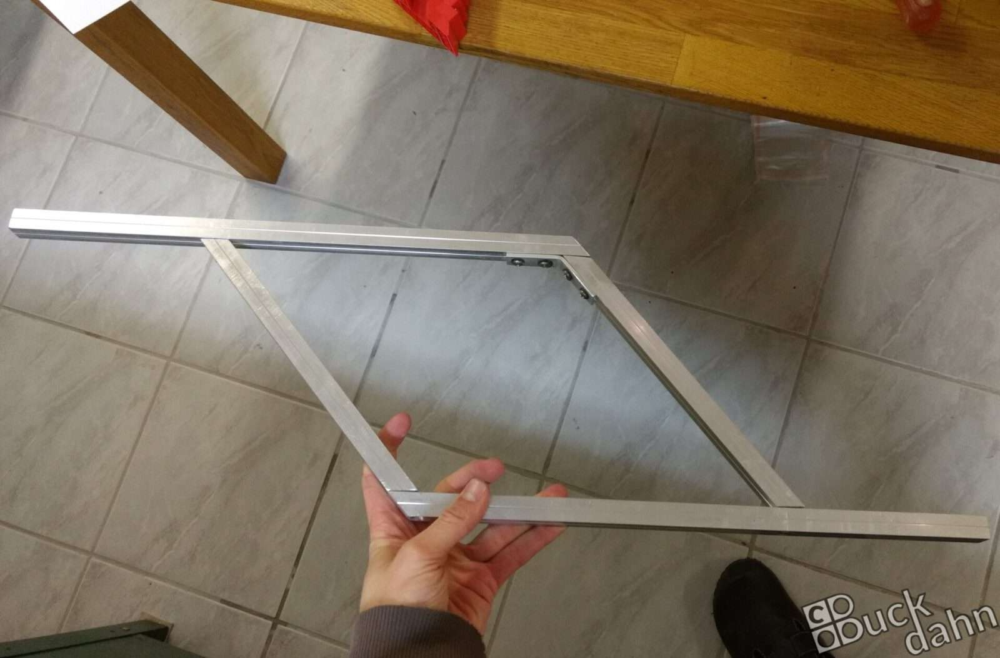](Weissstorch_0004.jpg)

Hierfür suchte ich allerlei Fotos aus dem Internet und druckte mir eine Seitenansicht in Originalgröße aus. Auf Basis des damit erstellten Umrisses ging es an die Planung des Metallgestells. Dieses war zwingend erforderlich, da die Beine viel zu lang und dünn für eine selbsttragende Legokonstruktion sind.

[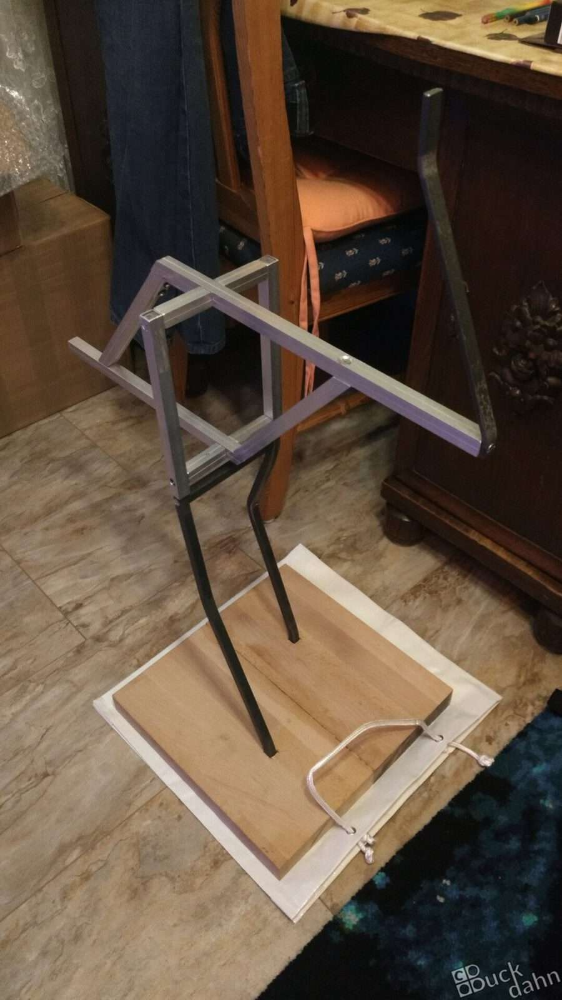](Weissstorch_0005.jpg)
[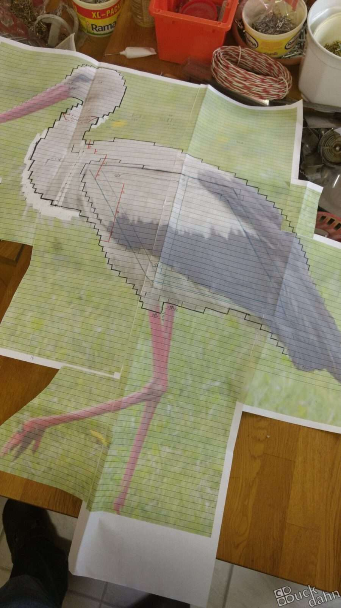](Weissstorch_0003.jpg)

So baute ich zusammen mit meinem Vater über die Weihnachtsfeiertage im heimischen Bastelkeller an einem grundsoliden Metallgestell aus Aluminium und Stahl. Als Grundplatte dient ein massives Holzbrett. Mit dieser Konstruktion düste ich nach dem Jahreswechsel glücklich in meine Wohnung und setzte mich an das eigentliche Werk: Den Bau der Legoskulptur.

[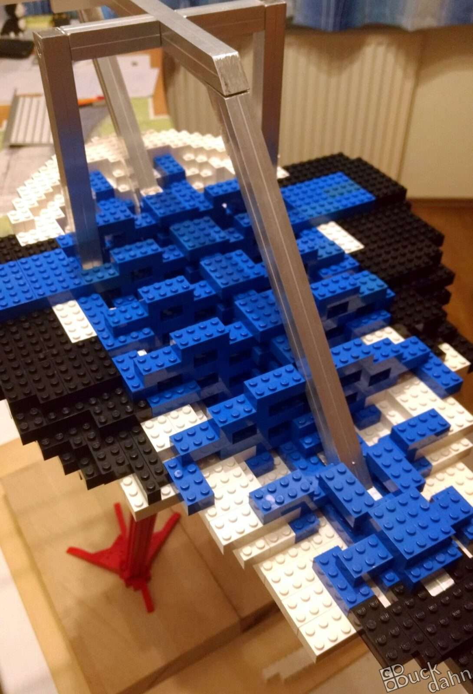](Weissstorch_0007.jpg)
[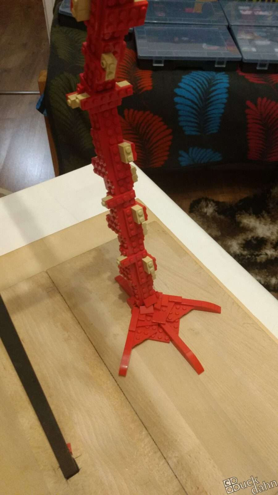](Weissstorch_0006.jpg)

Über die nachfolgenden vier Monate hinweg entstand so Schritt für Schritt das fertige Kunstwerk. Zwischenzeitig erwies sich die Verbindung zwischen Metallgestell und Grundplatte als zu wackelig. Aus diesem Grund habe ich das Modell lange Zeit mit einer Wasserwaage abstützen müssen.

[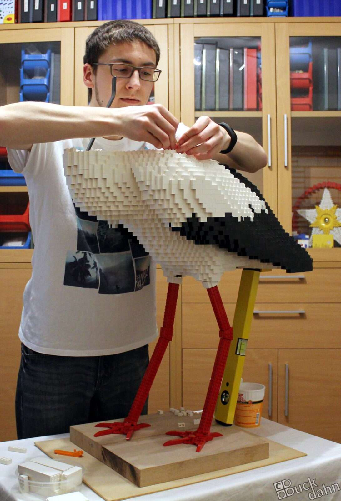](Weissstorch_0001.jpg)
[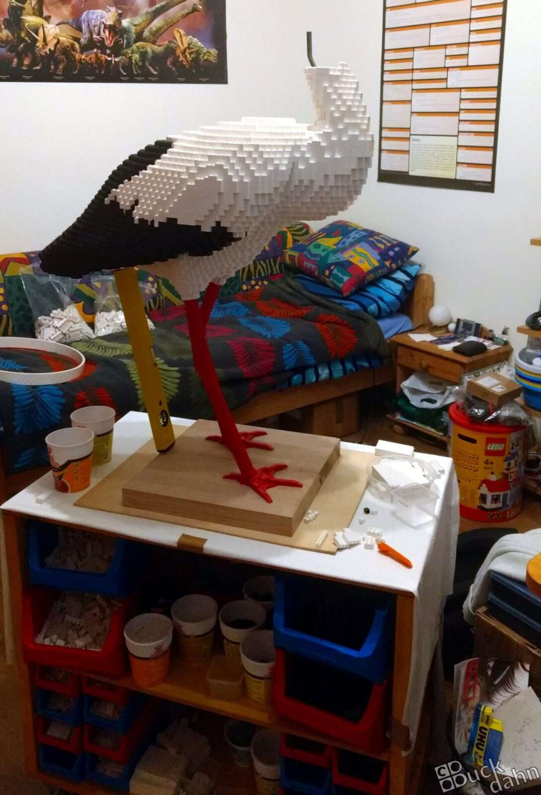](Weissstorch_0009.jpg)

Der Bau war von zahllosen Herausforderungen begleitet. Besonders in Erinnerung wird mir eine Situation bleiben, bei der mein Vater und ich am halbfertigen Storch das Metallgestell nachbearbeiten mussten. An einem riesigen Steinkoloss mal eben ein Stück Metall absägen ist schon ein Abenteuer für sich...

Besonders Spaß haben der Schnabel und die Augen gemacht. Sie waren eine große Herausforderung. Bei den Augen stellte sich die große Frage, wie sich alle Lücken schließen lassen, sodass man nicht irgendwo in den Kopf hinein schauen kann. Es war eine riesige Freude als wirklich keine Lücke mehr zu sehen war.

[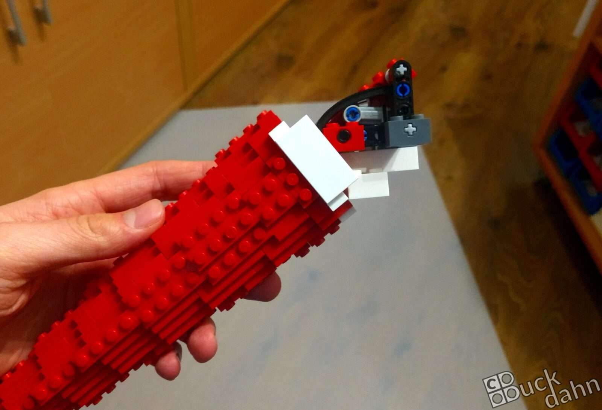](Weissstorch_0011.jpg)
[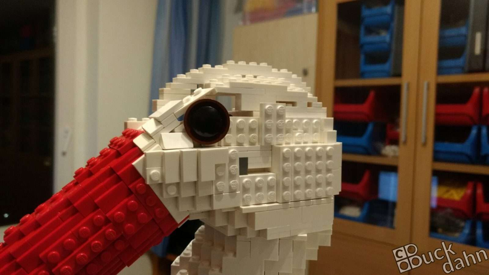](Weissstorch_0012.jpg)

[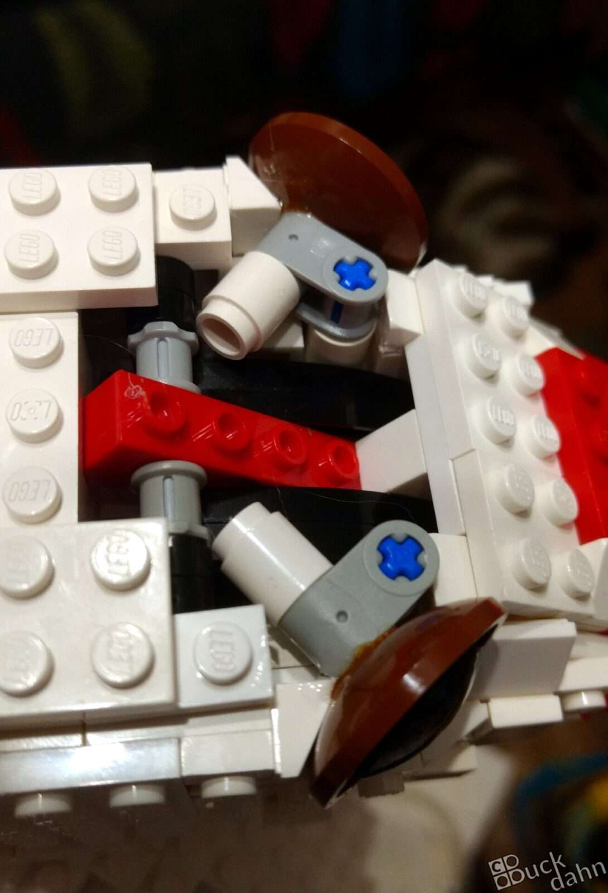](Weissstorch_0013.jpg)

Und so ging im April 2017 der Bau dieser Skulptur zu Ende. Im September konnte ich sie schließlich beim [6\. Berliner SteineWAHN!](http://www.steinewahn.de) zum ersten Mal der Öffentlichkeit präsentieren. Zu meiner großen Freude wurde der Storch von den Ausstellern zum besten MOC gewählt! Damit hätte ich nie gerechnet - eine traumhafte Krönung für dieses spannende Kapitel meiner Legoleidenschaft.

[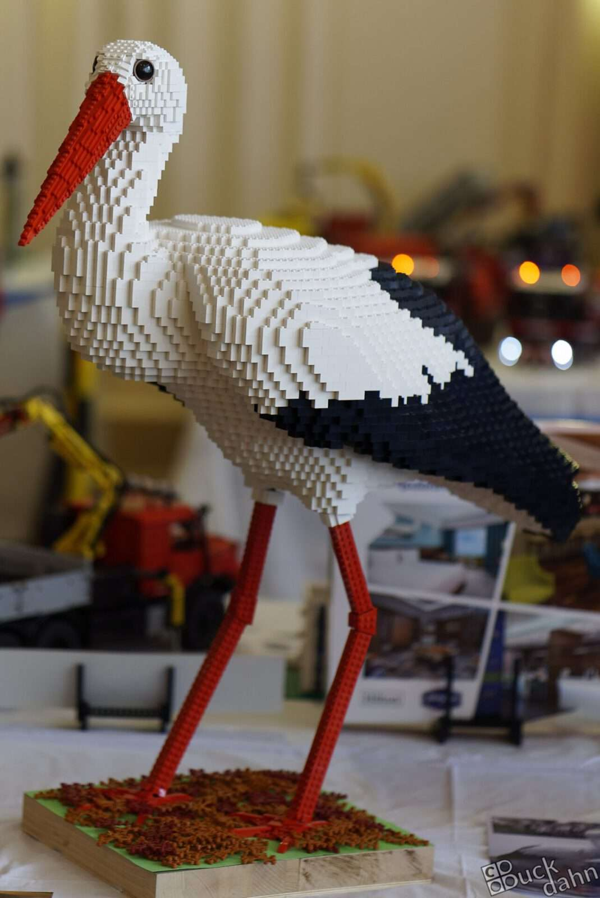](Weissstorch_0014.jpg)
[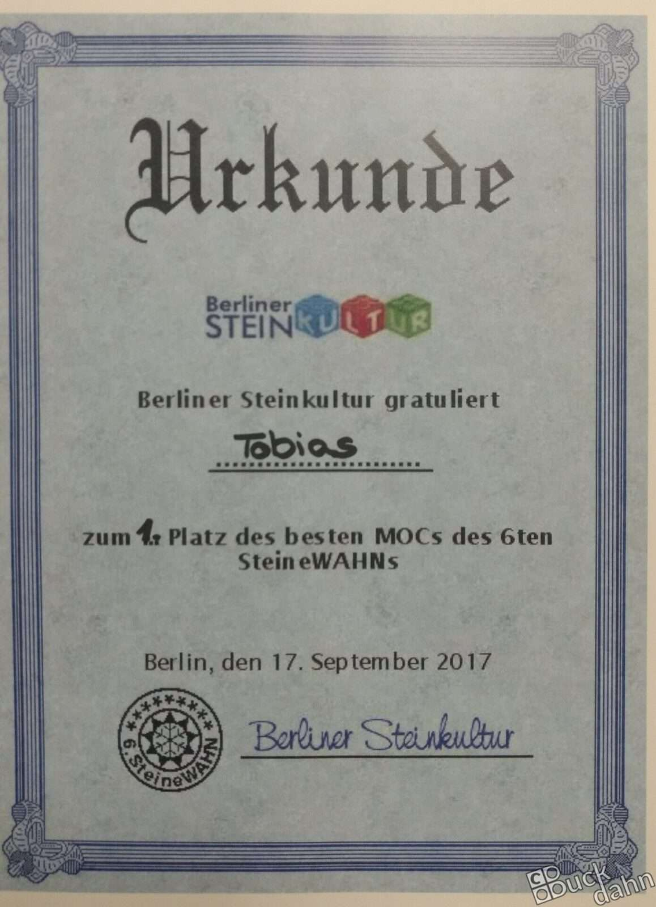](Weissstorch_0015.jpg)
