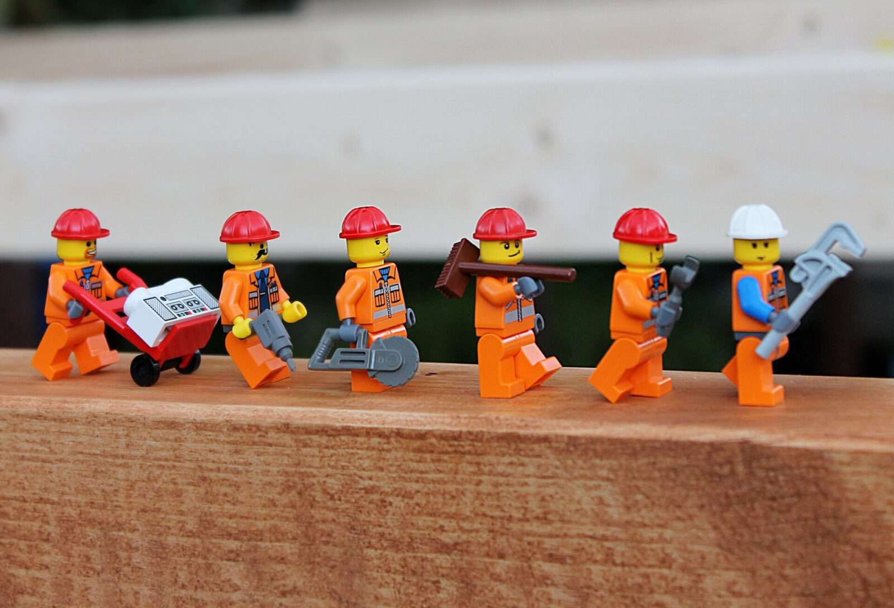
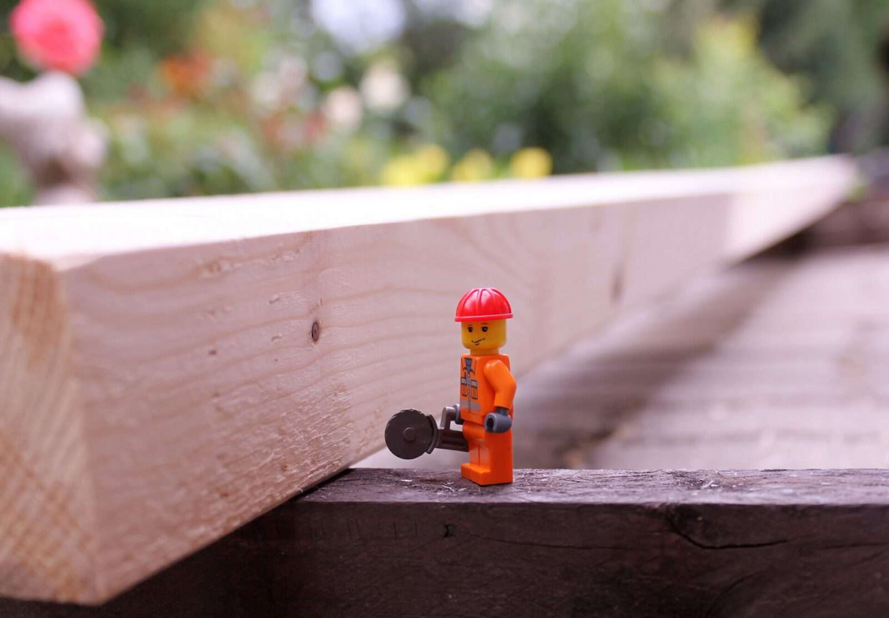
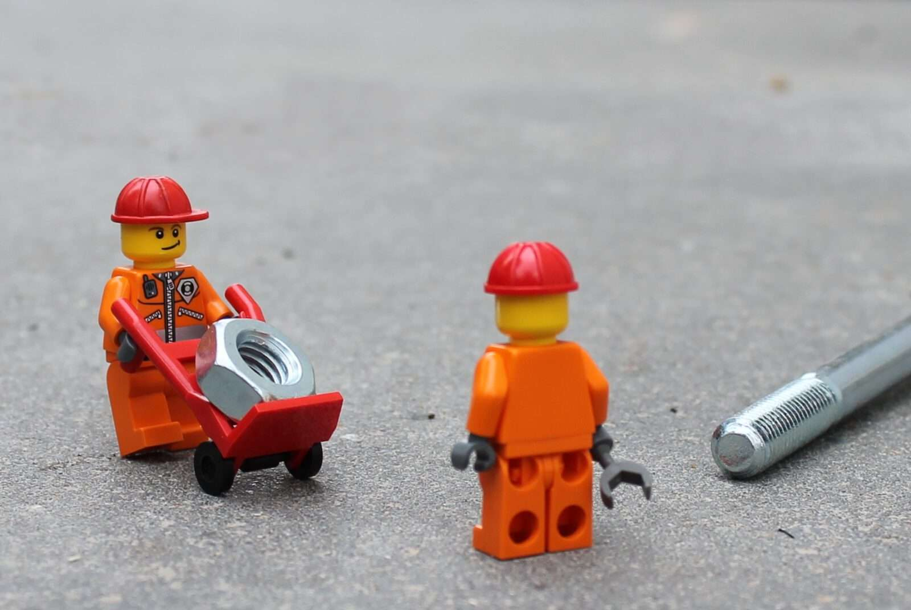
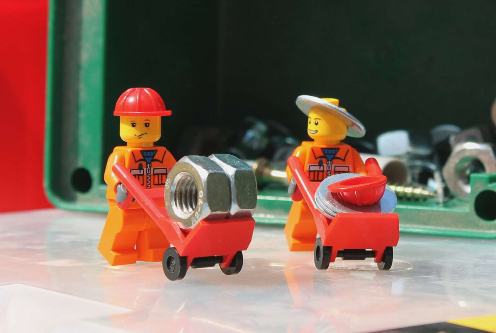
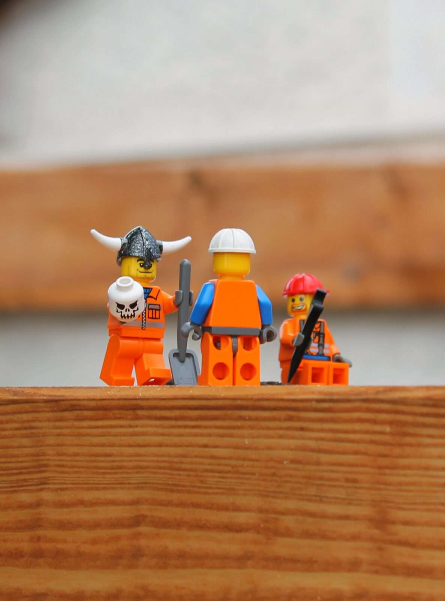
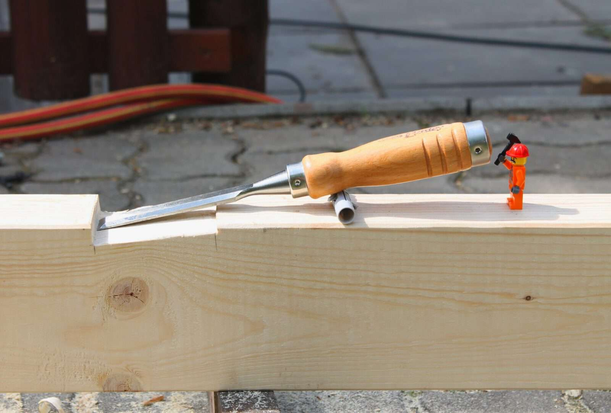
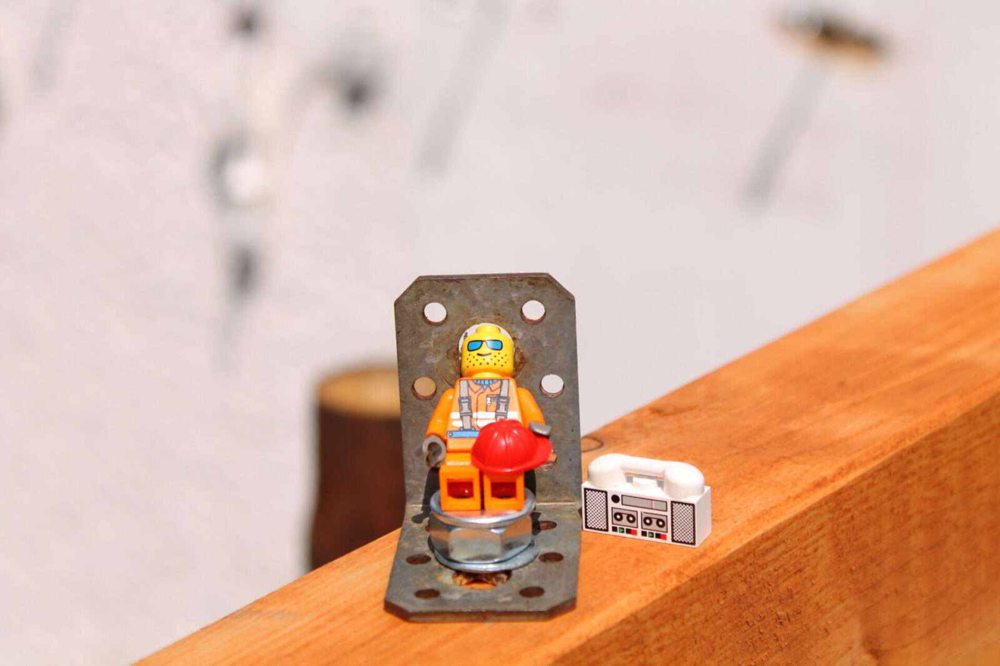
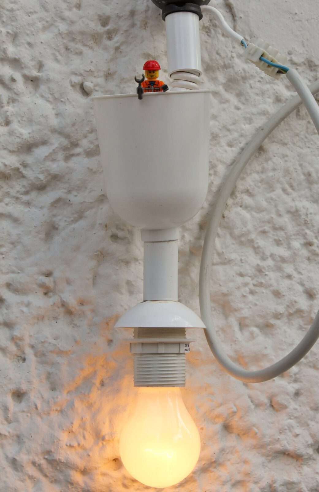
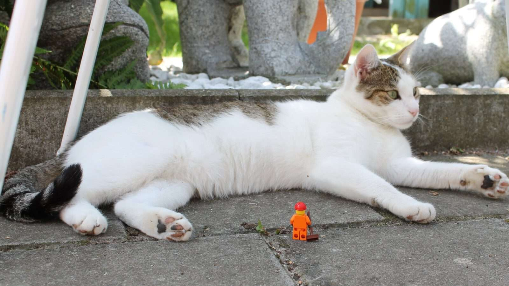
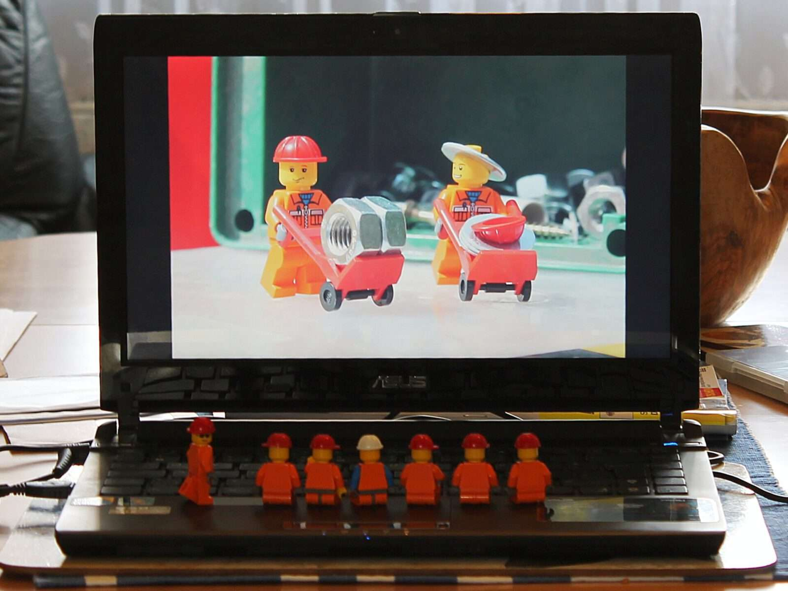

---
category:
  - minifigur
cover:
  alt: Gänsemarsch
  image: IMG_0248.jpg
date: "2011-07-08T13:02:29+00:00"
tag:
  - orange
  - rot
title: Minifiguren auf dem Bau
url: /2011/minifig-at-work
---

Es ist Sommer in Deutschland - das Wetter ist schön und nichts kann einen mehr drinnen halten. Also habe ich mir ein paar Lego Minifiguren geschnappt, und ein kleines "Fotoshooting" im heimischen Garten durchgeführt.

 Mir nach, Männer!

 Es kann sich nur um Stunden handeln ...

 Die Großmutter macht Probleme ...

 Oh mein Gott, sie sind gelandet.

 Boss, rate was wir in der Baugrube gefunden haben ...!

 Behämmert

 Energieleck repariert - holt mich hier runter.

 Entschuldigung, ich müsste dort kurz einmal ... äh, hallooo!?

 Nach getaner Arbeit
